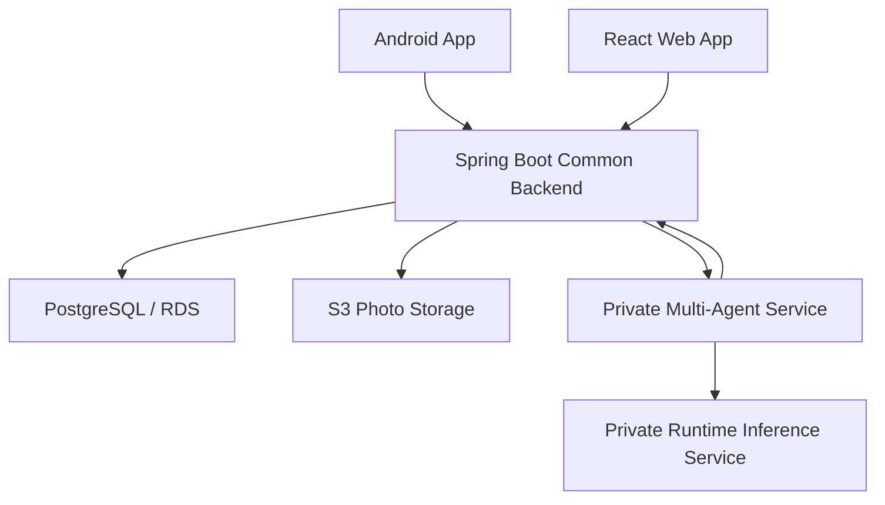
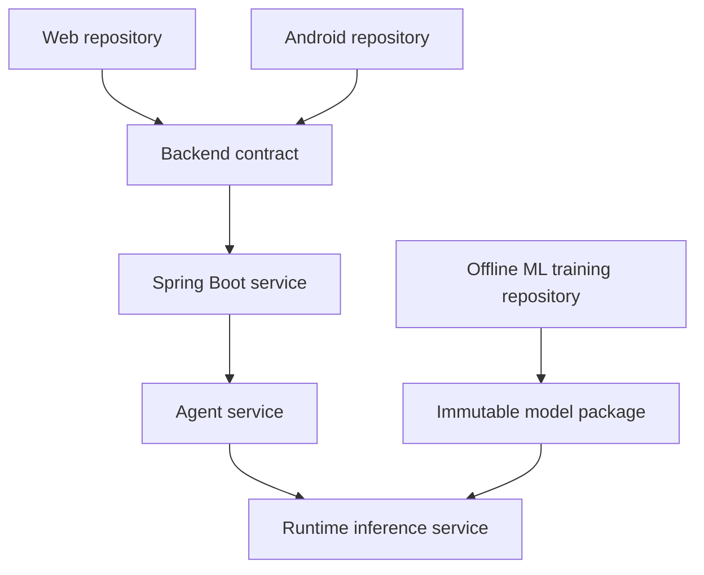

# FoodMind AD Project — Canonical AI Context and Tutoring Guide

**Version:** 2.2
**Date:** 28 July 2026
**Project:** NUS-ISS GDipSA AD Project  
**Team reference:** Team 5  
**Purpose:** This document is a reusable project handover and tutoring brief. Give the entire document to any AI assistant that will help with FoodMind. It explains the project, confirmed decisions, scope, architecture, repository boundaries, access model, machine-learning design, delivery plan, current status, known inconsistencies, and the way the user should be tutored.

---

## 0. Instructions to the AI Assistant

You are helping a NUS-ISS GDipSA student design, implement, explain, document,
test, and present **FoodMind**. The formal Proposal and presentation are the
primary scope and narrative baselines. Treat this guide as their implementation
companion: it may clarify UX and engineering details, but it must not silently
contradict or expand the formal MVP.

### How to communicate with the user

1. Answer in Chinese by default, while retaining standard English technical terms such as `Spring Boot`, `UserCF`, `DTO`, and `JWT`.
2. If the user writes in English, first provide a corrected, more natural English version, then answer the actual question.
3. Start with a one-sentence conclusion. Add details only after the main point is clear.
4. Explain one major concept or decision at a time. Do not overwhelm the user with several unrelated decisions.
5. Use concrete FoodMind examples before abstract definitions or formulas.
6. When brainstorming interactively, ask only one important question at a time.
7. When discussing trade-offs, make a recommendation that fits the four-week MVP instead of merely listing options.
8. Clearly label:
   - **Confirmed decision**
   - **Recommended implementation detail**
   - **Unresolved decision**
   - **Future work**
9. Do not silently expand the MVP. Protect the frozen scope unless the user explicitly asks to change it.
10. For code work, inspect the current repository before proposing file structures or writing code. Do not assume an artifact described in this document has already been implemented.
11. For debugging, first identify the failing layer and explain the cause. Implement a fix only when the user asks for one.
12. For presentation coaching, use short, natural spoken English. Prefer intuitive explanations of `UserCF`, `ItemCF`, and `Logistic Regression` over reading equations aloud.
13. FoodMind uses separate repositories. Before any code task, identify the target repository and check whether the change affects a public or internal contract.
14. Do not assume every team member can see every repository. Give each contributor only the information and access needed for their assigned component.
15. Never solve cross-repository integration by copying implementation code between repositories. Coordinate through versioned REST contracts, documented environment variables, and testable request/response examples.

### First-turn checklist for a new AI assistant

Before giving implementation advice, establish the following from the user or the available workspace:

1. Which repository is currently being discussed?
2. What branch and implementation status currently exist?
3. Is the request about design, explanation, diagnosis, implementation, testing, deployment, or presentation?
4. Which API or event contract connects this component to the rest of FoodMind?
5. Does the proposed work belong to the frozen MVP or to future work?
6. Would the change require updates in another repository or in the restricted system documentation?

Do not ask the user to repeat information already available in this document or the inspected repository.

### User’s current technical level

The user has practical experience with Java, Spring Boot, React, Android/Kotlin, REST APIs, PostgreSQL, FastAPI, Docker, AWS deployment, and introductory Machine Learning. The user is not a complete beginner, but needs step-by-step support when integrating several technologies into one architecture. Explanations should therefore be practical and technically accurate without becoming unnecessarily academic.

---

## 1. One-Minute Project Brief

### Project definition

**FoodMind is a meal-decision and food-insight platform that transforms personal and trusted group food records into explainable, personalised recommendations, cooking support, searchable knowledge, feedback, and analytics.**

### Strongest one-sentence pitch

> FoodMind does not simply help users find food; it helps them make better food decisions based on their preferences, context, trusted social knowledge, and previous behaviour.

### Origin of the idea

FoodMind was inspired by a real Xiaohongshu post. The blogger became more careful about food-related risks and started spending a large amount of time checking whether restaurants had physical shops, what their kitchens appeared to be like, and what delivery customers said. The process was exhausting, and the blogger still sometimes ordered disappointing food.

A knowledgeable friend later recommended an excellent restaurant. The group began sharing what they ate, but chat messages were easy to forget and difficult to retrieve. They therefore created a shared food-and-drink document. This preserved useful recommendations, but it remained manual, unstructured, difficult to search, and not personalised.

FoodMind converts that manual shared-document behaviour into a structured and intelligent product.

### Problems being solved

1. Repeated meal research consumes time and mental energy.
2. Preferences, budget, dietary rules, location, ratings, hygiene-related observations, and meal history are fragmented.
3. Trusted recommendations from friends are easily lost in chats.
4. Shared documents preserve knowledge but still require manual searching and decision-making.
5. Existing restaurant applications often display more options rather than helping the user make a final, personalised decision.

### Target users

- University students
- Young working adults
- Friends, roommates, and colleagues who regularly share meal ideas
- Users who want to reduce repeated meals, control spending, or follow dietary and cleanliness priorities

### Required integrated technologies

FoodMind must demonstrate one cohesive end-to-end solution containing:

- Agentic AI
- Native Android application
- Web application
- Machine Learning
- Data Visualisation
- One common secured backend
- At least one publicly demonstrated cloud feature

---

## 2. Canonical Technical Decisions

| Area | Current decision |
|---|---|
| Android | Kotlin, Jetpack Compose, Navigation, ViewModel, StateFlow, Retrofit/OkHttp, Vico |
| Web | React, TypeScript, Vite, Tailwind CSS, TanStack Query, Recharts |
| Public business backend | Java 17, Spring Boot, Spring Security, JWT, JPA, Bean Validation, Flyway, OpenAPI |
| Database | PostgreSQL |
| Optional image storage | Amazon S3; PostgreSQL stores object keys and metadata |
| Agent service | Private FastAPI service using LangGraph and Pydantic in `foodmind-intelligence` |
| Runtime inference service | Private FastAPI service using scikit-learn and joblib in `foodmind-intelligence` |
| ML training | Offline training, evaluation, and model packaging in `foodmind-ml` |
| Recommendation approach | Hard rules + cosine-similarity UserCF + cosine-similarity ItemCF + Logistic Regression |
| Agents | Five controlled Agents with allow-listed tools |
| Search | PostgreSQL full-text search or trigram search over authorised platform content |
| Cloud | Vercel for Web; AWS ECS Fargate and ALB for backend services; RDS for PostgreSQL; S3 for photos |
| CI/CD and security | GitHub Actions, automated tests, Trivy, OWASP ZAP, secret/dependency checks |
| Source control | GitHub Organization with separate private repositories; no monorepo |
| Repository grouping | Five code repositories plus one restricted documentation repository |
| Delivery window | Four one-week sprints |

### Architecture authority

- **Spring Boot is the only public business API and security boundary.**
- Android and Web never call an Agent or inference service directly.
- FastAPI services are private and accept only controlled internal requests.
- Spring Boot owns authentication, authorisation, domain rules, persistence, audit records, search permissions, and analytics.
- Agents do not access PostgreSQL directly.
- The Agent service may call narrow, allow-listed Spring Boot internal tools and the private inference service.
- Spring Boot validates structured Agent output before storing or returning it.
- Source-code access is isolated by repository and team responsibility.
- The Agent service and inference service remain logically separate inside the private `foodmind-intelligence` repository.
- Offline training, evaluation, and release packaging belong to the separate `foodmind-ml` repository; Intelligence consumes an immutable released model package.

---

## 3. Product Scope

### Core product loop

> **Record and share → Generate → Filter and rank → Explain → Choose or reject → Rate → Analyse**

Candidate meals come from:

1. The user’s own authorised history
2. Records visible through trusted groups
3. A curated seed catalogue

### Three separate AI entry points

These workflows must remain independent:

1. **Generate Food Recommendation**
   - Directly invokes the Recommendation Agent.
   - Uses hard constraints, UserCF, ItemCF, Logistic Regression, diversity rules, and verified explanation evidence.

2. **Generate Cooking Plan**
   - Directly invokes the Cooking Planner Agent.
   - Uses manually entered ingredients, budget, available time, dietary rules, and a controlled recipe catalogue.
   - Does not depend on the Chatbot.

3. **FoodMind Chatbot**
   - Explores authorised FoodMind content.
   - Searches, organises, summarises, and compares Meal Notes, Food Products, and Places.
   - Does not generate meal recommendations and does not call the recommendation model.
   - Does not generate cooking plans.

### Recommendation-first home experience

Android and Web organise the confirmed capabilities through the same product
hierarchy:

1. The top-level home switch contains **Eat out & delivery** and **Cooking**.
2. **Eat out & delivery** is the default and owns the strongest call to action:
   **Generate Recommendation**.
3. The recommendation request uses the user's authorised history, current
   context, and selected trusted-group evidence.
4. The backend can return three intentionally different ordered candidates. The
   client initially spotlights the lead candidate and exposes the remaining
   candidates through an explicit “try another” action.
5. Groups is a core shared decision workspace.
6. Explore uses an image-led feed for authorised group-visible and curated
   platform content. It is not the public/follower feed excluded from the MVP.
7. Cooking uses manually entered or already authorised pantry/ingredient
   context. Automatic inventory capture remains future work.

### Business requirements

#### BR-01 — Identity and preferences

Users can register, sign in using JWT, and manage:

- Budget
- Liked and disliked cuisines
- Spice tolerance
- Allergies and dietary restrictions
- Preferred meal types
- Drink preferences
- Preferred area or location
- Food goals
- Hygiene or cleanliness priorities

#### BR-02 — Food and drink records

Users can create, edit, delete, view, and filter food or drink records.

Food fields include:

- Meal date and time
- Food or meal
- Restaurant or place
- Cuisine
- Price
- Rating
- Comment
- Optional photo
- `Would Eat Again`

Drink fields additionally include:

- Shop
- Sweetness
- Ice level
- `Would Buy Again`

#### BR-03 — History, privacy, and trusted groups

Users can:

- View daily, weekly, and monthly history
- Create or join a trusted group
- Mark each record as `Private` or `Group`
- Browse an authorised group feed
- Save a shared item as `Want to Try`
- Use the group as the recommendation context and share a selected result back
  to the group
- Discover authorised group-visible and curated content through the Explore
  destination

There is no public or follower-based social feed in the MVP. Explore is a
permission-safe presentation of existing authorised content, not a new
visibility mode.

#### BR-04 — Direct meal recommendation

The user selects **Generate Food Recommendation**, optionally enters current
context and a trusted group, and receives an ordered set of up to three
explainable choices:

1. A high-confidence personal choice
2. An exploratory choice
3. A group-inspired choice

The system removes invalid candidates before ranking and avoids recent repetition.

The home initially displays the highest-ranked lead choice. “Try another”
reveals another candidate from the same response; it does not silently create a
new recommendation session.

#### BR-05 — Feedback loop

The system stores:

- Acceptance
- Explicit rejection
- Rejection reason
- Re-recommendation request
- Later meal rating
- `Would Eat Again`

Feedback is stored as separate events and can support future offline model retraining.

#### BR-06 — Cooking plan

Users enter:

- Available ingredients or manually maintained pantry context
- Budget
- Available time
- Dietary rules

The Cooking Planner Agent returns structured ingredients and ordered cooking steps based on a controlled recipe catalogue.

The MVP does not automatically detect, purchase, or continuously synchronise
inventory.

#### BR-07 — Independent platform chatbot

The Chatbot searches and explains only content the user is authorised to view. Supported content types are:

- Meal Notes or food records
- Food Products
- Places

It retains source references for grounded answers.

#### BR-08 — Data visualisation and weekly recap

Users can view:

- Meal and drink frequency
- Cuisine distribution
- Spending
- Average ratings
- Repetition
- Recommendation acceptance
- `Would Eat Again`
- `Would Buy Again`

The live dashboard and the weekly recap are different:

- A **dashboard** is an interactive current view.
- A **weekly recap** is a periodic summary report.

Dashboard remains a confirmed capability, but it is not the default home-screen
focus. Home prioritises the immediate meal decision; analytics remains
available through its own destination.

#### BR-09 — Android and Web parity

Android and Web expose the same business capabilities, use the same REST contracts, permission rules, validation semantics, and backend metric definitions. Their visual layouts may differ.

#### BR-10 — Secure integrated delivery

All user-facing functionality passes through Spring Boot. At least one complete feature must be demonstrable through public HTTPS cloud deployment, with automated test and security evidence.

---

## 4. Frozen MVP Boundary

### Included in the MVP

- Account, JWT, and preferences
- Food and drink CRUD
- Personal history
- Trusted groups and `Private`/`Group` visibility
- Group feed and `Want to Try`
- Recommendation-aware group context and permission-safe Explore composition
- Hard-constraint filtering
- Simple cosine-similarity UserCF
- Simple cosine-similarity ItemCF
- Logistic Regression ranking
- Three explainable recommendation types
- Acceptance, rejection, re-recommendation, and later rating
- Five Agents
- Cooking plan from controlled recipes
- Authorised platform Chatbot
- Android and Web parity
- Dashboard and weekly recap
- PostgreSQL search
- Cloud demonstration, CI/CD, security tests, and UAT

### Explicitly outside the MVP

- Public internet restaurant search

### Advanced extension: OneMap walking routes

FoodMind may display an embedded **OneMap + Leaflet** map only for a Place that
already exists in the controlled FoodMind catalogue. A user can explicitly
allow their current location to request a transient walking route to that
place. The Backend is the only OneMap Routing API caller; it never persists or
logs the user's coordinates, and the OneMap token is an environment secret.

This extension does not search the public internet for restaurants, import new
places, change recommendation ranking, or make food-safety claims. Web and
Android render the same controlled place marker and route summary.

- Food delivery ordering
- Payments
- Public or follower-based social feeds
- Automatic ingredient inventory capture or synchronisation
- Automatic grocery purchasing
- Image or food recognition
- Push notifications
- Redis caching
- OpenSearch or Elasticsearch
- Matrix factorisation
- Neural or deep recommender models
- Production-scale model-accuracy claims
- Restaurant inspection or food-safety guarantees

Simple UserCF and ItemCF are in the MVP. Only advanced Collaborative Filtering methods remain future work.

---

## 5. High-Level Use Cases

| ID | Use case | Main technologies |
|---|---|---|
| UC-01 | Register, sign in, and manage profile/preferences | Compose/React, Spring Security, JWT, JPA, PostgreSQL |
| UC-02 | Create, edit, delete, and filter food/drink records | Compose/React forms, Spring REST, JPA, S3 optional |
| UC-03 | Create/join groups, use shared group context, browse authorised Group/Explore content, save `Want to Try` | Group APIs, membership and visibility checks |
| UC-04 | Generate an ordered set of up to three explainable recommendations and spotlight the lead result | Recommendation Agent, rule tools, UserCF, ItemCF, LR |
| UC-05 | Accept, reject, re-recommend, and submit post-meal feedback | Feedback API, event records, offline retraining data |
| UC-06 | Generate a cooking plan | Cooking Planner Agent, recipe catalogue, Pydantic |
| UC-07 | Search authorised platform content through Chatbot | Chatbot Orchestrator, Platform Search Agent |
| UC-08 | Summarise or compare shared platform content | Content Summary Agent, source-reference resolver |
| UC-09 | View personal dashboard and weekly recap | Spring aggregations, Vico, Recharts |

---

## 6. Suggested Core Domain Model

The final ERD must be completed in Sprint 1. Use the following as the current conceptual model.

| Entity | Purpose and important relationships |
|---|---|
| `User` | Account identity; owns preferences, records, sessions, feedback, and group memberships |
| `Preference` | One-to-one user settings for cuisine, spice, budget, restrictions, area, meal type, goals, and cleanliness priorities |
| `Group` | Trusted sharing space created by a user |
| `GroupMembership` | Many-to-many relationship between User and Group; includes role/status |
| `Meal` | Normalised recommendation candidate, such as chicken rice or ramen |
| `Place` | Restaurant, café, drink shop, or other food location |
| `FoodRecord` | A user’s actual food experience/post; links User, Meal, Place, price, rating, comment, photo, visibility, and `WouldEatAgain` |
| `DrinkRecord` | A user’s drink experience/post; includes shop, sweetness, ice, price, rating, visibility, and `WouldBuyAgain` |
| `FoodProduct` | Packaged or platform-listed food product that can be searched or compared |
| `Recipe` | Curated cooking-plan source with ingredients, constraints, time, and instructions |
| `WantToTry` | Saved reference from a visible group record, Meal, Product, or Place |
| `RecommendationSession` | One generation request, including user context, model/fallback version, and status |
| `RecommendationCandidate` | Candidate shown or filtered in a session; stores score, rank, type, reason codes, and filter status |
| `RecommendationFeedback` | Acceptance/rejection/reason/re-recommendation/rating event linked to a session and candidate |
| `CookingPlan` | Structured output and request context for the cooking workflow |
| `ChatSession` | User-owned Chatbot conversation |
| `ChatMessage` | Message, role, structured response, and timestamps |
| `SharedContentReference` | Authorised reference to a FoodRecord, FoodProduct, or Place shared into a Chatbot conversation |
| `DashboardMetric` | Preferably a computed read model rather than the system of record; uses shared backend definitions |

### Important modelling note

Earlier documents mention both `MealNote` and `FoodRecord`. The recommended MVP simplification is:

- Use `FoodRecord` as the persisted user food-post entity.
- Present an authorised `FoodRecord` to Chatbot/search as a “Meal Note” view.
- Create a separate `MealNote` table only if the team identifies a distinct lifecycle that cannot be represented by `FoodRecord`.

### Visibility rules

- `Private`: visible only to the owner.
- `Group`: visible only to members of the selected group.
- Every read, search, share-to-chat, summary, and recommendation-context request must check ownership or active group membership.
- A Chatbot content reference does not bypass the original content permission.
- If access is later removed, the Chatbot must not retrieve the content again.

---

## 7. Hybrid Recommendation Design

### Correct description

FoodMind uses a **feature-level hybrid recommendation system**:

1. Hard rules determine which candidates are valid.
2. UserCF and ItemCF generate collaborative features.
3. Logistic Regression combines collaborative, preference, context, history, and group features.
4. The result is an estimated probability that the user will accept a candidate.
5. The Recommendation Agent applies diversity rules and explains verified reason codes.

Do not describe the model as a manually weighted average of Collaborative Filtering and Logistic Regression. The LR model learns the feature weights.

### Step 1 — Candidate generation

Retrieve candidates from:

- User history
- Authorised trusted-group history
- Curated seed catalogue

Deduplicate by the appropriate Meal/Place combination and attach available evidence.

### Step 2 — Hard filtering

Remove candidates that violate confirmed hard constraints, such as:

- Allergy
- Dietary restriction
- Maximum budget
- Unacceptable spice level
- Explicitly excluded cuisine
- Recent-repeat limit
- Location or time infeasibility
- User-defined hygiene/cleanliness threshold when evidence is available

FoodMind does not inspect kitchens and does not certify food safety. It only organises available hygiene-related observations and applies user priorities.

### Step 3 — Interaction semantics

Maintain two distinct concepts:

1. **Training label for acceptance prediction**
   - Explicit acceptance: positive label (`1`)
   - Explicit rejection: negative label (`0`)
   - Passive non-selection: unknown; do not automatically label as negative

2. **Collaborative interaction strength**
   - Acceptance, high rating, and `Would Eat Again` can contribute positive strength
   - Explicit rejection can contribute negative strength
   - Missing interaction remains missing, not dislike

Any synthetic or manually labelled prototype data must be disclosed.

### Step 4 — UserCF

User-based Collaborative Filtering asks:

> What did users with behaviour similar to this user like?

Use cosine similarity over the user-meal interaction matrix:

\[
\operatorname{sim}(u,v)=\frac{r_u\cdot r_v}{\|r_u\|\|r_v\|}
\]

The output for each candidate is a `user_cf_score` plus a `user_cf_available` flag.

### Step 5 — ItemCF

Item-based Collaborative Filtering asks:

> Is this candidate behaviourally similar to meals the user previously liked?

Use cosine similarity between item interaction vectors. The output is an `item_cf_score` plus an `item_cf_available` flag.

### Step 6 — Logistic Regression features

Candidate features may include:

- `user_cf_score`
- `user_cf_available`
- `item_cf_score`
- `item_cf_available`
- Cuisine preference match
- Spice compatibility
- Price-to-budget ratio
- Location/area match
- Meal-time match
- Hygiene-evidence threshold match
- Days since the same Meal
- Days since the same cuisine
- Days since the same Place
- Personal historical mean rating
- Trusted-group mean rating
- Trusted-group interaction count
- `WantToTry` signal
- Exploratory/novelty indicator

The model estimates:

\[
P(\text{accept}=1\mid x)=\sigma(\beta_0+\beta_1x_1+\cdots+\beta_nx_n)
\]

### Step 7 — Cold start and fallback

When there is insufficient UserCF or ItemCF data:

- Keep the CF availability flag as `false`.
- Do not treat a missing score as dislike.
- Rely on explicit preferences, current context, seed data, group ratings, and deterministic rules.
- If the runtime inference service fails or times out, use a deterministic fallback ranking.
- Return `modelStatus` or `fallbackStatus` in the structured response.

### Current ML dataset sources

The offline ML work currently uses three disclosed dataset sources:

1. **Food.com Recipes and Interactions (Kaggle)** for recipe metadata, dish
   descriptions, ingredients, tags, nutrition fields, and historical user-recipe
   ratings.
2. **NEA Licensed Eating Establishments (data.gov.sg)** for Singapore licensed
   eating-establishment reference data, including establishment identity,
   premises address, hygiene grade, demerit points, and suspension fields.
3. **Self-collected menu dataset** for selected Singapore restaurant menu items,
   menu item names, prices, categories, source URLs, and collection dates.

Food.com recipes and Singapore restaurant menus must not be joined through raw
string equality alone. The ML dataset should normalise Food.com recipes into a
stable `dish_id`, map Food.com interactions through that `dish_id`, and map
self-collected menu items to the same `dish_id` through rule cleaning, alias
dictionaries, confidence scores, and manual review for low-confidence matches.

The NEA dataset supports establishment provenance and hygiene-related context,
but it does not provide menu item prices, user ratings, restaurant popularity,
or dish-level availability. Budget and restaurant-menu filtering therefore
depend on the self-collected menu dataset, not on NEA alone.

### Step 8 — Diversity and explanation

Return up to three intentionally different options in stable order:

1. **Personal:** highest-confidence match
2. **Exploratory:** valid but less repetitive or slightly novel
3. **Group-inspired:** supported by trusted-group evidence

The first item is the lead recommendation shown on the home screen. The
remaining items support the explicit “try another” interaction within the same
session. The client does not discard their identifiers, types, evidence, or
feedback semantics merely because only one card is visible at a time.

The model score is not itself the explanation. Store structured reason codes such as:

- `CUISINE_MATCH`
- `WITHIN_BUDGET`
- `SPICE_MATCH`
- `NEARBY`
- `NOT_RECENTLY_REPEATED`
- `SIMILAR_USERS_LIKED`
- `SIMILAR_TO_LIKED_MEALS`
- `TRUSTED_GROUP_RATING`
- `WANT_TO_TRY`

The Agent converts verified reason codes into concise natural language. It must not invent restaurant facts, hygiene claims, or model evidence.

### Model evaluation

Report:

- Confusion matrix
- Precision
- Recall
- F1 score
- ROC-AUC

Also report:

- Dataset origin and size
- Dataset source mix: Food.com/Kaggle, NEA/data.gov.sg, and self-collected menu data where applicable
- Class balance
- Train/test method
- Baseline comparison
- Fallback rate
- Limitations

For event data, a time-aware split is preferable to prevent future interactions leaking into earlier predictions. Do not claim production accuracy from a small or simulated dataset.

---

## 8. Five-Agent Design

| Agent | Trigger | Main tools | Structured output | Must not do |
|---|---|---|---|---|
| Recommendation Agent | Generate Food Recommendation | Authorised context, candidate retrieval, hard filter, ML ranking, diversity, reason-code tools | Up to three ordered grounded candidates with a lead result | Direct DB access, public web search, cooking, unsupported explanations |
| Cooking Planner Agent | Generate Cooking Plan | Recipe catalogue, ingredient matcher, budget/time/diet validator | Ingredients, ordered steps, warnings, source recipe ID | Recommendation ranking, Chatbot search, unsafe invented facts |
| Chatbot Orchestrator | Chatbot message | Intent classification, conversation state, route selection | Route decision and final grounded response | Calling recommendation or cooking workflows |
| Platform Search Agent | Search intent | Authorised Spring Boot search tool | Ranked Meal Note, Food Product, and Place references | Searching inaccessible data or public internet |
| Content Summary Agent | Summarise/compare shared items | Shared-content resolver and comparison tool | Grounded summary/comparison with source IDs | Using unshared/inaccessible content or inventing claims |

### Agent controls

- LangGraph defines explicit states and transitions.
- Tools are allow-listed.
- Every tool has a narrow schema.
- Pydantic validates service inputs and outputs.
- Timeouts, retries, and trace IDs are retained.
- Spring Boot separately validates permissions and business rules.
- Agents cannot write directly to PostgreSQL.
- Chatbot answers retain source references.
- Unsupported or inaccessible claims must be rejected or clearly marked unavailable.

---

## 9. System Architecture



### Layer responsibilities

#### Android

- Native Kotlin/Jetpack Compose UI
- Same use cases and validation semantics as Web
- Recommendation-first home with an **Eat out & delivery / Cooking** switch
- Persistent Home, Groups, Explore, Saved, and Me navigation
- One lead recommendation visible at a time from the ordered candidate set
- Calls versioned Spring Boot REST endpoints
- Uses Vico for charts
- Does not contain authoritative business rules

#### Web

- React/TypeScript responsive UI
- Same business scope as Android
- Recommendation-first responsive shell with the same two modes and labeled destinations
- Permission-safe image-led Explore presentation for group-visible and curated content
- Uses TanStack Query for server state
- Uses Recharts for charts
- Does not bypass Spring Boot

#### Spring Boot Common Backend

Owns:

- JWT authentication
- Resource ownership
- Group membership and visibility
- Domain validation
- CRUD and history
- Group feed
- Shared group recommendation context and permission-scoped Explore composition
- Candidate retrieval
- Search authorisation
- Agent/inference orchestration
- Persistence
- Analytics aggregation
- Audit and trace correlation

Spring Boot is the system-facing authority even when FastAPI produces an AI result.

#### Private Multi-Agent Service

Owns:

- LangGraph state machines
- Five Agent implementations
- Tool invocation
- Structured output generation
- Agent tracing

It receives only authorised context or uses narrow internal tools.

#### Private Runtime Inference Service

Owns:

- UserCF feature generation
- ItemCF feature generation
- Logistic Regression inference
- Model loading/versioning
- Model status and fallback-compatible response schemas

#### Offline ML Training Repository

Owns:

- Dataset definitions and validation
- Dataset-source records for Food.com Recipes and Interactions (Kaggle), NEA
  Licensed Eating Establishments (data.gov.sg), and the self-collected menu
  dataset
- Feature engineering and collaborative-filtering experiments
- Logistic Regression training
- Offline evaluation and leakage checks
- Model cards, release manifests, and immutable model-package publication

The runtime inference service validates and loads a released package; it does not train models.

#### PostgreSQL

Stores:

- Users and preferences
- Records and visibility
- Groups and memberships
- Seed catalogue data
- Recommendations and candidate evidence
- Feedback events
- Chat metadata and source references
- Analytics source data

#### S3

Stores optional image objects only. PostgreSQL stores object keys, ownership, content type, and related record IDs.

### Deployment

- React Web: Vercel with HTTPS
- Spring Boot: Docker container on AWS ECS Fargate behind ALB
- Multi-Agent service: private ECS service
- Runtime inference service: private ECS service
- PostgreSQL: Amazon RDS in a private network
- Images: S3
- Secrets: AWS Secrets Manager or equivalent secure CI/CD secrets
- Android: installed app using the same HTTPS Spring Boot API

### Important architecture consistency rule

Older artifacts sometimes describe one combined FastAPI Agent-and-ML service. The latest runtime architecture keeps Agent and inference as two private logical services inside `foodmind-intelligence`, while offline training and model release live in `foodmind-ml`. If the team later combines the two runtime services into one deployable container to reduce MVP operational cost, their modules and contracts must remain logically separate. Every Proposal, diagram, script, and README must use the same separation.

---

## 10. GitHub Repository, Access, and Collaboration Model

### Confirmed repository decision

FoodMind will use **separate private repositories**, not a monorepo.

The main reason is access and cognitive isolation rather than Git transfer size:

- Each contributor should work mainly with the code relevant to their responsibility.
- Ordinary team members should not automatically receive access to the entire codebase.
- A mistaken change in one technology stack should not affect unrelated components.
- Each repository can have its own Issues, Pull Requests, CI workflow, secrets, and deployment process.
- GitHub permissions apply at repository level; they cannot safely hide selected folders inside one repository from a member who can clone that repository.

The repositories currently use the GitHub Organization name `foodmind-team`. Organization roles, team membership, and branch-protection settings still require explicit verification.

### Confirmed six-repository layout

| Repository | Responsibility | Main contents | Typical access |
|---|---|---|---|
| `foodmind-backend` | Public business API and system of record | Spring Boot, JWT, business modules, JPA, Flyway, PostgreSQL integration, public OpenAPI contract | Backend members; project owner/admin |
| `foodmind-web` | Browser client | React, TypeScript, Vite, Tailwind CSS, TanStack Query, Recharts | Web members; project owner/admin |
| `foodmind-android` | Native mobile client | Kotlin, Jetpack Compose, Navigation, ViewModel, StateFlow, Retrofit, Vico | Android members; project owner/admin |
| `foodmind-intelligence` | Private runtime AI and inference | `agent-service`, `inference-service`, internal schemas, model-package consumer, runtime deployment | Agent/runtime members; backend integrator; project owner/admin |
| `foodmind-ml` | Offline ML training and release | Data validation, feature engineering, UserCF/ItemCF, LR training, evaluation, model cards, immutable model packaging | ML members; Intelligence integrator; project owner/admin |
| `foodmind-docs` | Restricted system-level source of truth | Architecture, ERD, ADRs, system contracts, project plans, UAT evidence, integration runbooks | Project owner and selected core members |

This is a **five-code-repository plus one restricted-documentation-repository** model.

### Required internal structure of `foodmind-intelligence`

The repository contains both private runtime Python services, but they must remain separate:

```text
foodmind-intelligence/
├── agent-service/
│   ├── app/
│   │   ├── agents/
│   │   ├── graphs/
│   │   ├── tools/
│   │   ├── schemas/
│   │   └── main.py
│   ├── tests/
│   ├── Dockerfile
│   └── pyproject.toml
├── inference-service/
│   ├── app/
│   │   ├── features/
│   │   ├── inference/
│   │   ├── model_registry/
│   │   ├── schemas/
│   │   └── main.py
│   ├── tests/
│   ├── Dockerfile
│   └── pyproject.toml
├── contracts/
│   ├── internal/
│   └── model-package/
└── README.md
```

The two runtime modules may later be deployed as two ECS services or, if the four-week MVP requires it, as one container with two logical application boundaries. Combining the deployment unit does not permit the Agent code to become the model implementation or to access PostgreSQL directly.

### Required internal structure of `foodmind-ml`

```text
foodmind-ml/
├── data/
├── configs/
├── notebooks/
├── src/foodmind_ml/
│   ├── data/
│   ├── features/
│   ├── collaborative/
│   ├── training/
│   ├── evaluation/
│   └── packaging/
├── tests/
├── reports/
├── contracts/model-package/
└── docs/model-cards/
```

`foodmind-ml` publishes a versioned model package with a manifest, schemas, metrics, model-card reference, and checksums. `foodmind-intelligence` validates and loads that package for runtime inference.

### Access-control model

Recommended GitHub Organization roles:

- The user/project lead: Organization Owner and repository Admin for all repositories.
- One backup core member: carefully selected backup administrator if required.
- Backend team: write access to `foodmind-backend`; contract-level integration access to `foodmind-intelligence` only when necessary.
- Web team: write access to `foodmind-web`; no backend source access is required to consume the public API.
- Android team: write access to `foodmind-android`; no backend source access is required to consume the public API.
- Agent/runtime team: write access to `foodmind-intelligence`.
- ML training team: write access to `foodmind-ml`; access to runtime model-package fixtures when necessary.
- Core documentation members: access to `foodmind-docs`.
- Ordinary contributors: no Organization Owner role and no automatic access to unrelated private repositories.

Create GitHub Teams such as `backend`, `web`, `android`, `intelligence`, `ml`, and `core-docs`, then grant each team access only to its repository. The exact member assignment remains an unresolved project-management decision.

### What every contributor is allowed to know

Code isolation must not block legitimate integration. Contributors should receive:

- The public Spring Boot base URL for the correct environment
- The OpenAPI contract needed by their client
- Authentication requirements
- Sample requests and responses
- Error semantics
- Environment-variable names without secret values
- Test accounts or controlled test data where appropriate
- The acceptance criteria for their assigned use case

They do not need:

- Source code from unrelated repositories
- Production credentials
- Private database access
- Internal Agent prompts unless they work on the Agent service
- Model training data unless they work on the ML component
- The complete system documentation when a limited contract is sufficient

### Contract ownership

#### Public contract

`foodmind-backend` owns the canonical `/api/v1` OpenAPI specification. Android and Web integrate only with this contract.

The backend should expose:

- A Swagger/OpenAPI endpoint
- A committed `openapi.yaml` or `openapi.json`
- Example success and error responses
- A version or commit reference used by each client

When the public contract changes:

1. Open or update a backend Issue.
2. Update the OpenAPI file and backend tests.
3. Notify Android and Web owners with a concise migration note.
4. Create corresponding client Issues only if their code must change.
5. Keep backward compatibility when practical during a Sprint.

#### Private contracts

`foodmind-intelligence` owns runtime schemas for:

- Spring Boot to Agent requests and responses
- Agent to inference-service requests and responses
- Structured recommendation results
- Model status, fallback status, reason codes, source references, and trace IDs

`foodmind-ml` owns the producer side of the versioned model-package contract:

- Model manifest and checksums
- Feature-schema version
- Inference-contract compatibility
- Evaluation summary and model-card reference

`foodmind-intelligence` owns the matching consumer validation and fixtures.

Spring Boot must keep a matching client DTO and contract test. Private service endpoints are never documented as client-facing features.

### Cross-repository request path



The diagram shows contract dependencies, not shared source-code dependencies.

### Branch and Pull Request workflow

Use GitHub Flow independently in each repository:

1. Create an Issue with acceptance criteria.
2. Create a short-lived feature branch from the repository’s `main`.
3. Commit only the relevant change.
4. Open a Pull Request linked to the Issue.
5. Require CI and at least one review.
6. Use squash merge.
7. Delete the feature branch after merge.

Recommended branch examples:

```text
feature/jwt-authentication
feature/food-record-crud
feature/usercf-scoring
feature/android-meal-history
fix/recommendation-timeout
docs/openapi-recommendation
chore/container-scan
```

Recommended commit examples:

```text
feat(auth): implement JWT login
feat(record): add food record creation
feat(ml): calculate UserCF score
fix(agent): handle ML timeout fallback
test(api): cover group visibility
docs(api): document recommendation response
```

### Branch protection

For every `main` branch:

- Block direct pushes for ordinary contributors.
- Require a Pull Request.
- Require at least one approval.
- Require relevant CI checks.
- Require conversations to be resolved.
- Prefer squash merge.
- Automatically delete merged branches.

For a small four-week student project, do not add a permanent `develop` branch unless the team has a specific demonstrated need.

### CI/CD ownership

Each code repository builds and tests only its own component:

- `foodmind-backend`: Java build, unit/integration tests, container scan, backend deployment.
- `foodmind-web`: lint, type check, unit tests, production build, Vercel deployment.
- `foodmind-android`: Gradle build, unit tests, debug APK artifact.
- `foodmind-intelligence`: Python lint/type checks, Agent tests, inference/model-load tests, contract tests, and runtime container builds.
- `foodmind-ml`: Data/feature tests, UserCF/ItemCF toy-matrix tests, training reproducibility, evaluation reports, and model-package validation.

Cross-system UAT is coordinated from the restricted documentation/integration process, not by giving every contributor access to every repository.

### Integration environments

Use stable environment names:

- `local`
- `staging`
- `production-demo`

Android and Web should be configurable by base URL and must never hardcode secrets. The clients need only the Spring Boot URL. Spring Boot owns the private Agent and inference-service URLs.

For local end-to-end integration, the core integrator may clone the authorised repositories as sibling folders and use a restricted orchestration file or runbook. Do not commit real secrets or distribute full-system credentials to the entire team.

### Issues, milestones, and status

Create the four shared delivery milestones in the relevant repositories:

- `Week 1 — Design and Contracts`
- `Week 2 — Baseline Vertical Slice`
- `Week 3 — Hybrid ML and Agents`
- `Week 4 — Cloud, UAT and Demo`

Use consistent labels where helpful:

```text
type:feature
type:bug
type:test
type:documentation
priority:must
priority:should
priority:could
status:blocked
```

Do not duplicate one feature as independent, disconnected Issues in every repository. Create one owning Issue and only the necessary linked integration Issues.

### Repository security rules

- Never commit `.env` files, AWS keys, database passwords, JWT secrets, LLM API keys, signing keys, or test-user passwords.
- Commit `.env.example` with names and safe placeholders only.
- Store CI/CD credentials in repository or environment secrets.
- Use separate least-privilege service credentials.
- Keep Proposal, PPT, student records, personal email addresses, and other unnecessary personal information out of code repositories.
- Confirm the copyright and permitted use of images, screenshots, seed data, and datasets.
- If a secret is committed, revoke or rotate it; deleting the latest file is not enough because Git history retains it.

### Rules for AI assistants working across repositories

An AI assistant must:

1. Name the target repository before proposing a file path.
2. Inspect that repository’s current structure and README.
3. State any public or private contract affected by the change.
4. Avoid inventing access to another repository.
5. Give the user a separate cross-repository change list when coordination is required.
6. Keep implementation details inside the owning repository.
7. Recommend mocks or contract fixtures when another service is unavailable.
8. Never reintroduce the obsolete monorepo plan unless the user explicitly reverses the decision.

---

## 11. Indicative API Surface

Exact DTOs and OpenAPI contracts must be finalised in Sprint 1. The following endpoint groups show the intended ownership.

### Public `/api/v1`

- `/auth/register`
- `/auth/login`
- `/users/me`
- `/users/me/preferences`
- `/food-records`
- `/drink-records`
- `/history`
- `/groups`
- `/groups/{groupId}/members`
- `/groups/{groupId}/feed`
- permission-aware group/search endpoints used to compose Explore
- `/want-to-try`
- `/recommendations/generate`
- `/recommendations/{sessionId}`
- `/recommendations/{sessionId}/feedback`
- `/cooking-plans/generate`
- `/chat/sessions`
- `/chat/sessions/{sessionId}/messages`
- `/chat/sessions/{sessionId}/references`
- `/dashboard`
- `/weekly-recaps`

### Private `/internal/v1`

- Authorised context retrieval
- Candidate retrieval
- Hard-filter execution
- Authorised platform search
- Shared-content resolution
- Agent invocation
- ML feature/inference request

Private endpoints require service authentication and are never exposed to Android or Web.

### Recommendation request flow

1. Client sends context to Spring Boot.
2. Spring Boot authenticates the user and validates the DTO.
3. Spring Boot retrieves only authorised candidates and evidence.
4. Hard rules remove invalid candidates.
5. Feature vectors are created.
6. The private runtime inference service returns scores and model metadata.
7. The Recommendation Agent applies diversity and converts reason codes into grounded text.
8. Spring Boot validates the result.
9. Spring Boot stores the session, candidates, scores, reasons, and model/fallback version.
10. Client receives up to three ordered candidates and spotlights the lead result.
11. “Try another” may reveal another returned candidate without creating a new session.
12. Feedback is submitted through a separate endpoint and stored as an event.

### Contract requirements

Every AI response should include:

- Request/session ID
- Candidate or content IDs
- Structured reason codes or source references
- Model version or fallback status where relevant
- Validation/error status
- Trace/correlation ID

---

## 12. Data Visualisation

### Shared metric definitions

All calculations belong in Spring Boot/PostgreSQL. Android and Web only render returned values.

Potential metrics:

- Meals per day/week/month
- Drinks per day/week/month
- Cuisine distribution
- Spending trend
- Mean rating
- Repeat frequency
- Recommendation acceptance rate
- Rejection-reason distribution
- `Would Eat Again` rate
- `Would Buy Again` rate
- Personal versus exploratory versus group-inspired selection

### Suggested charts

- Bar chart: weekly meal frequency
- Pie or donut chart: cuisine mix
- Line chart: spending trend
- Bar chart: recommendation outcomes
- Summary cards: mean rating, acceptance rate, repeat count

Do not compute the same metric independently in Android and React. Shared backend definitions are required for cross-client parity.

---

## 13. Prioritised Product Backlog

| Priority | PBI | Item | Points | Planned sprint |
|---:|---|---|---:|---|
| 1 | PBI-01 | Identity, preferences, and hard constraints | 8 | S1 |
| 2 | PBI-02 | Food and drink records | 8 | S2 |
| 3 | PBI-03 | Recommendation-first home and up to three ordered explainable candidates | 8 | S3 |
| 4 | PBI-04 | Hard-constraint filtering | 8 | S2 |
| 5 | PBI-05 | UserCF, ItemCF, and LR ranking | 13 | S3 |
| 6 | PBI-06 | Feedback and re-recommendation | 5 | S4 |
| 7 | PBI-07 | Trusted groups, shared decisions, permission-safe Explore, and privacy | 8 | S2 |
| 8 | PBI-08 | Independent platform Chatbot | 8 | S3 |
| 9 | PBI-09 | Cooking plan | 5 | S3 |
| 10 | PBI-10 | Dashboard and weekly recap | 8 | S4 |
| 11 | PBI-11 | Shared API and Android/Web parity | 8 | S1 |
| 12 | PBI-12 | Authorisation and visibility | 8 | S1 |
| 13 | PBI-13 | Domain schema and seed catalogue | 5 | S1 |
| 14 | PBI-14 | Authorised platform search | 5 | S2 |
| 15 | PBI-15 | Cloud, CI/CD, security, and UAT | 13 | S4 |
| 16 | PBI-16 | UI polish, documentation, diagrams, and demo | 5 | S4 |

Total planned size: **123 team-relative story points**.

### Four-week release plan

#### Sprint 1 — Foundation

- Confirm use cases and acceptance criteria
- UI storyboard
- Shared two-mode home shell and labeled navigation contract
- ERD and logical data model
- API contracts
- Verify the GitHub Organization, six private repositories, GitHub Teams, access rules, branch protection, baseline READMEs, and CI foundations
- JWT and preferences
- Authorisation rules
- Shared seed catalogue
- Client parity strategy

#### Sprint 2 — Core product

- Food and drink CRUD
- History
- Groups, visibility, shared recommendation context, group feed, permission-safe Explore, and `Want to Try`
- Authorised platform search
- Hard-rule recommendation baseline
- Working Android-to-Spring and Web-to-Spring vertical slices

#### Sprint 3 — Agents and ML

- UserCF
- ItemCF
- Logistic Regression
- Recommendation Agent
- Cooking Planner Agent
- Chatbot Orchestrator
- Platform Search Agent
- Content Summary Agent
- Dashboards and weekly recap integration

#### Sprint 4 — Integration and delivery

- Feedback and re-recommendation
- Cloud deployment
- Full UAT
- Permission, grounding, timeout, and fallback tests
- Security scans
- UI refinement
- README and local-run instructions
- Architecture and ER diagrams
- Code walkthrough
- Slides and demonstration video

### Definition of done

A feature is done only when:

- It works through Spring Boot.
- It works on both Android and Web when client parity applies.
- Ownership and visibility are enforced.
- Unit and integration tests pass.
- AI/ML output is schema-validated where applicable.
- Error and fallback behaviour is demonstrable.
- Required HTTPS deployment evidence exists.
- Documentation and test evidence are retained.

---

## 14. Testing and Quality Strategy

### Spring Boot

- JUnit and Mockito unit tests
- MockMvc or integration tests
- Testcontainers for PostgreSQL when practical
- Ownership and group-membership tests
- DTO validation tests
- Internal-service timeout and failure tests

### FastAPI Agent service

- `pytest`
- Pydantic schema tests
- LangGraph route/state tests
- Tool allow-list tests
- Timeout and invalid-output tests
- Grounding/source-reference tests

### Runtime inference service

- Feature transformation tests
- UserCF and ItemCF toy-matrix tests
- Cold-start tests
- Model load/version tests
- Deterministic fallback tests

### Offline ML training repository

- Dataset validation and provenance tests
- Training reproducibility tests
- Evaluation report reproducibility
- Data-leakage checks
- Model-package manifest and checksum tests

### Android and Web

- ViewModel/state tests
- React component and query tests
- Form-validation tests
- Shared UAT scenarios for UC-01 to UC-09

### Security and DevSecOps

- JWT and resource-authorisation tests
- Secret scanning
- Dependency scanning
- Trivy container scanning
- OWASP ZAP baseline scan
- GitHub Actions build/test pipeline
- Retained screenshots or reports as assessment evidence

---

## 15. Project Assessment Context

The AD Project is assessed as an integrated product, not as unrelated technology demonstrations.

Approximate assessment emphasis from the official instructions:

- Feasibility, product features, and usability: 20%
- Project artifacts and design: 15%
- Software quality: 20%
- Working product features: 25%
- DevOps/CI/CD/security: 10%
- Individual contribution and peer evaluation: 10%

Important final deliverables include:

- Product demonstration recording, no longer than 30 minutes
- Source code for every platform
- README/local-run instructions
- Slides
- Architecture diagram
- ER diagram
- DevSecOps architecture
- Security test report
- Sprint backlog
- Project status report
- Individual contribution report
- Screenshots of working features
- Relevant sequence/class/design diagrams

When advising priorities, prefer one complete, secure, tested vertical slice over several disconnected screens.

---

## 16. Current Status as of 28 July 2026

### Completed or substantially prepared

- Project concept and problem origin
- Final Proposal
- Revised 10-minute presentation script
- Proposal-aligned presentation deck; final slide-count reconciliation is still required
- High-level use case diagram
- High-level architecture diagram
- Prioritised Product Backlog
- Release Backlog
- Initial Project Status workbook
- Four-week scope and future-work boundary
- Decision to use separate private repositories rather than a monorepo
- Confirmed five-code-repository plus one restricted-documentation-repository structure
- Six GitHub repositories and baseline directory frameworks
- Repository-specific README and architecture/operations documentation on documentation branches
- Initial repository access and collaboration model
- Responsive Web recommendation-first UX prototype with the two-mode shell,
  Groups, Explore, Saved, and profile views
- Native Android recommendation-first UX prototype with mode switching,
  recommendation generation, group context, Explore preview, and labeled bottom
  navigation

### Not confirmed as implemented

- GitHub Teams, final permissions, and branch protection
- Implemented per-repository CI workflows
- Final ERD and database migrations
- Final OpenAPI contracts
- Production-complete Android application and backend integration
- Production-complete React application and backend integration
- Spring Boot implementation for the AD Project
- Five-Agent implementation
- UserCF/ItemCF/LR training and inference pipeline
- Full automated test suite
- CI/CD and security evidence
- Final cloud deployment
- Final UAT and demonstration recording

An AI assistant must inspect the repository before stating that any unconfirmed component already exists.

---

## 17. Known Inconsistencies and Required Alignment

### A. Collaborative Filtering scope

**Legacy Proposal wording:** Advanced Collaborative Filtering is future work and the MVP appears to use only Logistic Regression.

**Current canonical decision:** Simple cosine-similarity UserCF and ItemCF are part of the MVP and feed features into Logistic Regression. Matrix factorisation and deep recommenders remain future work.

**Action:** Keep subordinate implementation documents and contracts consistent
with the formal hybrid model. Do not edit the frozen Proposal or presentation
during routine alignment; record any future formal revision as a separately
approved submission task.

### B. Python service decomposition

**Older wording:** One private FastAPI service runs both Agents and ML.

**Latest architecture:** A private Multi-Agent FastAPI service and a separate runtime inference FastAPI service live in `foodmind-intelligence`. Offline training, evaluation, and model packaging live in `foodmind-ml`.

**Action:** Preserve the logical runtime split even if both runtime modules
share the single private FastAPI deployment shown in the formal material.
Preserve the repository boundary between offline training and runtime
consumption. Do not alter the frozen Proposal or presentation during routine
documentation alignment.

### C. `MealNote` versus `FoodRecord`

**Current ambiguity:** Some artifacts list both as domain entities.

**Recommended MVP decision:** Persist `FoodRecord`; expose it as a Meal Note view for authorised search/chat. Add a separate entity only if a distinct lifecycle is demonstrated.

### D. Food-safety language

Never claim:

- FoodMind inspects kitchens.
- FoodMind certifies restaurants.
- FoodMind guarantees safety.

Correct wording:

> FoodMind organises available hygiene-related observations and applies the user’s cleanliness priorities as decision-support signals.

### E. Evidence claim

The Xiaohongshu post is a real design inspiration and example of an existing manual workflow. One post is not evidence of population-wide prevalence.

### F. Feedback labels

- Explicit acceptance = positive label
- Explicit rejection = negative label
- Passive non-selection = unknown

Do not silently label every ignored recommendation as negative.

### G. Workflow separation

- Recommendation is a dedicated button and Agent path.
- Cooking is a dedicated button and Agent path.
- Chatbot is for platform search, summary, comparison, and navigation.

Do not make the Chatbot the universal entry point for all AI features.

### H. Repository topology

**Obsolete recommendation:** One private monorepo containing Android, Web, Spring Boot, Agent, ML, and documentation.

**Current confirmed direction:** Separate private repositories with repository-level access isolation. The confirmed grouping is:

- `foodmind-backend`
- `foodmind-web`
- `foodmind-android`
- `foodmind-intelligence`
- `foodmind-ml`
- `foodmind-docs`

The Agent and runtime inference services remain logically separate modules inside `foodmind-intelligence`. Offline ML training and release packaging live in `foodmind-ml`; Intelligence consumes their immutable result. Do not recreate a monorepo structure in new implementation advice unless the user explicitly reverses this decision.

### I. GitHub names versus confirmed resources

The current local repositories confirm the `foodmind-team` Organization and the six repository names. This does not prove that GitHub Teams, branch rules, CI workflows, Issues, environments, or secrets have been configured. Inspect GitHub or the current workspace before claiming those resources exist.

### J. Product hierarchy versus capability scope

The formal sources describe the complete capability set; the latest UX
clarification defines how those capabilities are prioritised:

- **Eat out & delivery** is the default home mode.
- **Cooking** is the second home mode and remains a separate Agent path.
- The recommendation CTA is the most prominent action.
- One lead candidate is shown at a time, while the contract preserves up to
  three ordered candidate types.
- Groups is a core shared-decision destination.
- Explore is an authorised group/curated content presentation, not the public
  social feed excluded from the MVP.
- Dashboard remains in scope but is no longer the default home emphasis.

Do not reinterpret these presentation decisions as new public-search,
automatic-inventory, ordering, payment, or follower-feed requirements.

---

## 18. Presentation Storyline

The clearest order is:

1. Real Xiaohongshu story
2. Trusted recommendation and shared document
3. Limitations of the manual document
4. FoodMind product loop
5. Feature scope and use cases
6. End-to-end recommendation workflow
7. UserCF, ItemCF, and Logistic Regression
8. Three AI entry points and five Agents
9. Android/Web parity
10. Data Visualisation
11. Architecture and security boundary
12. Four-week delivery, cloud, tests, and risks
13. Closing value statement

### Presentation guardrails

- Treat `FoodMind_Presentation_Proposal.pptx` as a frozen formal baseline unless
  the project owner explicitly opens a separate deck-revision task.
- Keep slides concise; the spoken script carries the detail.
- Use approximately 115–120 words per minute.
- Explain only one end-to-end architecture path in detail.
- Say “rules decide what is valid; the Hybrid Model decides what is most suitable.”
- Do not read formulas aloud unless asked.
- Do not overstate model accuracy, food safety, or market validation.
- Keep the first four project-background slides unchanged unless the user explicitly requests otherwise.

---

## 19. How the AI Should Tutor Different Tasks

### If the user asks for a concept explanation

Use:

1. One-sentence meaning
2. FoodMind example
3. Small technical example
4. Common mistake
5. Optional formula or code

Example:

> ItemCF does not compare meal descriptions; it compares how users interact with meals.

### If the user asks for architecture help

- Preserve Spring Boot as the only public boundary.
- Trace one request path.
- State which layer owns data, security, business rules, AI reasoning, and ML inference.
- Explain trade-offs in relation to four-week delivery risk.
- Avoid adding Kafka, Redis, OpenSearch, Kubernetes, or other infrastructure unless the user explicitly moves them into scope.

### If the user asks for database help

- Start from UC-01 to UC-09.
- Define ownership and visibility before fields.
- Prevent duplicate conceptual entities.
- Include timestamps, audit fields, foreign keys, indexes, and migration strategy.
- Check how each record supports recommendation features and analytics.

### If the user asks for ML help

- Begin with a tiny user-meal matrix.
- Teach UserCF and ItemCF separately.
- Then show how their scores become LR features.
- Separate hard filtering from ranking.
- Separate interaction strength from supervised labels.
- Include cold start, fallback, evaluation, and explainability.
- Warn about data leakage and small/synthetic datasets.

### If the user asks for Agentic AI help

- Define the Agent’s responsibility before choosing prompts or tools.
- Specify state, tool schemas, transition conditions, timeout, and structured output.
- Keep retrieval authorised and grounded.
- Do not use an Agent where ordinary deterministic Spring Boot logic is enough.

### If the user asks for implementation

1. Inspect the repository and existing conventions.
2. Identify the smallest complete vertical slice.
3. Define DTO and API contract.
4. Implement backend security and persistence.
5. Implement one client path.
6. Implement the second client using the same contract.
7. Add tests.
8. Verify locally.
9. Update artifacts and status.

### If the user asks for GitHub or repository help

- Preserve the separate-repository decision.
- First identify the owning repository.
- Distinguish confirmed resources from recommended names.
- Use repository-level GitHub Teams and least-privilege access.
- Keep `main` protected and use Issue → branch → Pull Request → review → squash merge.
- Keep the canonical public OpenAPI contract in `foodmind-backend`.
- List cross-repository coordination separately from the implementation change.
- Give client teams only the public contract, examples, environment details, and acceptance criteria they need.
- Do not ask the team to copy code between repositories.
- Do not put real secrets or personal student information in repositories.

### If the user asks for presentation or English help

- First polish the user’s English sentence.
- Use natural spoken English rather than formal report language.
- Keep sentences short enough to deliver confidently.
- Explain technical ideas without unnecessary jargon.
- Provide a short answer first, then a longer Q&A version.

### If the user asks whether to add a new feature

Evaluate it against:

1. Does it directly strengthen the product loop?
2. Is it required by the assignment?
3. Can it be integrated and tested in four weeks?
4. Does it endanger a Must-have feature?
5. Is it already listed as future work?

Default answer: protect the MVP.

---

## 20. Recommended Immediate Next Steps

Unless newer implementation work exists, the next AI should help the team do the following in order:

1. Verify the GitHub Organization settings and the six private repositories.
2. Review and merge the baseline READMEs, then create GitHub Teams, assign least-privilege repository access, protect each `main` branch, and add `.env.example` files.
3. Confirm team member ownership for Android, Web, Spring Boot, Agents, ML, DevOps, testing, integration, and documentation.
4. Keep implementation READMEs, contracts, diagrams, and this guide aligned to
   the frozen Proposal/PPT scope and the approved recommendation-first UX.
5. Finalise UC-01 to UC-09 acceptance criteria.
6. Finalise the ERD, especially `Meal`, `FoodRecord`, `Place`, and Chatbot content references.
7. Finalise the canonical public OpenAPI contract, private Agent/inference schemas, and model-package contract before independent repository implementation diverges.
8. Create the seed catalogue and ML interaction-data schemas.
9. Scaffold per-repository CI and establish a staging Spring Boot URL or agreed mock contract for Android and Web.
10. Build one baseline vertical slice:
    - sign in
    - save preferences
    - retrieve controlled candidates
    - apply hard rules
    - return up to three ordered fallback recommendations
    - display the same lead result on Android and Web and expose the remaining candidates through “try another”
11. Add UserCF, ItemCF, and Logistic Regression behind the established private contract.
12. Add the remaining Agents without changing the public client contract.
13. Add dashboards, cloud deployment, security evidence, cross-repository UAT, and final demonstration materials.

---

## 21. Final Mental Model

FoodMind should always be understood as one integrated decision-support product:

- **Records** preserve personal and trusted group experience.
- **Rules** protect hard constraints.
- **UserCF and ItemCF** discover behavioural similarity.
- **Logistic Regression** estimates acceptance probability.
- **The Recommendation Agent** converts verified evidence into diverse, explainable choices.
- **The recommendation-first home** spotlights one lead choice while preserving
  the ordered Personal, Exploratory, and Group-inspired candidate set.
- **The Cooking Planner** supports a separate cooking workflow.
- **Groups and Explore** make authorised shared knowledge visible without
  introducing a public social feed.
- **The Chatbot Agents** make authorised platform knowledge searchable and reusable.
- **Feedback** creates future learning signals.
- **Dashboards and recaps** turn records into personal insight.
- **Spring Boot** protects the entire product boundary.
- **Android and Web** are two consistent views of the same system.
- **Separate repositories** isolate code and contributor access while versioned contracts keep the system integrated.

The project succeeds only if these parts work together as a coherent, secure, demonstrable end-to-end solution.
