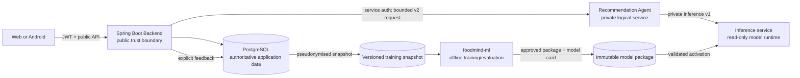
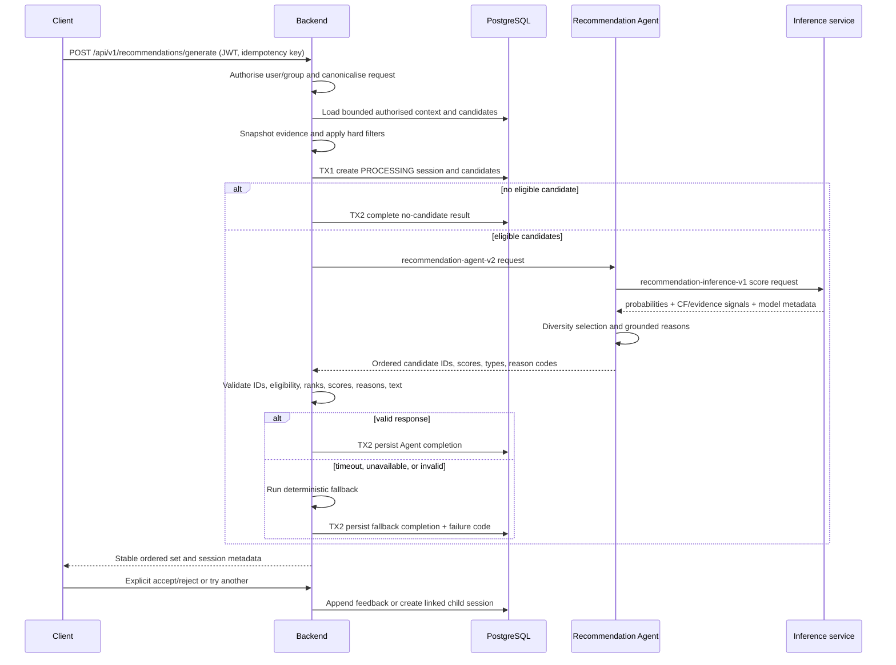
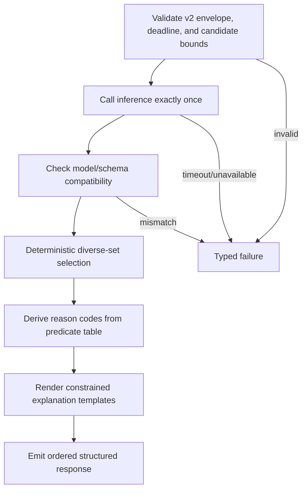

# Recommendation System Implementation Design

- **Status:** Proposed
- **Owner:** Chen Yaqi / recommendation workstream
- **Last updated:** 3 August 2026
- **Related repositories:** `foodmind-backend`, `foodmind-intelligence`, `foodmind-ml`, `foodmind-docs`, `foodmind-web`, `foodmind-android`
- **Related contract/ADR:** Existing `recommendation-agent-v1` and `recommendation-features-v1`; proposed `recommendation-agent-v2`, `recommendation-inference-v1`, `recommendation-features-v2`, and model-package manifest v1
- **Open questions:** Dataset approval; minimum interaction threshold; pseudonymous model-key rotation; launch metric thresholds; synchronous latency budget

## Executive decision

Implement the formal MVP as a hybrid ranker in which:

1. Spring Boot remains the only public, authoritative, permission-aware boundary.
2. Spring Boot retrieves a bounded candidate set, captures point-in-time evidence, applies safety and business hard filters, and persists an auditable session.
3. A dedicated Recommendation Agent orchestrates one bounded inference call, applies deterministic result-shaping and diversity rules, and emits only evidence-backed reason codes.
4. A private inference service loads an immutable package containing UserCF, ItemCF, preprocessing, and logistic-regression artifacts; it performs no training and no database access.
5. `foodmind-ml` builds, evaluates, signs off, and packages models offline from pseudonymised, versioned snapshots.
6. Any timeout, unavailable model, schema mismatch, unsafe explanation, or invalid candidate response falls back to the existing deterministic Backend selector.

This is an evolution of the implemented Backend flow, not a replacement. The public API and client “lead result + try another” behavior can remain stable while the internal feature and Agent contracts move to v2.

## Scope

### In scope

- User-based collaborative filtering (UserCF).
- Item-based collaborative filtering (ItemCF).
- Logistic regression estimating explicit acceptance probability.
- Preference, context, recency, group, novelty, and evidence-availability features.
- Cold-start degradation to non-CF features.
- Up to three intentionally different results: Personal, Exploratory, and Group-inspired.
- Evidence-backed reason codes and constrained explanation templates.
- Explicit accept/reject feedback, later outcome enrichment, snapshot export, time-aware training, model packaging, release, rollback, metrics, and evidence.
- Web and Android parity through the existing Backend public contract.

### Out of scope for the MVP

- Matrix factorisation, neural recommenders, embeddings, reinforcement learning, online learning, and automatic hyper-personalised retraining.
- Agent access to the application database or client access to private AI services.
- Treating unselected impressions as negative labels.
- Public/follower recommendation feeds.
- Chatbot routing of the dedicated recommendation workflow.
- Claims that a statistical model can prove allergen safety, cleanliness, health benefit, or factual truth.

## Current state and target gap

| Capability | Current repository evidence | Target change |
| --- | --- | --- |
| Public recommendation API | Implemented in Backend controllers/OpenAPI | Preserve unless an additive response field is separately approved |
| Permission and group validation | Implemented in `GenerateRecommendation` and context query | Retain in Backend only |
| Candidate retrieval | Up to 100 active curated `place_meal` offerings; history/group data are evidence | Formalise candidate-source policy and cover historical offerings through the authorised catalog or an explicit union |
| Hard filters | Nine filter policies | Inject a clock; define fail-closed evidence completeness; support actual requested-time availability data |
| Session and evidence persistence | Implemented with lifecycle, candidate snapshots, and reasons | Add v2 schema metadata and any required exposure/session export fields through forward-only migration |
| Deterministic fallback | Implemented | Keep as mandatory independent baseline and resilience path |
| Agent HTTP integration | Implemented for v1, bounded timeout/body, no retry | Add v2 compatibility and contract tests |
| Result validation | Implemented, including IDs, ranks, scores, types, and explanation safety | Make reason-code evidence explicit; stop using group/personal counts as CF proxies |
| Explicit feedback and “try another” | Implemented | Preserve append-only semantics and parent-session lineage |
| Training export | Implemented, HMAC-pseudonymised, manifest/checksum, explicit labels only | Add v2 features, pseudonymous session grouping, model-key version, and separate nullable-label impression data |
| Recommendation Agent | Placeholder in Intelligence | Implement bounded deterministic graph/workflow |
| Runtime inference | Placeholder in Intelligence | Implement package loader, schema validation, CF lookup, LR scoring, health/readiness |
| Offline training | Repository scaffolding only | Implement reproducible UserCF/ItemCF/LR pipeline and release tooling |

## Trust and ownership boundaries



Boundary rules:

- Backend owns authentication, authorisation, group visibility, candidate eligibility, public errors, idempotency, persistence, feedback, and final response validation.
- Agent owns bounded orchestration and result shaping. It cannot broaden the candidate set or change hard-filter eligibility.
- Inference owns feature compatibility, CF lookups, preprocessing, probability calculation, and package readiness. It has no application-database credentials.
- ML owns training code, experiment configuration, metrics, data validation, model cards, and immutable releases. It never serves a public request.
- Clients know neither the internal service topology nor raw model features.

## End-to-end online sequence



The remote call stays outside database transactions. TX1 captures the immutable decision-time state; TX2 writes exactly one terminal outcome. Idempotency returns the same completed response for a canonical request key.

## Recommendation function design in the current Backend

The existing `GenerateRecommendation.handle` already implements the correct high-level transaction pattern. Evolve it behind the application ports instead of moving orchestration into controllers.

```text
generate(actor, request, idempotencyKey):
  assert actor may use requested group and parent session
  canonical = canonicalise(request)
  return prior result when idempotency record matches canonical

  context = contextQuery.loadAuthorisedSnapshot(actor, canonical, now)
  evaluated = context.candidates.map(candidate -> hardFilters.evaluate(context, candidate, now))
  featuresV2 = featureAssembler.build(context, evaluated, modelKeyVersion)
  fallbackPlan = fallbackSelector.select(evaluated.eligible)

  session = transaction1.createProcessingSession(
      canonical, context.provenance, evaluated, featuresV2, fallbackPlan)

  if no eligible candidate:
      transaction2.completeWithoutCandidate(session)
  else:
      generation = agentPort.generate(session, featuresV2, deadline)
      validated = resultValidator.validate(generation, evaluated, featuresV2)
      if validated succeeds:
          transaction2.completeFromAgent(session, validated)
      else:
          transaction2.completeFromFallback(session, fallbackPlan, failureCode)

  complete idempotency record and emit metrics
  return repository.getAuthorisedResult(actor, session.id)
```

### Backend class-level changes

| Existing area | Proposed evolution |
| --- | --- |
| `JdbcRecommendationContextQuery` | Separate candidate-source query from evidence aggregation; keep one bounded, permission-aware query plan; make the catalog/history policy explicit; retrieve point-in-time fields required by v2 |
| `RecommendationContextQuery` | Accept an injected decision timestamp and return source/evidence-completeness metadata |
| `HardFilterPipeline` and policies | Pass an injected `Clock`/decision timestamp; fail closed for required allergen/dietary evidence; use actual hours/availability when present; record filter code and evidence source |
| New `RecommendationFeatureAssembler` | Build `recommendation-features-v2` once from the persisted decision-time evidence; do not let Agent or inference reinterpret raw application records |
| `RecommendationTransactionService` | Persist schema version, model-key version, candidate source, exposure position, and immutable features before remote inference |
| Agent DTOs and `RecommendationAgentPort` | Add a v2 envelope and a short compatibility period; public API remains unchanged |
| `AgentResultValidator` | Validate contract/model/schema versions and evidence predicates for every reason code |
| New `ReasonEvidenceValidator` | Centralise the reason-to-feature predicate table; use the same table for Agent validation and fallback rendering |
| `BuildTrainingSnapshot` and schema registry | Export v2 labeled examples plus a separate nullable-label impressions file; include a pseudonymous session key and key version |
| Database migrations | Use the next unused forward-only migration after rebasing on Backend `master`; never edit V7 or an applied migration |

### Candidate-source decision

The current query chooses active curated offerings and enriches them with personal/group history. The documentation's “user history, group history, seed catalog” wording is satisfied only if historical meals resolve to currently recommendable offerings.

Adopt this rule:

- The recommendable unit is an active `place_meal` offering.
- User and group records are evidence and may nominate an offering only when it resolves to the active catalog and passes current availability rules.
- Seed/catalog candidates use the same offering registry and evidence completeness rules.
- Never recommend an orphan historical free-text meal as if its place, price, allergen, availability, or cleanliness evidence were current.
- Bound the union before feature construction, with deterministic source quotas and a final cap of 100.

### Hard-filter semantics

Hard filters are not learned and never become positive explanation claims.

| Constraint | Rule |
| --- | --- |
| Allergen | Reject on a known conflict. If the user has a required exclusion and candidate evidence is incomplete, reject as `ALLERGEN_EVIDENCE_MISSING`; never infer safety. |
| Dietary | Require an explicit matching tag when a dietary constraint is requested; missing evidence fails closed. |
| Budget/currency | Compare only compatible currency; reject missing/incompatible monetary evidence when a maximum is present. |
| Spice | Reject above the requested maximum; reject unknown spice only when the constraint requires a verified level. |
| Disliked cuisine | Reject explicit matches; an unknown cuisine is not a positive match. |
| Recent repeat | Use the persisted decision timestamp and configurable 14-day default; inject `Clock` for deterministic tests. |
| Distance/area | Require sufficient location evidence for distance constraints; area filtering remains exact/canonical-code based. |
| Requested time | Evaluate actual place/offering hours or explicit availability at `requestedFor`; a generic availability boolean is not time evidence. |
| Cleanliness | Require a current-enough observation at or above threshold; missing evidence rejects when a threshold is requested. |

## Feature contract v2

Feature v2 extends, rather than mutates, v1. Feature names, types, nullability, units, derivation, and evidence cutoff belong in a machine-readable schema shared by Backend, ML, and Intelligence.

### Identity and envelope fields

- `contractVersion`, `featureSchemaVersion`, `requestId`, `sessionId`, `traceId`, and absolute deadline.
- `modelUserKey`, `modelMealKey`, and `modelOfferingKey`: stable HMAC-derived model keys, never raw database identifiers.
- `modelKeyVersion`: identifies the HMAC domain/key version used by both snapshot generation and runtime lookup.
- `candidateId`: request-scoped opaque ID used only for response correlation.
- `decisionAt`: persisted decision timestamp; training splits use decision time, not outcome-enrichment time.

### Candidate feature groups

| Group | Proposed fields | Notes |
| --- | --- | --- |
| Current v1 context | meal type, cuisine code, area, price/currency, spice, availability, cleanliness, dietary/allergen codes, want-to-try, personal/group counts and averages, distance | Preserve with explicit nullability and units. Do not export raw IDs. |
| Preference match | cuisine match, meal-type match, preferred-area match, budget ratio, spice-distance, dietary evidence complete | Derived from the authorised request snapshot. |
| Temporal context | local day-of-week, meal-period, requested-time availability, days since personal occurrence, days since group occurrence | Encode cyclical time where useful; fit transforms on training only. |
| Collaborative | `userCfScore`, `userCfAvailable`, neighbor count; `itemCfScore`, `itemCfAvailable`, supporting-item count | Availability flags distinguish “zero evidence” from “neutral score.” |
| Social/group | group support count, group mean rating, group recency, trusted-group match | Group evidence is not UserCF evidence. |
| Novelty/diversity | personal occurrence count, recent-repeat distance, want-to-try, candidate-source code | Used by LR and Agent result shaping. |
| Evidence quality | allergen/dietary/price/location/hours/cleanliness completeness and freshness | Prevent missing data from masquerading as a favorable value. |

Store the exact vector supplied for each eligible candidate before inference. The training export reads that snapshot, so retraining cannot silently recompute features with future data.

## Pseudonymous model keys

Collaborative artifacts need stable lookup keys, but private services do not need raw application IDs.

- Backend derives `HMAC-SHA-256(secretVersion, domain || canonicalId)` with distinct domains for user, meal, offering, and session.
- Snapshot rows and online requests use the same documented key version.
- ML packages contain only pseudonymous mapping indices and sparse artifacts.
- The package manifest declares supported `modelKeyVersion`; inference refuses an incompatible package or request.
- Keys are secrets and are never included in a model package. Rotation requires a dual-read/rebuild migration and a new package.
- Logs expose only request/session correlation IDs permitted by the logging policy, never model keys or feature vectors by default.

This decision changes a cross-service compatibility boundary and requires an ADR before implementation.

## Offline training design

### Dataset construction

Use two related snapshot products:

1. **Labeled decision dataset:** only explicit `ACCEPTED = 1` and `REJECTED = 0` feedback against returned candidates. Passive non-selection remains absent, not zero.
2. **Impression dataset:** all displayed candidates and exposure position with `label = null` when no explicit decision exists. Use it for coverage, exposure-bias analysis, and future methods, not as automatic LR negatives.

Every row includes the decision-time feature vector, pseudonymous session/user/meal/offering keys, feature schema, model-key version, candidate type/rank when exposed, outcome-observation cutoff, provenance, and snapshot checksum. Later rating and “would eat again” may enrich collaborative strength only when recorded before the declared cutoff.

The existing repeatable-read export, HMAC pseudonymisation, allowlist, manifest, checksum, repository revision, window, and cutoff behavior should be preserved.

### Collaborative signal mapping

Keep LR labels separate from collaborative-strength values. Start with a versioned, reviewable mapping:

| Signal | Baseline signed strength |
| --- | ---: |
| Explicit accept | `+1.0` |
| Explicit reject | `-1.0` |
| Rating 1-5 | `(rating - 3) / 2`, yielding `-1.0` to `+1.0` |
| Would eat again: yes/no | `+1.0` / `-1.0` |

Aggregate multiple observations for a user-meal pair with configured reliability weights and a documented recency decay, then clamp to `[-1, 1]`. Fit and sensitivity-test those weights on training data; do not present the starting values as learned truth. Retain the mapping version in the manifest.

### UserCF

1. Build a sparse user-by-meal matrix from training-window interactions only.
2. Require a configurable minimum number of interactions for a user.
3. Compute cosine similarity and retain the top-K positive neighbors; start evaluation with `K in {10, 20, 40}`.
4. For candidate meal `i`, calculate the similarity-weighted mean of neighbor strengths for `i`.
5. Emit the normalized score, neighbor-support count, and `userCfAvailable`.
6. Emit unavailable, not zero, when the active user, neighbors, or candidate support is insufficient.

### ItemCF

1. Use the transposed sparse matrix to calculate meal-to-meal cosine similarity.
2. Retain top-K neighbors for meals meeting the support threshold.
3. Score a candidate from the active user's positively supported meals, weighted by item similarity and interaction strength.
4. Emit the normalized score, supporting-item count, and `itemCfAvailable`.
5. Use meal identity for collaborative similarity and offering identity for price/place/context features.

All matrix construction occurs strictly inside each training fold. A validation/test interaction must never contribute to its own neighbor structure.

### Logistic-regression ranker

Train a single serialised preprocessing-and-model pipeline:

- Numeric features: explicit missing indicators where meaningful, training-fitted median imputation, and scaling.
- Categorical features: training-fitted one-hot encoding with unknown-category handling.
- Booleans and availability flags: stable binary encoding.
- Estimator: regularised logistic regression producing `P(explicit acceptance | candidate, user evidence, context)`.
- Class weighting, regularisation, and probability calibration are selected from time-aware validation, not hard-coded because the class distribution is unknown.
- Package the full preprocessing pipeline with the estimator so online and offline transformations cannot drift.

The Backend deterministic fallback remains an independently implemented baseline; do not copy LR coefficients into it.

### Cold start

- New user: both CF flags false; LR uses preferences, want-to-try, request context, candidate quality, and group evidence if authorised.
- New meal: ItemCF may be unavailable; UserCF and content/context features can still score it.
- Sparse group: group fields unavailable/zero with explicit evidence flags.
- Insufficient overall labeled data: serve deterministic fallback and keep the model package in evaluation status.

### Split and evaluation

Use expanding-window or fixed time-aware train/validation/test splits by `decisionAt`, grouping all rows from one session into the same fold. Add explicit segments for new-user, new-meal, sparse-history, and group requests.

Required comparisons:

- Majority/constant probability.
- Existing deterministic fallback.
- Preference/context-only logistic regression.
- UserCF only and ItemCF only.
- Full hybrid model.

Required metrics:

- Classification: precision, recall, F1, ROC-AUC when both classes exist, PR-AUC, log loss.
- Calibration: Brier score and a reliability/calibration plot; Expected Calibration Error where sample size supports it.
- Ranking: top-1 hit/acceptance proxy, top-3 hit rate, mean reciprocal rank where sessions contain comparable explicit outcomes.
- Product quality: candidate coverage, result-type coverage, cuisine/meal diversity, fallback rate, no-candidate rate.
- Slices: cold-start, group/personal, candidate source, meal type, evidence completeness; sensitive or protected-attribute analysis only if collection is lawful and approved.

Do not promote solely because the hybrid beats one metric. The release must beat the agreed baseline without unacceptable calibration, coverage, latency, or critical-slice regression. Thresholds are set in the Phase 0 acceptance record after the first representative snapshot is profiled.

### Bootstrap data

If FoodMind lacks enough explicit feedback, an approved external dataset such as Yelp may be used only for a prototype package:

- Record licence, source date, checksum, allowed use, transformations, and domain limitations.
- Define proxy labels explicitly, for example high ratings as positive and low ratings as negative while omitting ambiguous middle ratings.
- Keep external and FoodMind evaluation results separate.
- Never claim that external restaurant ratings are equivalent to FoodMind acceptance feedback.
- Replace or retrain with FoodMind data before making production-quality claims.

## Immutable model package

A release directory should contain at least:

```text
recommendation-model-<version>/
  manifest.json
  feature-schema.json
  inference-schema.json
  preprocessing-and-lr.joblib
  user-cf.npz
  item-cf.npz
  model-indexes/
  metrics.json
  model-card.md
  checksums.sha256
```

The manifest declares model version, package schema, feature schema, inference contract, model-key version, collaborative-strength mapping version, training-code revision, dataset snapshot ID/checksum, Python/library versions, artifact checksums, training window, evaluation summary, created time, and release status.

Runtime rules:

- Download only from an allowlisted source over authenticated transport.
- Verify every checksum and schema before loading.
- Treat pickle/joblib artifacts as executable: load only an approved, checksum-matched package produced by controlled CI.
- Warm the candidate schemas and a known-answer fixture before readiness succeeds.
- Activate atomically; keep the last known-good package for rollback.
- Refuse partial packages, unknown schema versions, key mismatches, or failed known-answer tests.
- Never train or mutate model artifacts in the runtime service.

## Inference service design

Implement under `foodmind-intelligence/inference-service` with these components:

- Package registry/loader and atomic active-model handle.
- Pydantic request/response schemas and generated JSON Schema.
- Feature-schema validator with unknown/missing/type/unit checks.
- Pseudonymous-key index lookups for UserCF and ItemCF.
- Vectorised LR scorer returning calibrated probabilities.
- Structured evidence output for reason derivation.
- `/live`, `/ready`, model metadata, and metrics endpoints on the private network.

The service accepts only already eligible candidates. A response contains:

- Candidate correlation ID.
- Acceptance probability in `[0, 1]`.
- Model/package/feature/inference versions.
- UserCF/ItemCF availability, score, and support counts.
- Named non-sensitive evidence signals required by the reason predicate table.
- Per-candidate status for a recoverable feature issue, or a request-level typed failure when compatibility/safety is uncertain.

It does not return arbitrary prose, query the database, apply permissions, or introduce candidates.

## Recommendation Agent design

Implement a bounded workflow, not an open-ended autonomous conversation:



Recommended hard bounds:

- At most 100 candidates in, at most 3 results out.
- One inference call, no database/tool search, no external web access.
- Monotonic deadline inherited from Backend; stop before Backend's own timeout.
- Deterministic tie-break by request-scoped candidate ID.
- Structured state transitions and typed failures; no hidden retries.
- LLM use is optional and unnecessary for ranking. If used for surface text, it receives only approved reason facts, temperature is low, and Backend still validates the final text. Templates are the safer MVP default.

### Result shaping

The inference service ranks every eligible candidate by probability. The Agent then builds a stable set:

1. **Lead/Personal:** highest-confidence eligible candidate; prefer personal evidence when scores are within a configured tie band, but never displace a materially higher probability.
2. **Exploratory:** best remaining candidate after a diversity penalty for similarity to selected meals/cuisines/places plus a bounded novelty bonus.
3. **Group-inspired:** best remaining candidate with authorised group support.

If a type lacks evidence, omit it or use the next valid distinct type according to an accepted policy; never manufacture all three. Preserve the highest-confidence candidate at rank 1. Store the diversity-policy version with the response.

### Grounded reason-code predicates

| Reason concept | Minimum evidence predicate |
| --- | --- |
| Similar users liked it | `userCfAvailable` and UserCF score/support at approved thresholds |
| Similar to meals you liked | `itemCfAvailable` and ItemCF score/support at approved thresholds |
| Matches cuisine/meal preference | Explicit preference-match field is true |
| From want-to-try | Decision-time want-to-try is true |
| Group-inspired | Authorised group support count/strength meets threshold |
| Fits current context | Specific budget, distance, meal-period, or availability match facts are present |
| Cleanliness evidence | A current-enough observation exists; wording states the source/score without guaranteeing safety |

Group counts do not prove “similar users,” and personal record counts do not prove item similarity. Probability or coefficient magnitude alone is not an explanation. Backend validates every reason against the same persisted fields and discards the entire Agent response on any unsupported reason.

## Contract evolution and compatibility

| Contract | Owner | Compatibility approach |
| --- | --- | --- |
| Public recommendation API | Backend | Keep current response stable; additive changes require OpenAPI-first client coordination |
| `recommendation-agent-v2` | Intelligence canonical schema; Backend consumer DTO/tests | Deploy Backend dual-read/client support, then Intelligence v2, then remove v1 after telemetry and rollback window |
| `recommendation-inference-v1` | Intelligence | Internal to logical private services; version in every request/response and fixture |
| `recommendation-features-v2` | Backend decision-time producer, ML trainer, Intelligence runtime consumer | Exact schema/checksum in snapshots and packages; reject unknown incompatible versions |
| Model package v1 | ML producer, Intelligence consumer | Consumer contract tests and compatibility matrix gate release |

No component should “best effort” parse an incompatible feature or package version. Compatibility failures are observable typed failures and trigger Backend fallback.

## Security, privacy, and safety

- Preserve Spring Boot as the sole public boundary and database authority.
- Use service-to-service authentication, network restrictions, TLS outside an explicitly local environment, and short-lived credentials.
- Minimise the Agent request to authorised, bounded, decision-time evidence.
- Use HMAC pseudonyms, not plain hashes, and domain-separate every identity type.
- Never put raw user IDs, group membership, free-text notes, tokens, model keys, full feature vectors, or package secrets in normal logs.
- Apply payload-size and candidate-count limits on both private services.
- Validate all external dataset rights and prevent real personal data from entering source control.
- Keep explanation wording observational: “recorded cleanliness score” or “matches your saved preference,” not “safe,” “healthy,” or “guaranteed.”
- Treat unknown allergen/dietary evidence as unknown and apply the fail-closed constraint policy.
- Scan dependencies, images, and packages; generate an SBOM and retain release evidence.

## Reliability and observability

Propagate `traceId`, `requestId`, `sessionId`, contract versions, and model version without user identity. Record:

- Candidate counts before/after every filter and rejection-code totals.
- Context-query, feature-build, TX1, Agent, inference, validation, TX2, and total latency histograms.
- Agent/inference outcome and typed failure codes.
- Active model/package/schema/key versions and readiness state.
- Fallback, no-candidate, invalid-response, and timeout rates.
- Recommendation type/rank exposure and explicit accept/reject rates.
- Feature-missing and unknown-category rates, score distribution, calibration drift, and candidate coverage.

Alert on sustained readiness failure, package activation failure, contract mismatch, fallback-rate spike, no-candidate spike, latency budget breach, and material feature-distribution drift. Do not alert on a single expected fallback.

## Verification strategy

### Backend

- Unit tests for every filter boundary with an injected fixed clock.
- Property tests for deterministic ordering, uniqueness, bounded output, and score ranges.
- Contract fixtures for valid v1/v2, unknown IDs, unsupported reasons, model mismatch, malformed/oversized response, timeout, and unavailable inference.
- PostgreSQL/Testcontainers flows for session lifecycle, idempotency, permission isolation, feedback, re-recommendation lineage, point-in-time snapshot, and export.
- Query-plan tests for the bounded candidate union.

### ML

- Schema and data-quality tests, leakage checks, deterministic seeded runs, and fold-isolation tests for CF matrices.
- Golden-feature parity fixtures shared with inference.
- Baseline comparison, slice metrics, calibration report, reproducibility from manifest, and checksum verification.

### Intelligence

- Package tamper/compatibility/readiness tests and last-known-good rollback test.
- Known-answer scoring across every supported platform/container.
- Agent graph state-transition, deadline, single-inference-call, diversity, reason-grounding, and deterministic tie-break tests.
- Backend-to-Agent and Agent-to-inference contract tests with checked-in examples.

### End to end

- Normal personal, exploratory, and group-inspired result.
- New user, new meal, sparse group, and insufficient-model-data fallback.
- No eligible candidate after hard filters.
- Agent and inference timeout/unavailable/malformed/incompatible package.
- Unsupported reason and unsafe wording rejected by Backend.
- Idempotent retry, explicit accept/reject, “try another,” and parent-child session audit.
- Web/Android ordered-set parity and accessibility.

On the audit workstation, pure recommendation validator/filter and HTTP-adapter tests passed. Database-backed recommendation tests could not start because Docker/Testcontainers was unavailable; CI with PostgreSQL Testcontainers remains a required gate, not a waived failure.

## Rollout and rollback

1. Ship Backend feature v2 persistence/export behind flags while serving the existing fallback/v1 path.
2. Build a representative snapshot and evaluation-only package.
3. Deploy inference with no traffic; validate package and known-answer readiness.
4. Deploy Agent v2 and Backend dual-contract support in shadow mode. Do not expose shadow output.
5. Compare model scores, coverage, latency, reason support, and fallback behavior against the deterministic baseline.
6. Enable a small cohort, then staged percentages, with explicit rollback thresholds.
7. Roll back by disabling Agent v2 and activating the last known-good package or Backend fallback; no client release is required.
8. Retire v1 only after the agreed compatibility window and evidence review.

The concrete cross-repository sequence and acceptance gates are in [Recommendation System Delivery Plan](../planning/recommendation-system-delivery-plan.md). The source audit is in [Recommendation and Agent Documentation Inventory](recommendation-document-inventory.md).
