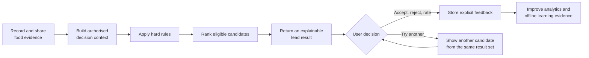

# Solution Overview

## Problem statement

Food decisions are repeated, personal, and context-dependent, yet the evidence people use is usually fragmented across memory, chat messages, photos, shared documents, and restaurant listings. The original team problem statement came from using a shared document to remember meals, restaurants, and drinks: recording was slow, evidence was scattered, and every new decision required manual comparison.

FoodMind addresses this by turning a user's own food history, authorised group knowledge, preferences, and curated catalogue data into reusable decision support. It does not position an ungrounded chatbot or a public social feed as the product.

## Target users

| User | Need | FoodMind response |
|---|---|---|
| Individual diner | Decide what to eat without repeating an unsuitable choice | Preference-aware, explainable recommendations based on personal history and explicit constraints |
| Home cook | Decide what to cook from a controlled context | Structured cooking plans using manually entered or authorised inventory and recipe data |
| Trusted group member | Reuse friends' relevant experiences without exposing private records | Group membership, visibility checks, group feed, shared recommendation context, and Want to Try |
| Returning user | Understand habits and improve future suggestions | Food/drink history, explicit feedback, dashboard metrics, and a weekly recap |
| User seeking help inside FoodMind | Search, compare, or summarise accessible platform content | A grounded chatbot that returns source references and respects the same authorisation rules |

## Product goals

1. Make the next food decision faster by placing recommendation generation at the centre of both Web and Android navigation.
2. Ground every recommendation in identifiable FoodMind evidence: personal records, authorised group records, or curated catalogue candidates.
3. Apply deterministic safety and preference constraints before ranking or generative assistance.
4. Explain why a result was selected and record explicit accept, reject, rating, and Would Eat Again feedback.
5. Keep Web and Android aligned through the same Backend API and business rules.
6. Protect privacy by enforcing ownership and active group membership on the server before content is retrieved or shared.
7. Make ML and agent components replaceable, private services; clients communicate only with the public Backend API.

## Product flow

## Response to the project theme

FoodMind responds to the theme through a human-centred application of AI to an ordinary but high-frequency decision. The intelligence is constrained by real user data, explicit permission boundaries, deterministic filters, and traceable feedback. This makes AI an assistive layer inside a complete product workflow rather than a standalone demonstration.

The solution also treats responsible operation as part of the product: secrets remain server-side, agents cannot access PostgreSQL directly, model packages are versioned, and demonstrated behaviour is tied to contracts, tests, and deployment evidence.

## Scope boundaries

The documented product scope excludes automatic pantry capture, public/follower feeds, unrestricted public internet search, ordering, and payment. Explore is permission-safe, not public. Cooking uses manually entered or otherwise authorised context. External map and language-model services support controlled Backend or private-agent workflows; they are not called directly by the clients.

## Source traceability

- Problem, solution flow, product features, and navigation: `presentation/slides/Final_Presentation_Features.pptx`, slides 3–9.
- Product priorities and acceptance criteria: `planning/status/FoodMind_Prioritisation_Strategy_and_Project_Status_Report.xlsx`, `Features` sheet.
- Scope and UX rules: workspace-root `foodmind-web/docs/ux/README.md` and `foodmind-android/docs/ux/README.md`.
- Service and security boundaries: `presentation/slides/Final_Presentation_CodeQuality.pptx`, slides 3, 12–18, and 21–29; current Backend, Intelligence, ML, and Infrastructure documentation.
