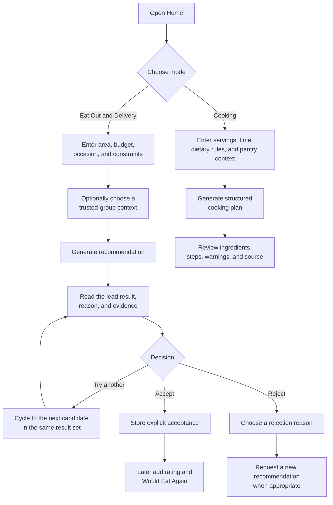

# Prototype Screens and User Navigation

## Reused FoodMind screens

These are copies of the original UX assets in the Web and Android repositories. They are not newly generated mockups.

### Web recommendation-first home

The desktop layout makes **Eat Out & Delivery** and **Cooking** the primary mode choice, places the recommendation context and generation action in the first viewport, and keeps recent decisions and supporting destinations secondary.

### Responsive Web home

The mobile-width Web layout retains the same task order while reducing the content to a single-column decision flow.

### Android recommendation-first home

The Android prototype uses native touch targets and labelled bottom navigation while preserving the same core modes and destinations.

### Permission-safe Explore

Explore is an image-led discovery surface assembled from authorised group-visible records and curated platform content. It is not a public follower feed and does not imply unrestricted internet search.

## Primary recommendation journey

## Global navigation

| Destination | User purpose | Key return path |
|---|---|---|
| Home | Generate and review recommendations or cooking plans | Recommendation result returns to context without losing the user's draft. |
| Groups | Manage trusted groups, read the group feed, and share selected results | Group context can be selected during recommendation generation. |
| Explore | Discover accessible group or catalogue items and save Want to Try | A detail view returns to the same Explore state. |
| Saved | Revisit Want to Try, recipes, inventory, and related saved workflows | A saved item can become decision context. |
| Me / Profile | Manage identity and preferences and open personal history | Updated preferences apply to later requests through the Backend. |
| Chat | Search, compare, and summarise authorised FoodMind content | Source cards lead back to the referenced platform item. |
| Dashboard | Review personal metrics and weekly recap | Metrics lead back to the underlying records where supported. |

## Prototype scope and provenance

The source assets are:

- workspace-root `foodmind-web/docs/ux/today-dashboard-web.png`;
- workspace-root `foodmind-web/docs/ux/today-dashboard-mobile-web.png`;
- workspace-root `foodmind-web/docs/ux/explore-feed-web.png`;
- workspace-root `foodmind-android/docs/ux/today-dashboard-android.png`.

The navigation explanation reuses the UX README files and slides 7–9 of the feature deck. Images under `Xiaohongshu_UI/` were reference-product research and are intentionally not presented here as FoodMind prototypes.
