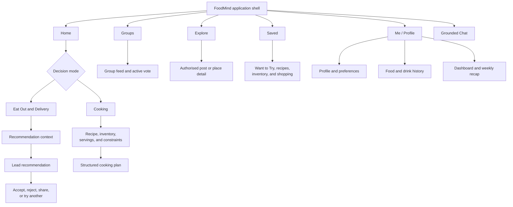
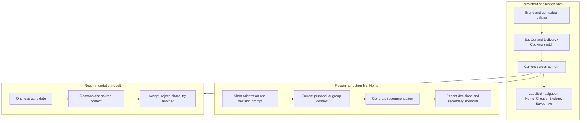
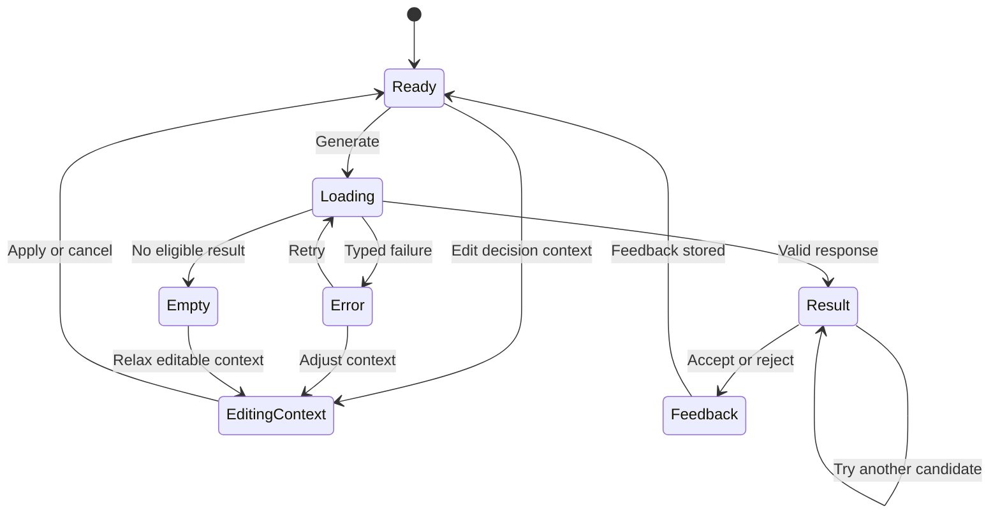
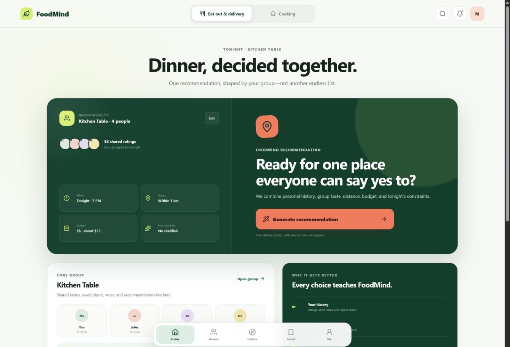
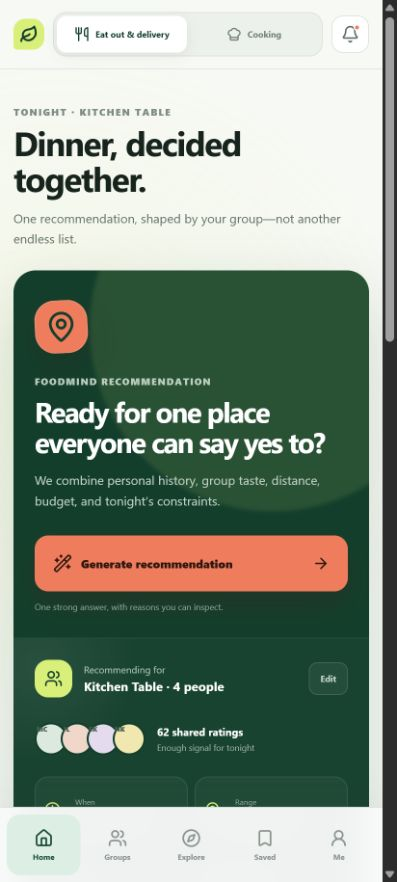
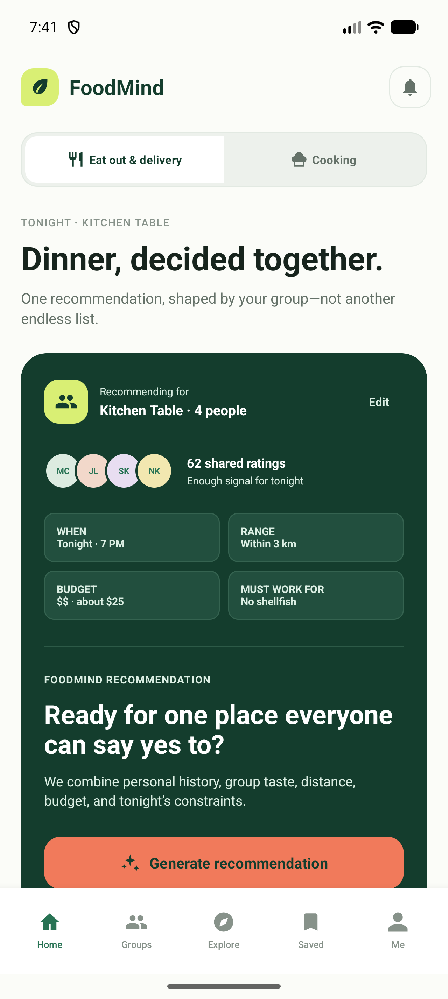

# User Interface Design

## Design objective

FoodMind's interface is designed around one high-frequency decision: helping the user decide what to eat or cook. Recommendation mode is the default, the main action is visible in the first viewport, and secondary capabilities remain reachable without competing with that decision.

The Web and Android interfaces share the same information architecture, task order, terminology, and Backend-owned rules. Each client still follows its platform conventions: responsive browser layouts on Web and native Compose layouts, system insets, and touch behaviour on Android.

## Interface principles

1. **Recommendation first:** make **Generate recommendation** the dominant action on the home screen.
2. **One primary action per screen:** place lower-frequency actions in menus, sheets, secondary buttons, or later steps.
3. **Progressive disclosure:** keep detailed recommendation and cooking context on dedicated screens rather than expanding Home indefinitely.
4. **Explain the result:** show the lead recommendation with its reasons and relevant personal, group, budget, distance, and dietary context.
5. **Preserve user context:** returning from a result, error, or detail view should not unnecessarily discard the current decision draft.
6. **Permission-aware presentation:** Explore, Groups, and Chat show only content the Backend has authorised; the interface does not imply a public feed.
7. **Cross-client parity:** Web and Android expose the same product destinations and business meaning without forcing identical layouts.
8. **Accessible interaction:** preserve labelled controls, visible keyboard focus on Web, content descriptions on Android, sufficient touch targets, and reduced-motion support.

## Information architecture

## Primary screen composition

The ordered response may contain up to three candidates, but the interface presents one confident lead choice at a time. **Try another** moves through that bounded result set instead of silently creating a new recommendation session.

## Visual language

### Web palette

The current Web design tokens provide implementation traceability for the visual concept:

| Token | Value | Intended role |
|---|---|---|
| Forest | `#113E2C` | Brand structure, high-emphasis surfaces, and strong text/actions |
| Leaf | `#287354` | Supporting green accent and selected states |
| Lime | `#D9EF74` | Brand highlight and high-visibility accent |
| Coral | `#F17A5B` | Prominent action or warm feedback accent |
| Paper | `#F7F9F4` | Main light background |
| Surface | `#FFFFFF` | Cards and elevated content |
| Ink | `#17241D` | Primary text |
| Muted | `#657269` | Secondary text |
| Success / warning / danger / information | `#237A52` / `#A76216` / `#B73D32` / `#2B6680` | Semantic feedback states |

Web typography uses `Inter` followed by system sans-serif fallbacks. Rounded cards, restrained green shadows, and fluid type sizes create hierarchy without replacing text labels with decoration.

### Android palette

Android uses a dark Material 3 theme while retaining FoodMind's green, lime, and coral identity:

| Token | Value | Intended role |
|---|---|---|
| Background | `#0D100D` | Dark application background |
| Surface / raised surface | `#151915` / `#202620` | Cards, sheets, and elevated sections |
| Primary text | `#F1F4F0` | High-emphasis text on dark surfaces |
| Muted text | `#98A29A` | Supporting copy |
| Green / dark green | `#79B78E` / `#17261C` | Secondary accent and containers |
| Lime | `#D9EF74` | Primary Material accent |
| Coral | `#E38A7B` | Error or warm feedback accent |
| Border / soft border | `#343B34` / `#272D27` | Component separation |

Android shape tokens use 10dp, 14dp, and 18dp rounded corners for small, medium, and large components. The palette is platform-adaptive rather than a claim that every Web and Android colour is numerically identical.

## Component specification

| Component | Design requirement | Interaction rule |
|---|---|---|
| Mode switch | Visible near the top of Home without competing with the primary action | Changes between independent Dining and Cooking workflows |
| Primary action | Highest visual emphasis and at least a 48px/dp-class interaction area where defined | One dominant action on each core screen |
| Context summary | Compact summary of personal or selected group context | Opens a dedicated context editor; edits apply to the current decision |
| Recommendation card | Candidate name, type, reasons, and relevant evidence | Present one lead result; actions remain explicit and labelled |
| Group card | Group identity, member signals, and active decision/vote | Opens an authorised group destination |
| Explore tile | Image-led preview with enough source context to avoid implying public content | Opens only content supplied through authorised platform data |
| Bottom navigation | Persistent labels for Home, Groups, Explore, Saved, and Me | Current destination is visually and semantically selected |
| Form controls | Visible labels, validation, and retained values | Invalid input produces actionable inline feedback |
| Loading state | Skeleton, progress indicator, or disabled action with status text | Prevent duplicate submissions while preserving context |
| Empty state | Explain why no content is available and identify the next useful action | Do not render an unexplained blank container |
| Error state | Human-readable message and recovery action | Keep retry separate from destructive reset |

## Responsive and adaptive behaviour

| Context | Layout behaviour |
|---|---|
| Narrow Web viewport | Single-column task flow, persistent labelled navigation, full-width primary action, and no horizontal dependence |
| Wider Web viewport | Multi-column context/result layouts may be used while preserving reading order and the first-viewport CTA |
| Android phone | Native vertical scrolling, system insets, labelled bottom navigation, and minimum 48dp touch targets |
| Android expanded layout | Additional width can support broader cards or columns without changing navigation meaning or Backend behaviour |

The Web source supports a minimum width of 320px and includes component-specific responsive queries rather than one universal breakpoint. Android is expected to preserve native scrolling and avoid clipping when system font or content size increases.

## Interaction states

Loading, empty, error, success, and feedback states are part of the interface design. The client should render the Backend's stable outcome without inventing a different permission, ranking, or validation rule.

## Accessibility requirements

- Keep visible focus styling for keyboard-operable Web controls.
- Provide accessible labels for icon-only actions and content descriptions for meaningful Android imagery.
- Use persistent text labels in primary navigation; do not rely on icons alone.
- Use 44–48px-class Web controls where defined and 48dp Android touch targets for primary interactions.
- Preserve reduced-motion behaviour on Web.
- Do not use colour as the only representation of selection, error, permission, or recommendation type.
- Keep text alternatives for charts, metrics, recommendation reasons, and media-led Explore content.

These requirements describe mechanisms found in the UX and style sources. They are not an unsupported claim of formal accessibility certification.

## Reused screen references

### Web recommendation-first Home

### Responsive Web Home

### Android recommendation-first Home

### Permission-safe Explore

## Scope boundaries

The interface does not promise automatic pantry capture, a public/follower feed, unrestricted public restaurant search, ordering, or payment. Explore is authorised content discovery. Cooking uses controlled recipe and inventory context. Web and Android call the Backend API; private agents, inference, database credentials, and protected provider tokens are not client UI responsibilities.

## Source traceability

- UX goals and navigation: workspace-root `foodmind-web/docs/ux/README.md` and `foodmind-android/docs/ux/README.md`.
- Web tokens, typography, focus, motion, component sizing, and responsive rules: `foodmind-web/src/index.css` and `foodmind-web/src/App.css`.
- Android palette and shapes: `foodmind-android/app/src/main/java/com/foodmind/foodmind_android/FoodMindTheme.kt`.
- Android Home composition and interaction: `foodmind-android/app/src/main/java/com/foodmind/foodmind_android/MainActivity.kt`.
- Product journey and screen intent: `foodmind-docs/presentation/slides/Final_Presentation_Features.pptx`, slides 7–9.
- Reused FoodMind screen assets: `foodmind-web/docs/ux/` and `foodmind-android/docs/ux/`.

The token tables reflect the inspected current implementation and support the design specification. They do not, by themselves, prove the exact code state at the historical Sprint 0 boundary.
