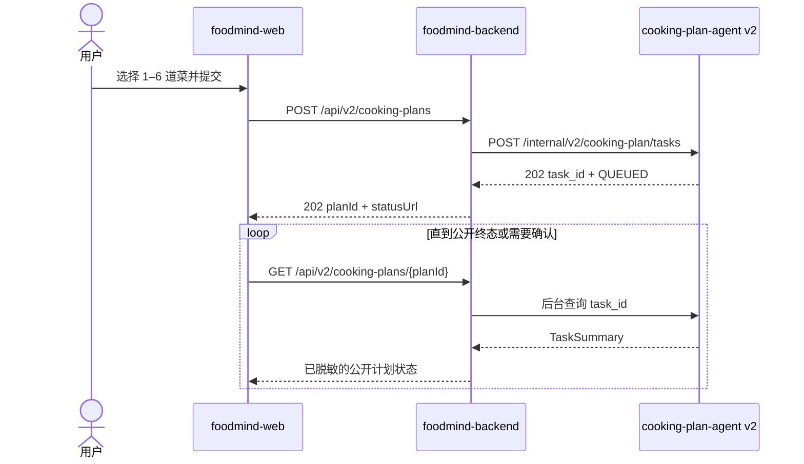

# 00：现状基线与范围

- **状态：** Proposed
- **负责人：** Cooking Plan 跨仓库集成负责人
- **最后更新：** 2026-08-02
- **相关仓库：** `foodmind-web`、`foodmind-backend`、`foodmind-intelligence`
- **相关契约/ADR：** 当前 Backend v1 与 Intelligence v1/v2 OpenAPI；正式版本在阶段 0 冻结
- **未决问题：** v2 公开 API 形态、确认恢复、生产共享存储

## 1. 审计结论

Cooking Plan 当前并非“Agent 尚未开发”的状态，而是三端演进不同步：

- Agent v2 已在本地提交中实现主要异步执行能力；
- Backend 仍接入 Agent v1 同步接口；
- Web 虽能多选菜谱，提交后仍按同步成功处理；
- 因此后续核心工作是 v2 集成与生产化，而不是重做 Agent 业务内核。


## 2. 仓库事实

### 2.1 foodmind-web

已确认能力：

- Cooking 路由支持选择多个菜谱 ID；
- 调用 `POST /api/v1/cooking-plans/generate`；
- 请求成功后立即导航到计划详情；
- 已有测试、类型检查、lint 和构建门禁。

当前差距：

- 缺少异步任务状态页面与轮询生命周期；
- 缺少 `NEEDS_CONFIRMATION` 的问答和决策提交；
- 缺少取消、超时、刷新恢复和跨设备恢复；
- “Recipe Library” 尚不等同于完整的自有菜谱 CRUD；
- 结果页面需要承载多菜谱时间线、备料、完成清单和安全提示。

### 2.2 foodmind-backend

已确认能力：

- 公开同步生成接口 `POST /api/v1/cooking-plans/generate`；
- 内部同步调用 Agent v1 `/internal/v1/cooking-plans/generate`；
- 有 Bearer 服务认证、短超时和基础回退；
- 已支持目录菜谱和用户自有菜谱候选。

当前差距：

- 公开模型仍是一次请求一次结果，不适合长工作流；
- 没有公开计划与 Agent 任务的持久化映射；
- 没有后台协调器处理轮询、重启恢复与结果物化；
- 现有 `source_recipe_id` 只能表达单来源，不适合 1–6 道菜；
- 用户自有菜谱快照缺少可靠耗时、结构化食材、步骤和资源信息；
- 目录菜谱外键与用户菜谱 UUID 复用可能导致来源外键不成立；
- 当前约 800 ms 的 Agent 超时只适用于同步 v1，不应沿用到 v2 完整执行。

### 2.3 foodmind-intelligence 中的 cooking-plan-agent v2

组织仓库 `foodmind-team/foodmind-intelligence` 已在 PR #21 / `94ae323` 合入 v2 P3 架构批次，并在 `604518e` 合入共享备料。当前远端主线已确认包括：

- `POST /internal/v2/cooking-plan/tasks` 异步提交；
- `GET /internal/v2/cooking-plan/tasks/{task_id}` 查询；
- `POST /internal/v2/cooking-plan/tasks/{task_id}/cancel` 取消；
- QUEUED、RUNNING、NEEDS_CONFIRMATION、READY、INFEASIBLE、FAILED、CANCELLED、EXPIRED 状态；
- SQLite Task Store、任务租约、续租、重试和最大尝试次数；
- Memory / SQLite Checkpointer；
- 1–6 道菜、LangGraph 工作流、CP-SAT 多目标调度；
- 区域食安策略包；
- READY、NEEDS_CONFIRMATION、INFEASIBLE、FAILED 业务结果。

本轮在同步后的 `foodmind-intelligence/main@604518e` 上，定向执行 Task API、任务存储、检查点、多目标调度和区域策略测试：

```text
66 passed, 4 warnings
```

仓库内测试报告记载完整套件为 `937 passed`、覆盖率 `91%`；该数字是已有报告，不替代本轮的 66 项实测证据。

### 2.4 Git 与工作区约束

- `foodmind-intelligence/main@604518e` 是 Agent 的正式远端基线，本地仓库已可安全快进到该提交；
- 独立的 `cooking-plan-agent` 目录没有 remote，只作为开发镜像，不承担组织仓库发布；
- 该独立镜像当前有未跟踪的 `openapi.json`，本次同步不触碰该文件；
- 后续 Agent 变更应在 `foodmind-intelligence/agent-service/app/agents/cooking` 建分支和 PR；
- 不从独立镜像盲目复制、push 或覆盖远端主线；确有差异时先做目录级 diff 和测试。

## 3. v2 已有能力与剩余缺口

| 领域 | 已有实现 | 仍需完成 |
| --- | --- | --- |
| 异步任务 | 提交、查询、取消、Worker | 与 Backend 的强类型契约和稳定版本语义 |
| 状态机 | 8 个任务状态 | 统一终态定义、公开映射和非法转换测试 |
| 确认 | 能产生 NEEDS_CONFIRMATION | 缺少决定提交与恢复端点/服务方法 |
| 进度 | 返回 progress 字段 | 大多只有排队与完成，需要节点级真实进度 |
| 取消 | 可写入 CANCELLED 并阻止最终覆盖 | 需要节点边界协作取消，明确不可中断区间 |
| 存储 | SQLite、租约、重试 | 多实例生产环境需要共享 PostgreSQL 或等价存储 |
| 检查点 | Memory / SQLite | 多实例需要共享 Checkpointer 与恢复演练 |
| 结果 | 四类业务结果 | `result/error` 当前是通用字典，需要判别式强类型 |
| 实时更新 | 文档提及 polling/SSE | 当前没有 SSE 路由，首发只承诺轮询 |
| Feature Flag | `task_api_enabled=false` 默认 | 关闭时应稳定返回不可用，而非未初始化异常 |
| 运维 | TTL、并发、租约配置 | 需要指标、滞留告警、清理策略和容量基线 |

## 4. 版本语义

现有代码同时出现：

- 路由版本：`/internal/v2/...`；
- 工作流请求字段：`schema_version="1.0"`；
- FastAPI 应用版本：`1.0.0`。

这些值描述不同层级，不应强行同步递增。阶段 0 需明确：

1. URL 中的 `v2` 表示异步 Task API 传输契约；
2. `schema_version` 表示工作流输入/输出领域结构，可先保留 `1.0`；
3. 服务发布版本遵循独立的应用版本规则；
4. Backend 与 Agent 用显式契约标识（建议 `cooking-plan-task-v2`）校验兼容性。

## 5. 单一主链路



这里的关键点是：Web 的轮询不会穿透到 Agent。Backend 可以独立控制查询频率、缓存、权限、错误映射和下游压力。

## 6. 输入边界

Agent v2 接受 1–6 个 `RecipeInput`。Backend 必须在提交前完成：

- 校验每个菜谱对当前用户可见；
- 冻结名称、份量、耗时、食材、步骤、设备和来源版本；
- 将受控菜谱优先映射为结构化候选，避免不必要的 LLM 重解析；
- 只有明确的自由文本入口才使用 `recipes[].text` 原始解析路径；
- 统一过敏原、饮食限制、库存批次、厨房资源、区域和出餐时间；
- 保证重复重试使用同一不可变输入快照。

## 7. 非功能目标

| 目标 | 阶段性约束 |
| --- | --- |
| 提交延迟 | v2 提交只落库并入队，不等待完整工作流 |
| 一致性 | 允许 Backend 与 Agent 短暂最终一致，但状态转换必须单调 |
| 幂等 | 创建、取消、确认决定和结果物化均可安全重试 |
| 恢复 | Backend 或 Agent 重启后不丢任务，不生成重复计划 |
| 安全 | 浏览器只访问 Backend；Agent 内部令牌不出服务边界 |
| 扩展 | 单机 SQLite 只用于本地或受控单实例；多实例前迁移共享存储 |
| 可观测 | 所有日志和指标可由 public plan ID、Agent task ID、request ID 串联 |

## 8. 明确不做的假设

- 不假设 Agent v2 已能完成确认后的恢复；当前代码缺少该端点；
- 不假设已有 SSE；首版使用有退避和抖动的轮询；
- 不把写入 CANCELLED 等同于底层计算已瞬时停止；
- 不把 SQLite 租约能力等同于多主机共享存储；
- 不把 Agent 通用字典结果直接暴露为公开 API；
- 不因 v1 回退可用就允许多菜谱请求静默丢菜。
