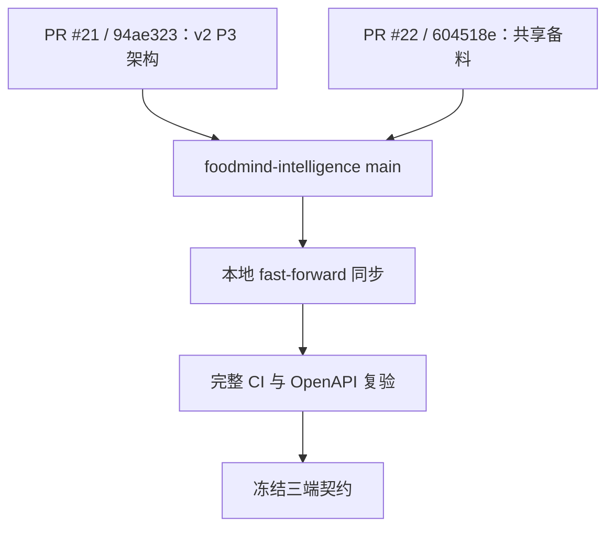
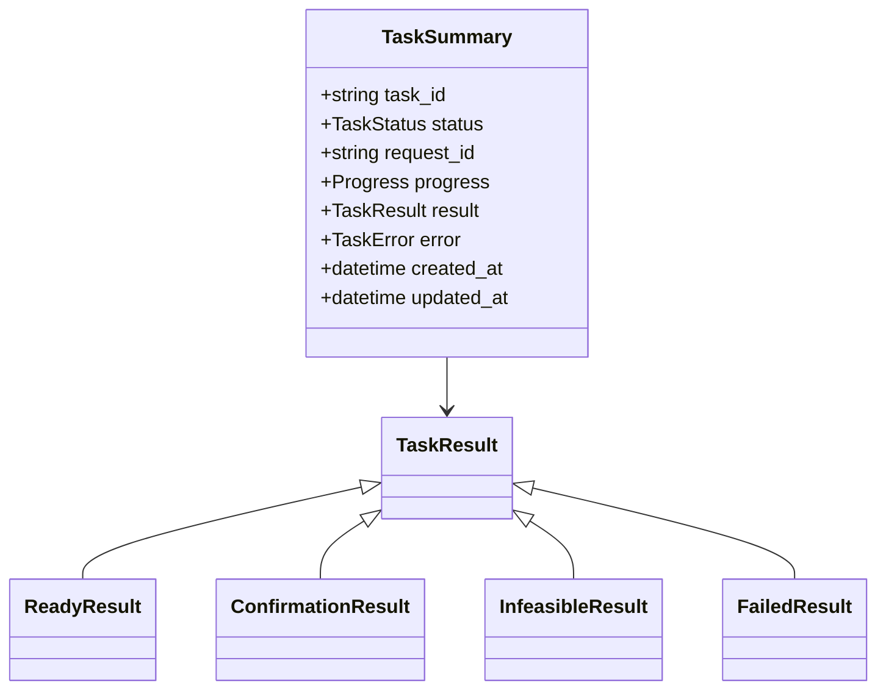
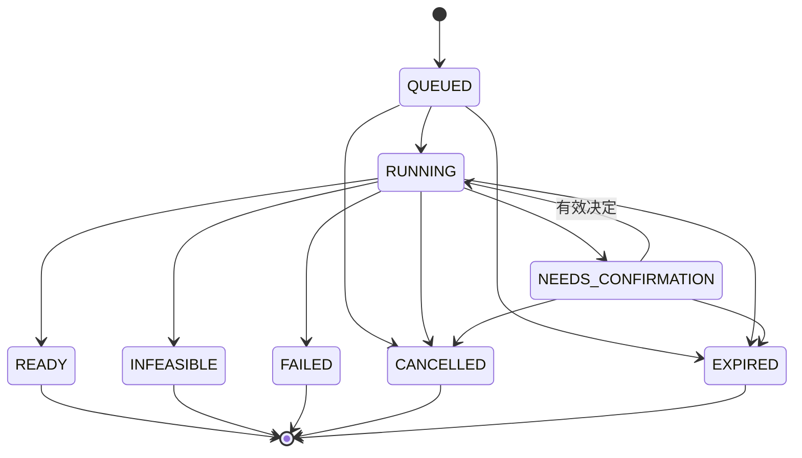

# 01：阶段 0——验证 v2 基线与冻结契约

- **状态：** Proposed
- **负责人：** Backend 与 Intelligence 契约负责人
- **最后更新：** 2026-08-02
- **相关仓库：** `foodmind-backend`、`foodmind-intelligence`、`foodmind-web`
- **相关契约/ADR：** Backend 公开 OpenAPI、Intelligence Agent 内部 OpenAPI、状态机 ADR（待创建）
- **未决问题：** decisions 端点原子语义、结果 discriminator、契约版本头

## 1. 阶段目标

阶段 0 先复验组织仓库中已经合入的 Agent v2，再冻结三端共同依赖的最小契约。完成前，Web 和 Backend 不应分别猜测字段、状态或重试规则。

## 2. 第一优先级：同步并复验远端 v2

正式事实源为 `foodmind-team/foodmind-intelligence`。PR #21 的 `94ae323` 已合入 P2-06/P3 架构批次，`604518e` 已继续合入共享备料。建议按以下顺序处理：

1. `git fetch` 后以 fast-forward 同步 `foodmind-intelligence/main`；
2. 确认 `94ae323` 的 v2 Task API 和 `604518e` 的共享备料都在当前主线；
3. 在 `agent-service/app/agents/cooking` 运行完整 CI；
4. 以远端 OpenAPI、测试和运行文档生成契约基线；
5. 仅在发现缺失变更时对独立本地镜像做目录级 diff，不把它直接发布为新仓库。



验收：从组织仓库全新 clone 后可运行 v2 完整测试，且不依赖独立本地镜像。

## 3. 冻结公开 API v2

公开 API 由 Backend 提供。路径可按仓库规范微调，但资源语义不应变化。

| 方法 | 路径 | 用途 | 成功响应 |
| --- | --- | --- | --- |
| POST | `/api/v2/cooking-plans` | 创建异步计划 | `202 Accepted` |
| GET | `/api/v2/cooking-plans/{planId}` | 查询状态与结果 | `200 OK` |
| POST | `/api/v2/cooking-plans/{planId}/cancel` | 请求取消 | `202` 或幂等 `200` |
| POST | `/api/v2/cooking-plans/{planId}/decisions` | 提交确认决定并恢复 | `202 Accepted` |
| GET | `/api/v2/cooking-plans` | 查询用户历史计划 | `200 OK` |

### 3.1 创建请求

```json
{
  "recipeIds": ["recipe-1", "recipe-2"],
  "targetServings": {
    "recipe-1": 2,
    "recipe-2": 4
  },
  "serveAt": "2026-08-02T19:30:00+08:00",
  "region": "SG",
  "dietaryRestrictions": ["vegetarian"],
  "userAllergens": ["peanut"],
  "inventoryLotIds": [],
  "kitchenResourceIds": ["oven-main", "stove-1"]
}
```

约束：

- `recipeIds` 去重后为 1–6 个；
- 所有菜谱必须对当前用户可见并且处于可生成状态；
- `serveAt` 必须携带偏移量，Backend 统一转换为 UTC 存储；
- `region` 使用受控枚举；未支持区域不应偷偷套用其他区域策略；
- Backend 从当前用户档案合并默认过敏原，但请求不得降低既有安全限制。

### 3.2 创建响应

```json
{
  "planId": "cp_01J...",
  "status": "QUEUED",
  "revision": 1,
  "statusUrl": "/api/v2/cooking-plans/cp_01J...",
  "pollAfterMs": 1000,
  "createdAt": "2026-08-02T10:00:00Z"
}
```

公开响应不得包含 Agent URL、内部令牌、内部 `task_id` 或原始堆栈。

### 3.3 查询响应

所有状态共享稳定信封：

```json
{
  "planId": "cp_01J...",
  "status": "RUNNING",
  "revision": 1,
  "progress": {
    "percent": 40,
    "stage": "SCHEDULING",
    "message": "正在协调厨房资源"
  },
  "result": null,
  "confirmation": null,
  "error": null,
  "updatedAt": "2026-08-02T10:00:03Z",
  "pollAfterMs": 1500
}
```

返回规则：

- READY 才返回可展示的 `result`；
- NEEDS_CONFIRMATION 返回 `confirmation`，不伪装成失败；
- INFEASIBLE 返回结构化原因和安全替代项；
- FAILED 返回稳定错误码、可读消息与 correlation ID；
- 非当前用户资源统一按既有安全策略返回 404 或 403，不泄漏资源存在性。

### 3.4 确认决定

```json
{
  "revision": 1,
  "decisions": [
    {
      "decisionId": "use_second_oven",
      "optionId": "yes"
    }
  ]
}
```

- 必须携带当前 `revision` 或 `If-Match`；
- 决定请求必须携带 `Idempotency-Key`；
- 仅 NEEDS_CONFIRMATION 可接受决定；
- 过期修订返回 `409 REVISION_CONFLICT` 并附当前修订；
- 成功后修订递增，状态回到 QUEUED 或 RUNNING；
- 安全政策的硬约束不能被用户决定绕过。

## 4. 冻结内部 Agent Task API v2

### 4.1 已有端点

| 方法 | 路径 | 当前状态 |
| --- | --- | --- |
| POST | `/internal/v2/cooking-plan/tasks` | 已实现 |
| GET | `/internal/v2/cooking-plan/tasks/{task_id}` | 已实现 |
| POST | `/internal/v2/cooking-plan/tasks/{task_id}/cancel` | 已实现 |

### 4.2 必须新增的端点

```text
POST /internal/v2/cooking-plan/tasks/{task_id}/decisions
```

职责：验证任务处于 NEEDS_CONFIRMATION、校验 `plan_revision`、原子写入决定、从持久检查点恢复工作流，并返回新的任务摘要。不要通过创建完全无关联的新任务来伪造恢复。

### 4.3 内部认证与版本

- 保留现有 `X-Internal-Token` 可实现最小变更；
- 令牌从 Secret 注入，比较采用常量时间方法；
- 日志、异常和追踪属性不得记录令牌；
- 加入明确的契约标识，例如 `X-Contract-Version: cooking-plan-task-v2`；
- Backend 启动或健康检查时暴露契约不兼容，而不是等首个用户请求失败。

## 5. 强类型 TaskSummary

当前 Agent 的 `result` / `error` 为通用字典。进入 Java Backend 前，应生成或维护可验证的判别联合：



最低要求：

- OpenAPI 对每个结果有独立 schema 和 discriminator；
- Backend 生成/手写 DTO 都要拒绝未知必需字段缺失；
- 未知新增字段可向前兼容，未知结果类型必须进入受控协议错误；
- 时间统一为 RFC 3339；金额、份量和时长明确精度与单位；
- `location` 只作为内部相对路径，不透传给浏览器。

## 6. 状态机



契约决策：

- NEEDS_CONFIRMATION 是“暂停态”，不是不可恢复终态；
- READY、INFEASIBLE、FAILED、CANCELLED、EXPIRED 是终态；
- 状态版本必须单调，较旧轮询结果不得覆盖 Backend 的较新状态；
- 取消与 READY 竞态采用条件更新：已经 READY 时返回当前结果，不改写为 CANCELLED；
- 未知 Agent 状态映射为 Backend 协议错误并告警，不直接透传。

## 7. 输入适配契约

Agent 原生请求使用 snake_case，包含 `recipes`、饮食限制、过敏原、时间限制、日期/出餐时间、库存、厨房资源、已批准决定、修订号、区域等字段。

Backend 适配规则：

| Backend 数据 | Agent 字段 | 规则 |
| --- | --- | --- |
| 公开 plan ID / attempt | `request_id` | 每次逻辑执行稳定，重试不变化 |
| 当前用户 ID | `user_id` | 服务端派生，禁止接收客户端冒充 |
| 菜谱不可变快照 | `recipes` / `preparsed_candidates` | 1–6 个，顺序稳定 |
| 出餐时间 | `cooking_date` + `serving_at` | 明确时区转换 |
| 用户限制 | `dietary_restrictions` / `user_allergens` | 服务端与请求合并，安全限制只增不减 |
| 厨房配置 | `kitchen_resources` | 使用稳定资源 ID 和能力枚举 |
| 用户决定 | `approved_decisions` | 仅恢复时写入，绑定修订号 |
| 区域 | `region` | ISO/项目受控代码，映射到食安策略包 |

## 8. 错误契约

统一错误信封：

```json
{
  "error": {
    "code": "REVISION_CONFLICT",
    "message": "计划已更新，请刷新后重试",
    "correlationId": "corr_01J...",
    "retryable": false,
    "details": {}
  }
}
```

至少冻结以下类别：

- `INVALID_INPUT`、`RECIPE_NOT_FOUND`、`RECIPE_NOT_ELIGIBLE`；
- `PLAN_NOT_FOUND`、`INVALID_STATE_TRANSITION`、`REVISION_CONFLICT`；
- `AGENT_UNAVAILABLE`、`AGENT_PROTOCOL_ERROR`、`TASK_EXPIRED`；
- `RATE_LIMITED`、`INTERNAL_ERROR`。

## 9. 阶段任务拆分

1. `agent-v2-baseline`：复验 `foodmind-intelligence@604518e` 的完整 CI 与 OpenAPI；
2. `contract-state-machine`：状态、转换、终态和 revision ADR；
3. `contract-agent-openapi`：强类型内部 OpenAPI 和契约标识；
4. `contract-public-openapi`：Backend 公开 v2 OpenAPI；
5. `contract-fixtures`：共享请求、各状态结果和错误 golden fixtures；
6. `contract-codegen-check`：在 CI 中检测破坏性契约变化。

## 10. 退出标准

- v2 基线已从组织仓库同步并通过完整复验；
- 公开 API、内部 API、状态机、revision 和幂等规则完成评审；
- Agent OpenAPI 可生成或验证 Backend DTO；
- READY、NEEDS_CONFIRMATION、INFEASIBLE、FAILED fixture 均能被 Backend 消费；
- 文档不再把 SSE、确认恢复或多实例存储误写为“已完成”；
- Web、Backend、Agent 分别有负责人和可独立交付的后续任务。
