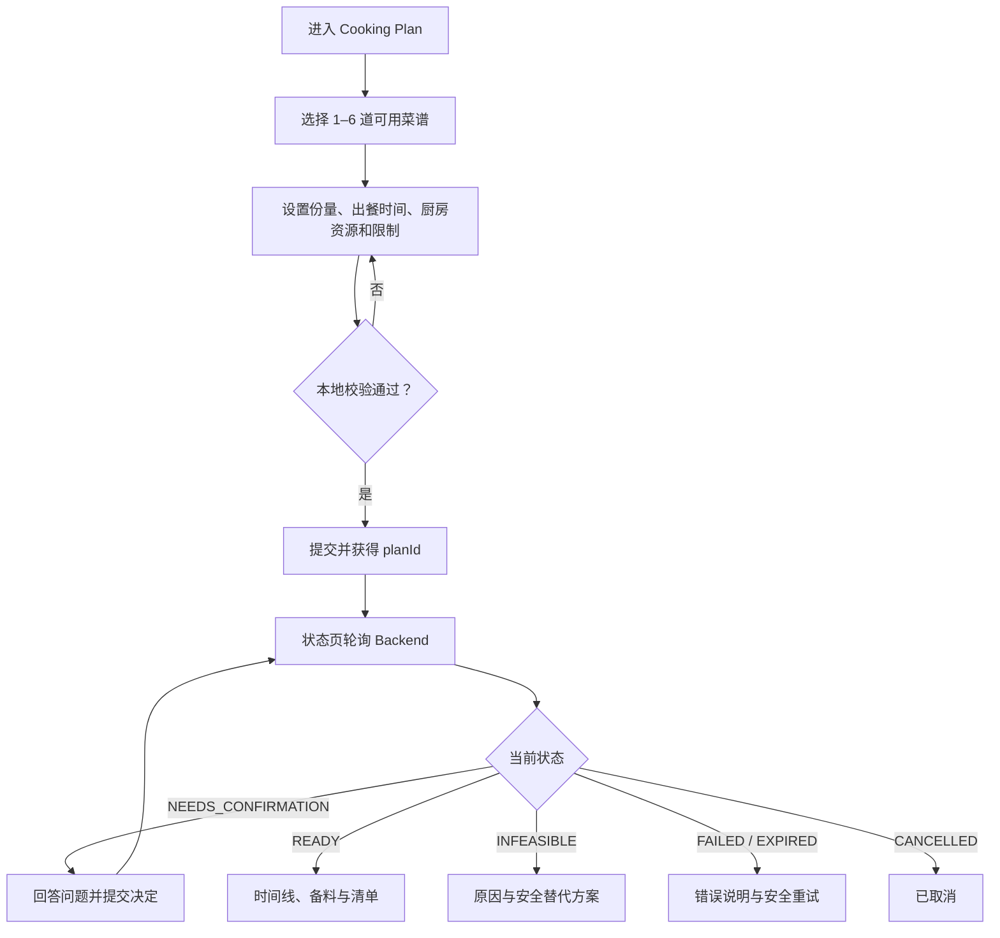
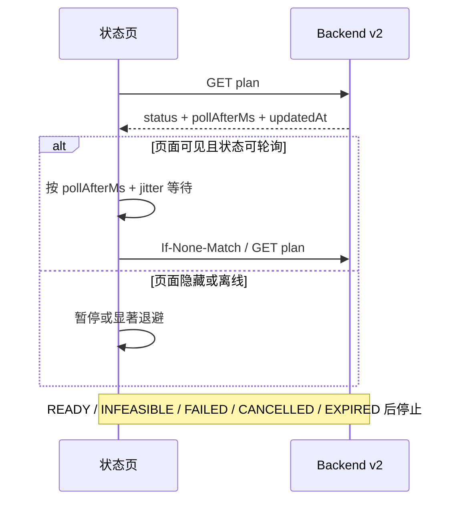
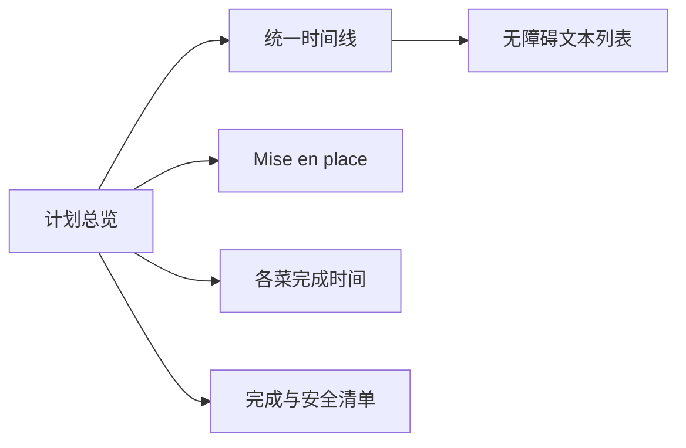

# 02：阶段 1——前端与输入闭环

- **状态：** Proposed
- **负责人：** Web 负责人
- **最后更新：** 2026-08-02
- **相关仓库：** `foodmind-web`、`foodmind-backend`
- **相关契约/ADR：** 阶段 0 公开 API v2 OpenAPI
- **未决问题：** 自有菜谱生成资格、轮询参数、移动端是否同期接入

## 1. 阶段目标

把现有“多选后同步生成并跳转”改造成可恢复的异步计划体验。Web 只依赖 Backend 的公开 API v2，不感知 Agent 内部任务。

## 2. 用户旅程



## 3. 页面与路由

建议把创建和运行状态分开，避免页面刷新丢失内存状态。

| 路由 | 页面职责 |
| --- | --- |
| `/cooking-plans/new` | 选择菜谱、配置输入、提交 |
| `/cooking-plans/:planId` | 轮询状态、确认、取消、展示结果 |
| `/cooking-plans` | 用户历史计划与状态入口 |
| `/recipes` | 目录菜谱与自有菜谱管理入口 |

planId 必须在提交成功后立即进入 URL。刷新恢复只依赖 URL、登录态和 Backend，不依赖 Zustand 中的临时对象。

## 4. 创建表单

### 4.1 菜谱选择

- 最少 1 道、最多 6 道；
- 已选择项保留稳定顺序，支持拖动调整展示顺序；
- 同一菜谱不能重复选择；
- 目录菜谱和用户菜谱明确标识来源；
- 不满足结构化数据要求的菜谱显示不可选原因；
- 菜谱被删除、禁用或权限变化时，提交前重新校验。

### 4.2 配置项

- 每道菜的目标份量；
- 出餐日期、时间和用户时区；
- 饮食限制和过敏原确认；
- 可用炉灶、烤箱、锅具等厨房资源；
- 可选库存批次；
- 区域食安策略；
- 总时间限制（若产品需要开放）。

表单校验与服务端规则同源或由 OpenAPI/schema 生成。前端校验只改善体验，Backend 仍是最终裁决者。

### 4.3 自有菜谱输入质量

自有菜谱编辑器至少提供：

- 名称、默认份量、总耗时；
- 结构化食材：名称、数量、单位、可选/必需；
- 有序步骤和每步时间；
- 设备/热源要求；
- 关键温度、静置或冷却要求；
- 草稿、可生成、需补充信息等状态。

低质量数据不应通过伪造 `1 分钟` 或空单位进入 Agent。可以保存草稿，但生成前必须给出具体补全提示。

## 5. 状态页面

### 5.1 状态展示

| 状态 | 主文案 | 用户操作 |
| --- | --- | --- |
| QUEUED | 正在排队 | 取消、离开页面 |
| RUNNING | 正在解析/调度 | 取消、查看阶段进度 |
| NEEDS_CONFIRMATION | 需要你的确认 | 回答问题、选择修复项、取消 |
| READY | 计划已完成 | 查看、打印/分享（若已有能力） |
| INFEASIBLE | 当前条件无法安全完成 | 调整条件、选择安全替代项 |
| FAILED | 生成失败 | 按 retryable 提供重试或返回编辑 |
| CANCELLED | 已取消 | 基于原输入重新创建 |
| EXPIRED | 任务已过期 | 基于保存的输入重新创建 |

不要用无限旋转动画掩盖滞留。超过正常阈值时展示“仍在处理”并允许用户离开，后台完成后历史列表仍可访问。

### 5.2 轮询策略



实现要求：

- 以服务端 `pollAfterMs` 为主，并设置前端上下限；
- 加入抖动，避免大量客户端整齐轮询；
- 页面隐藏时降低频率，恢复可见时立即刷新一次；
- 网络失败指数退避，不把网络中断误判为计划失败；
- 使用 AbortController 取消旧请求；
- 同一 planId 只允许一个活跃轮询器；
- 支持 ETag / `If-None-Match` 时处理 304；
- 终态和 NEEDS_CONFIRMATION 停止常规轮询，提交决定后再恢复。

## 6. 确认与修订冲突

确认卡片应根据结构化问题渲染，不直接展示 Agent 原始文本/HTML。

- 每个问题有稳定 `decisionId` 和受控选项；
- 明确哪些选择会改变时间、资源或菜品结果；
- 高风险决定只提供 Agent 允许的安全选项；
- 提交时带当前 revision 与 Idempotency-Key；
- 提交期间禁用重复点击，但请求失败后允许安全重试；
- 遇到 409 时重新获取计划并提示“计划已更新”；
- 多标签页竞争时，较旧页面不得覆盖新决定。

## 7. READY 结果展示

结果页面至少分为四个区域：

1. 总览：出餐时间、总历时、菜品完成时间和求解状态；
2. 时间线：按时间排序的任务、所属菜品、资源、并行关系；
3. Mise en place：共享备料、食材分组和提前准备；
4. 完成清单：每道菜完成确认、安全检查和收尾动作。



如果使用视觉时间线，同时提供语义化列表，保证键盘和屏幕阅读器可访问。安全温度和过敏原提示不能只用颜色表达。

## 8. 前端代码组织

沿用现有 React + Vite 结构，建议边界如下：

```text
features/cooking-plans/
  components/
  hooks/useCookingPlanPolling.ts
  pages/CookingPlanCreatePage.tsx
  pages/CookingPlanStatusPage.tsx
  services/cookingPlanApi.ts
  store/cookingPlanDraftStore.ts
  schemas/cookingPlan.ts
```

- API 请求只放在 service；
- 轮询生命周期封装在 hook；
- Zustand 只保存创建草稿和短期 UI 状态，不把它当服务端事实来源；
- 公开 OpenAPI 类型优先自动生成；
- 所有状态分支采用穷尽检查，新增状态时编译或测试失败。

## 9. 错误与安全体验

- 401：进入既有登录恢复流程，保留本地草稿；
- 403/404：不暴露其他用户计划信息；
- 409：刷新 revision，不盲目重试决定；
- 422：定位到具体输入字段；
- 429：尊重 Retry-After；
- 5xx/断网：保留 planId，提供稍后刷新；
- Agent 内部 correlation ID 可以作为客服排查编号展示，但不显示堆栈；
- 任何 Agent 返回的 Markdown/文本都按不可信内容渲染和转义。

## 10. 测试计划

### 10.1 单元/组件测试

- 1 和 6 道菜边界、重复菜谱、无权限菜谱；
- 时区与跨日出餐；
- 所有状态的穷尽渲染；
- 轮询退避、页面可见性、卸载取消；
- 确认 revision 冲突与幂等重试；
- READY 时间线排序和共享备料显示；
- 错误信封与未知状态的安全降级。

### 10.2 浏览器流程

- 创建 → QUEUED → RUNNING → READY；
- 创建 → NEEDS_CONFIRMATION → 提交决定 → READY；
- RUNNING → 取消；
- 处理中刷新页面并恢复；
- 断网、恢复后继续查询；
- 桌面与移动端布局；
- 键盘导航、焦点回归和屏幕阅读器标签。

## 11. 交付拆分

1. `web-v2-client-types`：公开 OpenAPI 客户端与 schema；
2. `web-plan-create`：1–6 道菜创建表单；
3. `web-plan-status`：状态页与可恢复轮询；
4. `web-plan-confirmation`：确认和 revision 冲突处理；
5. `web-plan-result`：时间线、备料、清单和安全策略；
6. `web-recipe-readiness`：自有菜谱完整度与生成资格；
7. `web-v2-e2e`：浏览器主路径和异常路径。

## 12. 退出标准

- 所有请求只访问 Backend v2；
- 选择 1–6 道菜、创建、轮询、确认、取消和结果展示完整可用；
- 刷新和短暂离线不丢 planId；
- 前端不会把 NEEDS_CONFIRMATION 当作失败；
- 终态自动停止轮询，滞留状态有明确提示；
- 桌面、移动端与基本无障碍测试通过；
- 既有 lint、类型检查、单测和构建门禁继续通过。
