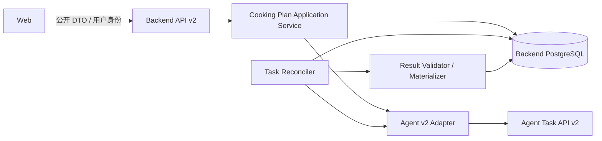
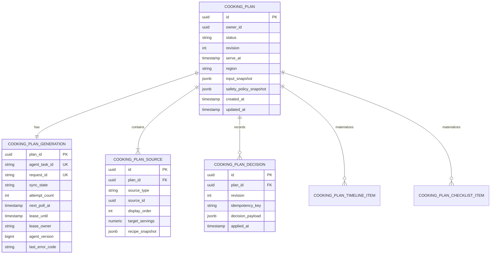
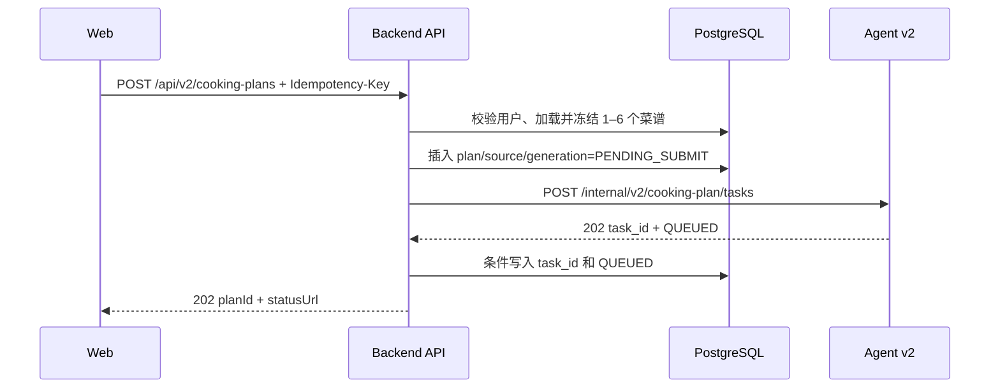
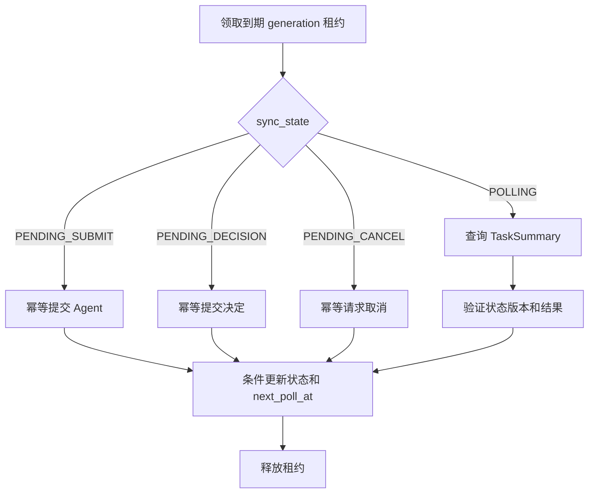

# 03：阶段 2——后端编排与持久化

- **状态：** Proposed
- **负责人：** Backend 负责人
- **最后更新：** 2026-08-02
- **相关仓库：** `foodmind-backend`、`foodmind-intelligence`
- **相关契约/ADR：** Backend 公开 OpenAPI、Agent 内部 OpenAPI、异步编排/数据模型 ADR（待创建）
- **未决问题：** migration 结构、结果物化粒度、Reconciler 租约参数

## 1. 阶段目标

Backend 从“同步转发 Agent v1”升级为 v2 公开资源的所有者和异步协调者。它必须在 Agent 暂时不可用、服务重启或用户刷新后仍能回答：计划是谁的、当前是什么状态、下一步能做什么。

## 2. 责任边界



Backend 负责：

- 用户认证、授权和资源所有权；
- 输入校验、菜谱快照和幂等创建；
- 公开 planId 与 Agent task_id 映射；
- 状态镜像、revision、取消和决定编排；
- 轮询 Agent、重试、恢复、协议校验和结果物化；
- 稳定公开错误码、限流、审计和观测。

Backend 不负责：

- 复刻 Agent 的解析、调度或食安推理；
- 将 Agent 内部数据库作为公开查询源；
- 让 Web 直接使用 Agent `location`；
- 通过 v1 回退悄悄减少菜谱数量或安全约束。

## 3. 数据模型

迁移编号需以仓库实际最新版本为准。建议采用新增表和新增列的可回滚迁移，避免直接破坏 v1 数据。



### 3.1 关键设计

- `COOKING_PLAN_SOURCE` 替代单一 `source_recipe_id` 表达 1–6 个来源；
- `source_type + source_id` 支持目录菜谱和用户菜谱，不复用不成立的单表外键；
- `recipe_snapshot` 保存不可变输入，来源后来编辑不会改变在途任务；
- `agent_task_id` 只在内部表出现；
- `revision` 用于确认并发控制；
- `agent_version` 或等价字段用于拒绝乱序状态覆盖；
- 原始 Agent 响应可短期保留为受控审计 JSON，但公开查询读取已验证、已物化结果；
- JSONB 仅保存演进快、非关系查询核心的快照；历史列表和状态查询字段保持结构化并建索引。

### 3.2 索引建议

- `cooking_plan(owner_id, created_at desc)`：用户历史列表；
- `cooking_plan(owner_id, id)`：所有权查询；
- `generation(next_poll_at, sync_state)` 部分索引：协调器领取任务；
- `generation(agent_task_id)` 唯一索引：下游任务映射；
- `source(plan_id, display_order)` 唯一索引：稳定菜谱顺序；
- `decision(plan_id, idempotency_key)` 唯一索引：决定幂等。

新增关键索引前使用真实查询执行 `EXPLAIN (ANALYZE, BUFFERS)`；记录查询收益、写放大和保留周期。

## 4. 创建流程



### 4.1 事务与下游调用

不要在持有长数据库事务时等待 Agent 网络调用。可采用：

1. 事务 A 写入 plan、source、generation=`PENDING_SUBMIT`；
2. 事务提交后调用 Agent；
3. 事务 B 用条件更新写入 `task_id`；
4. 若步骤 2/3 失败，由 Reconciler 以稳定 `request_id` 重试。

Agent 必须按 `request_id` 支持幂等提交，或 Backend 能通过安全查询/唯一键消除重复任务。仅依赖 HTTP 客户端“不重试”不能保证一致性。

### 4.2 公开创建幂等

- `(owner_id, Idempotency-Key)` 唯一；
- 相同 key + 相同规范化请求返回已有 plan；
- 相同 key + 不同请求返回 409；
- 幂等记录至少覆盖前端合理重试窗口；
- 请求哈希不包含不稳定字段顺序；
- 不使用 Agent `task_id` 作为公开 planId。

## 5. 菜谱快照与 Agent 请求映射

Backend 提交前构建 `CookingPlanInputSnapshot`：

- 来源类型、来源 ID、来源版本；
- 名称、份量、总耗时；
- 结构化食材、数量、单位和过敏原；
- 有序步骤、步骤时长、温度和设备；
- 厨房资源、库存批次、出餐时间和区域；
- 用户饮食限制与安全限制；
- 契约/领域 schema 版本。

映射策略：

- 受控目录菜谱和完整用户菜谱优先填充 `preparsed_candidates`，减少重新解析的不确定性；
- `recipes[].text` 保留给明确的自由文本兼容路径；
- 所有 recipe ID、步骤 ID 和资源 ID 在一次任务内稳定；
- 单位在 Backend 规范化，无法转换时拒绝生成并指出字段；
- 计划输入只引用已冻结快照，不在重试时重新读取已变化菜谱。

## 6. Agent v2 Adapter

建议提供窄接口便于测试替换：

```text
submitTask(request) -> TaskSubmitResponse
getTask(taskId) -> TaskSummary
cancelTask(taskId, requestId) -> TaskSummary
submitDecisions(taskId, revision, decisions, idempotencyKey) -> TaskSummary
```

实现要求：

- 基地址和 token 由配置/Secret 注入；
- 发送 `X-Contract-Version` 和 correlation/request ID；
- 连接超时、读取超时、总调用预算分别设置；
- GET 可短重试；POST 只有具备业务幂等键时才自动重试；
- 429/503 尊重 Retry-After；
- 4xx 协议错误与 5xx 暂时故障分开计数；
- DTO 强类型解析，未知 discriminator 进入 `AGENT_PROTOCOL_ERROR`；
- 响应大小设置上限；
- 日志只记录 task ID、plan ID、状态、耗时和错误码，不记录内部 token 或完整敏感配方。

## 7. Reconciler

Reconciler 处理三类记录：`PENDING_SUBMIT`、可轮询任务、待确认恢复/取消操作。



多实例要求：

- 使用 `FOR UPDATE SKIP LOCKED` 或原子条件更新领取短租约；
- 每条记录同时只有一个 lease owner；
- 租约过期可被其他实例接管；
- 网络调用不持有行锁；
- 更新时校验 lease owner、旧版本和当前 sync_state；
- 轮询间隔根据 Agent 建议、状态和错误次数退避并加抖动；
- READY 等终态停止轮询；
- 单条毒任务超过阈值进入可见失败/人工队列，不阻塞整个批次。

Web 的 GET 可以只读 Backend 状态；如产品要求更低延迟，可在严格限流下触发轻量刷新，但不能让每个浏览器轮询直接等比例打到 Agent。

## 8. 状态镜像与结果物化

Agent 摘要进入 Backend 后按以下顺序处理：

1. 校验契约版本和 JSON schema；
2. 校验 task_id/request_id 与本地映射一致；
3. 拒绝非法状态转换和旧版本；
4. 校验时间线引用的菜谱、步骤和资源属于输入快照；
5. 校验数值范围、时间排序和结果大小；
6. 在单个数据库事务中更新状态、revision 和物化结果；
7. 记录低基数指标，并以 correlation ID 保存协议错误。

READY 物化至少包含：

- 总历时、求解状态；
- 有序时间线项目；
- 每道菜完成时间；
- Mise en place 项；
- 完成检查项；
- 适用的食安策略快照。

不要在每次 Web GET 时重新解析 Agent 原始 JSON。

## 9. 确认、取消与竞态

### 9.1 提交决定

1. 锁定当前用户的计划行；
2. 校验状态 NEEDS_CONFIRMATION 和 revision；
3. 以幂等键写入 decision；
4. 将 generation 置为 `PENDING_DECISION`；
5. 返回 202；
6. Reconciler 调用 Agent decisions 端点；
7. 成功后 revision 递增并恢复 RUNNING。

### 9.2 取消

- 公开取消先写 `PENDING_CANCEL`，快速返回；
- Reconciler 请求 Agent 取消并同步结果；
- 取消已经终态的计划返回当前终态，保持幂等；
- READY 与 CANCELLED 竞态用 Agent 版本和条件更新决定，不做无条件最后写入覆盖；
- Web 文案区分“正在取消”和“已取消”。

## 10. API 安全

- 所有 plan 查询都带 owner 条件，禁止先按 ID 查再在业务层补判定；
- user_id 只从认证上下文派生；
- 菜谱 IDs 批量加载后逐个验证权限，禁止只验证第一个；
- 创建、决定、取消分别限流；
- Agent 内部 endpoint 和 token 永不出现在公开响应；
- 输入/结果大小、菜谱数和嵌套数组长度都有限制；
- 错误不泄漏 SQL、内部 URL、堆栈或策略实现细节；
- 审计记录用户、plan、动作、revision、结果和时间，但避免记录敏感食谱全文。

## 11. 迁移与回滚

- v2 表/列先新增，不改变 v1 endpoint；
- v2 Controller 和 Reconciler 受独立 feature flag 控制；
- schema migration 可回滚应用代码；若不能立即删除新表，记录前滚/清理策略；
- v1 计划历史继续按原模型读取；v2 历史按新模型读取；
- 多菜谱 v2 失败不得转写为单来源 v1 计划；
- 回滚时停止新 v2 创建，但继续查询或安全终结已创建 v2 计划。

## 12. 测试计划

### 12.1 单元与契约

- DTO 映射、状态穷尽、错误映射；
- 1–6 个混合来源菜谱快照；
- READY/确认/不可行/失败 fixture 解析；
- 幂等创建、决定和取消；
- revision 冲突和非法转换；
- 未知结果类型、超大响应、字段缺失。

### 12.2 数据库与集成

- 真实 PostgreSQL/Testcontainers 迁移；
- owner 访问控制和混合来源外键；
- 两个 Reconciler 实例的租约竞争；
- 租约过期接管、乱序响应和重复物化；
- Backend 重启后 PENDING_SUBMIT/POLLING 恢复；
- Agent 超时、429、503 和协议错误；
- 关键查询 `EXPLAIN ANALYZE`。

## 13. 交付拆分

1. `backend-v2-schema`：计划、来源、generation、decision 和结果迁移；
2. `backend-v2-public-api`：创建、查询、历史、取消、决定；
3. `backend-agent-v2-client`：强类型内部适配器；
4. `backend-v2-reconciler`：租约、轮询、重试和恢复；
5. `backend-v2-materializer`：结果校验和物化；
6. `backend-v2-security`：owner、限流、审计和错误脱敏；
7. `backend-v2-integration-tests`：PostgreSQL 与 Agent stub/真实 Agent 测试。

## 14. 退出标准

- 公开 v2 API 与阶段 0 OpenAPI 一致；
- Backend 可在重启后恢复在途任务；
- 1–6 个目录/用户菜谱能生成不可变快照；
- 公开 planId 与 Agent task_id 严格隔离；
- READY、NEEDS_CONFIRMATION、INFEASIBLE、FAILED、CANCELLED、EXPIRED 均正确物化；
- 重复创建、决定、取消和重复 Agent 响应不产生重复副作用；
- 多实例 Reconciler 竞争测试通过；
- 数据库迁移、回滚说明和关键 SQL 计划完成验证。
