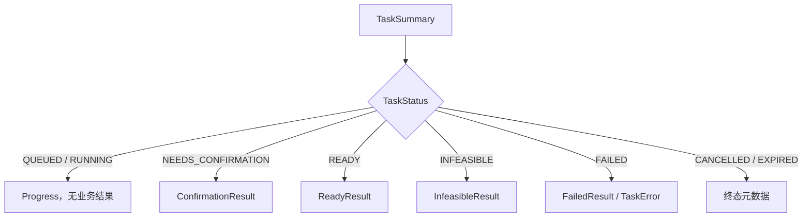
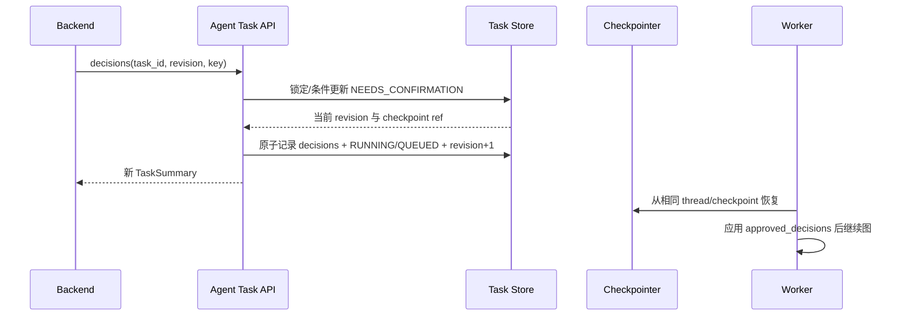
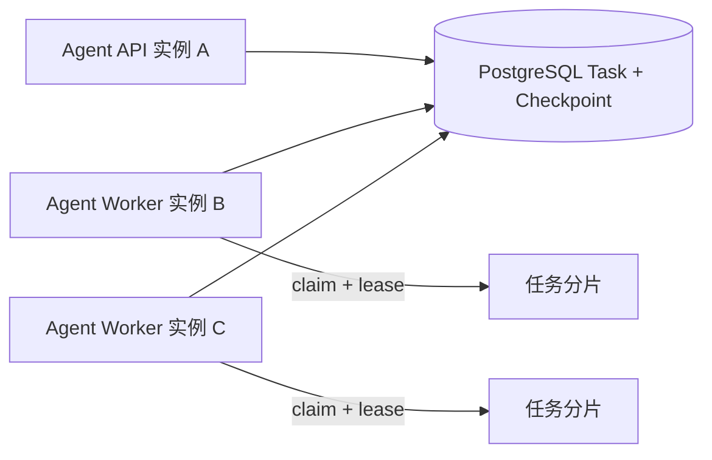

# 04：阶段 3——Agent v2 生产化

- **状态：** Proposed
- **负责人：** Intelligence / Cooking Agent 负责人
- **最后更新：** 2026-08-02
- **相关仓库：** `foodmind-intelligence`、`foodmind-backend`
- **相关契约/ADR：** Agent 内部 OpenAPI、Task/Checkpoint Store ADR（待创建）
- **未决问题：** decisions 恢复、协作取消、生产 PostgreSQL 存储

## 1. 阶段目标

本阶段从 `foodmind-intelligence/main@604518e` 的现有 v2 开始，不重建工作流。重点是把“已合入远端的异步 Agent”收敛为“契约稳定、可恢复、可观测、可多实例演进的内部服务”。

## 2. 已有基础

应直接复用并回归验证：

- `/internal/v2/cooking-plan/tasks` 提交、查询、取消；
- TaskStatus 和基础转换规则；
- SQLite 任务持久化、claim/renew lease、重试和最大尝试；
- Memory / SQLite Checkpointer；
- LangGraph 工作流；
- CP-SAT 分层多目标调度；
- 1–6 道菜输入；
- 区域食安政策；
- READY、NEEDS_CONFIRMATION、INFEASIBLE、FAILED 结果；
- 任务 TTL、Worker 并发、solver timeout 等配置。

共享备料已通过 PR #22 合入远端 `main@604518e`。后续无需重新移植，但必须在 v2 Task API、检查点、多目标调度和区域安全策略组合下重新验证确定性与安全隔离。

## 3. 工作流 A：强类型契约

### 3.1 请求与响应

- 为 `TaskSummary.result` 建立 discriminator 和强类型联合；
- 为 `error` 建立稳定错误码、retryable 和 correlation ID；
- 明确 `TaskStatus`、业务结果状态与 HTTP 状态三者的区别；
- 所有内部模型进入 OpenAPI，并以契约快照检测破坏性变化；
- 保留未知可选字段向前兼容，拒绝未知必需结果类型；
- 明确 `schema_version="1.0"` 是领域结构，而 `/internal/v2` 是传输协议版本。

### 3.2 建议的响应关系



状态和结果类型不匹配时由 Agent 自身拒绝持久化或返回协议错误，不能留给 Backend 猜测。

## 4. 工作流 B：确认决定与恢复

这是现有 v2 最大的功能缺口。虽然状态允许 `NEEDS_CONFIRMATION → RUNNING`，当前 Task API 没有 decisions/resume 端点，服务层也没有完整恢复方法。

### 4.1 端点

```text
POST /internal/v2/cooking-plan/tasks/{task_id}/decisions
```

请求至少包含：

- `plan_revision`；
- `decisions[]`，每个包含稳定 decision/option ID；
- `idempotency_key` 或请求 ID；
- 可选 correlation ID。

### 4.2 原子语义



实现要求：

- 只有 NEEDS_CONFIRMATION 可恢复；
- revision 不匹配返回 409，不覆盖新决定；
- 同一幂等键重复请求返回相同结果；
- 决定与任务状态更新在同一事务或等价原子边界内；
- 检查点缺失时转为稳定不可恢复错误，不从头静默重算；
- 恢复沿用原 request/user/input snapshot；
- 安全硬约束不允许通过 approved decision 关闭；
- NEEDS_CONFIRMATION 的 TTL 应给用户足够响应时间，并区别于运行中 TTL。

## 5. 工作流 C：真实进度

当前 progress 主要反映排队/完成。v2 首发至少提供低基数、单调的阶段进度：

| 阶段 | 建议范围 | 说明 |
| --- | --- | --- |
| QUEUED | 0–5 | 已接收、等待 Worker |
| PARSING | 5–25 | 解析/校验候选菜谱 |
| NORMALIZING | 25–40 | 单位、份量、安全约束 |
| SCHEDULING | 40–75 | 资源约束与多目标求解 |
| VALIDATING | 75–90 | 计划和食安验证 |
| FINALIZING | 90–99 | 生成清单与持久化 |
| READY | 100 | 终态 |

要求：

- 进度由工作流节点事件写入，不由耗时猜测；
- 百分比只单调增加，恢复后不倒退；
- `stage` 是稳定枚举，`message` 可本地化；
- Worker 写进度使用版本/租约条件，旧 Worker 不覆盖新 Worker；
- 高频节点事件节流，避免放大存储写入；
- NEEDS_CONFIRMATION 显示等待用户而非 100%。

## 6. 工作流 D：协作取消

现有取消能写入 CANCELLED 并阻止最终结果覆盖，但不保证立即中断底层图或求解器。

改进点：

- 每个主要图节点入口检查取消标志；
- 长循环、外部调用和调度阶段增加安全检查点；
- 能取消的异步 I/O 传递 cancellation signal；
- CP-SAT 等不可安全瞬停区间明确最大超时；
- Worker 发现租约丢失或状态已取消时停止后续写入；
- 取消完成前保留 `CANCEL_REQUESTED` 内部语义，公开可显示“正在取消”；
- 最终条件写入保证 READY/CANCELLED 竞态可重复、可解释。

不要宣称“取消后计算立即停止”，除非已有节点级与求解器级证据。

## 7. 工作流 E：Feature Flag 与服务生命周期

现有 `task_api_enabled=false` 默认值需要安全行为：

- 关闭时路由返回稳定 `503 TASK_API_DISABLED`，而不是访问未初始化服务后 500；
- readiness 明确区分“进程存活”和“Task API 可接流量”；
- 启动时校验 token、task store、checkpointer、策略包和 schema；
- Worker 与 Web 进程的启动/关闭顺序可配置；
- 优雅关闭先停止领取新任务，再等待/释放在途租约；
- 配置变更记录安全值和版本，不记录 secret。

## 8. 工作流 F：任务与检查点存储

### 8.1 本地和单实例

SQLite 可继续用于：

- 本地开发；
- CI；
- 明确单实例的受控测试环境。

要求启用合理 busy timeout、WAL/事务策略，验证进程崩溃后文件恢复，并确保 task DB 与 checkpoint DB 有持久卷。

### 8.2 多实例生产

多主机不能共享本地 SQLite 文件。生产横向扩展前需实现 PostgreSQL 或等价共享存储：



存储接口需覆盖：

- 幂等 create/get；
- 按状态和到期时间 claim；
- owner + lease version 条件续租；
- 状态/进度/结果条件写入；
- 决定和 revision 原子更新；
- TTL/归档清理；
- checkpoint 按 thread/task/revision 读取和保存。

数据库时间作为租约时间源，避免主机时钟漂移。迁移需对 claim 查询做并发测试和 `EXPLAIN ANALYZE`。

## 9. 工作流 G：重试、过期与故障恢复

- 区分可重试基础设施故障、不可重试输入错误和业务不可行；
- 重试沿用同一 task/request ID，不重复产生业务结果；
- attempt 递增且有最大值；
- 租约丢失的 Worker 不得最终提交；
- Worker 崩溃后由新 Worker 从最近有效 checkpoint 恢复；
- 运行中 TTL、等待确认 TTL、终态保留 TTL 分开配置；
- EXPIRED 是显式终态，并保存过期原因；
- 清理任务前确保 Backend 已同步终态或通过保留窗口覆盖最长故障期；
- 对毒任务提供隔离和人工排查信息。

## 10. 工作流 H：安全与资源治理

- 保留内部 token 认证并使用常量时间比较；
- 内部入口设置请求大小、菜谱数量、文本长度和数组长度上限；
- user_id 仅用于上下文和审计，不让 Agent 反向访问用户资源；
- LLM/搜索默认关闭的配置保持 fail-closed；
- 外部调用都有超时、并发上限和受控重试；
- Worker 全局并发与单租户/用户公平性分开考虑；
- solver 超时返回可解释结果，不能无限占用 Worker；
- 区域策略未加载时拒绝执行，而不是静默使用错误区域；
- 输出日志不包含 token、完整敏感输入或不必要的个人信息。

## 11. 可观测性

### 11.1 指标

- `task_submit_total{outcome}`；
- `task_active{status}`；
- `task_queue_age_seconds`；
- `task_duration_seconds{terminal_status}`；
- `task_stage_duration_seconds{stage}`；
- `task_attempts_total`、`lease_lost_total`；
- `checkpoint_restore_total{outcome}`；
- `confirmation_wait_seconds`；
- `solver_duration_seconds{status}`；
- `policy_region_total{region}`；
- `protocol_error_total{code}`。

task_id、user_id、request_id 不作为指标标签，避免高基数；它们只进入结构化日志和 trace。

### 11.2 追踪

Backend 的 correlation/request ID 贯穿 Agent API、Task Store、Worker、工作流节点和 solver。日志至少包含 task_id、状态、revision、attempt、lease owner、stage、耗时和稳定错误码。

## 12. 测试计划

### 12.1 保留回归

- 现有 Task API 和 task store 测试；
- 检查点持久化与恢复；
- 多目标调度确定性和超时；
- 不同区域食安策略；
- 1–6 道菜边界和四类业务结果。

### 12.2 新增重点

- decisions 成功、revision 冲突、重复幂等、检查点缺失；
- NEEDS_CONFIRMATION → RUNNING → READY 完整恢复；
- 节点进度单调与恢复不倒退；
- 取消在排队、节点间、求解中和完成竞态；
- flag 关闭时 503；
- lease 丢失、Worker 崩溃、续租失败和重试耗尽；
- SQLite 重启恢复；
- PostgreSQL 多 Worker claim/lease 并发；
- schema/OpenAPI 兼容性；
- token 缺失/错误、请求过大、未知区域。

### 12.3 验证门禁

- 从持久 v2 分支运行完整 pytest，而不只运行定向套件；
- 覆盖率不低于仓库现有门禁；
- mypy/ruff/格式检查按仓库配置通过；
- OpenAPI 变更经过 breaking-change 检查；
- 生产存储实现通过故障注入和并发测试。

## 13. 交付拆分

1. `agent-v2-baseline`：复验 `foodmind-intelligence@604518e` 并全量回归；
2. `agent-v2-typed-contract`：结果联合、错误和 OpenAPI；
3. `agent-v2-resume`：decisions 端点、revision 和 checkpoint 恢复；
4. `agent-v2-progress-cancel`：真实进度与协作取消；
5. `agent-v2-lifecycle`：flag、readiness、优雅关闭；
6. `agent-v2-postgres-store`：共享 Task Store 与 Checkpointer；
7. `agent-v2-observability`：指标、追踪、清理和容量门禁；
8. `agent-v2-shared-prep`：验证已合入共享备料与 v2 全链路的兼容性。

## 14. 退出标准

- v2 基线已进入稳定 Git 历史；
- 内部 OpenAPI 为强类型且 Backend 契约测试通过；
- 确认决定可从持久检查点恢复，revision/幂等正确；
- 进度来自节点且单调，取消行为和不可中断窗口有证据；
- 关闭 Task API 时返回稳定不可用状态；
- 单实例 SQLite 的适用边界被强制记录；
- 多实例上线前 PostgreSQL Task Store 与 Checkpointer 通过并发和故障恢复验证；
- 完整测试、类型、lint、覆盖率和 OpenAPI 门禁通过；
- 关键指标、滞留告警和清理策略可用。
