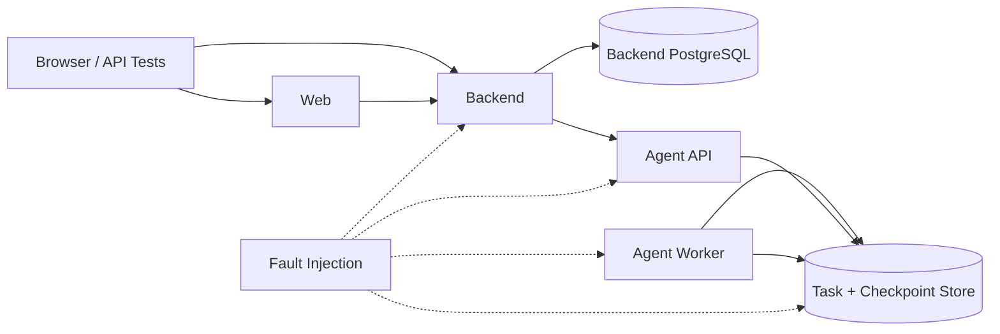
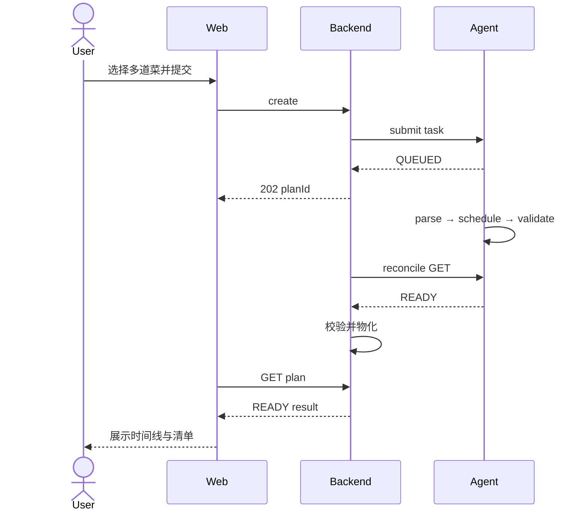
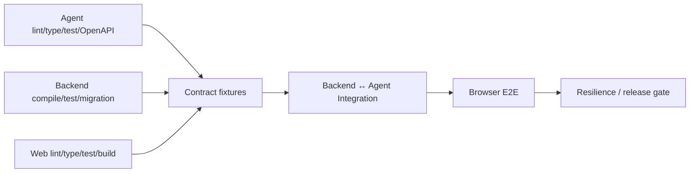

# 05：阶段 4——三端集成与质量门禁

- **状态：** Proposed
- **负责人：** 跨仓库集成与 QA 负责人
- **最后更新：** 2026-08-02
- **相关仓库：** `foodmind-web`、`foodmind-backend`、`foodmind-intelligence`
- **相关契约/ADR：** 阶段 0 契约、UAT/traceability 记录（待创建）
- **未决问题：** 性能基线与发布阈值、故障注入环境

## 1. 阶段目标

验证 Web、Backend、Agent v2 组成的是一个可恢复的分布式工作流，而不只是三个各自通过单测的服务。主路径、确认路径、取消路径、故障恢复和安全边界必须在接近生产的环境中形成证据。

## 2. 集成环境

建议用 Docker Compose 或现有等价环境提供：

- Web 生产构建或接近生产的开发服务器；
- Backend；
- PostgreSQL；
- Agent API + Worker；
- Agent Task Store / Checkpointer；
- 可控的 Agent stub，用于稳定模拟错误和竞态；
- 统一的日志、trace 和指标采集。

测试环境不使用真实生产 secret；时间、随机数和外部 LLM/search 应可固定或替换，保证核心契约测试可重复。

## 3. 测试分层

| 层级 | 目标 | 主要工具/方式 |
| --- | --- | --- |
| Schema | 检测破坏性 OpenAPI/JSON 变化 | OpenAPI diff、fixture validation |
| Contract | Backend 与 Agent 独立演进 | provider/consumer fixtures、stub |
| Component | 单服务 + 真实存储 | pytest、Backend 集成测试、Testcontainers |
| Service integration | Backend ↔ 真实 Agent | HTTP + PostgreSQL/Task Store |
| Browser E2E | 用户可见主流程 | Playwright 或仓库既有浏览器方案 |
| Resilience | 重启、超时、乱序、租约 | 故障注入、进程重启、网络代理 |
| Performance | 提交、队列、执行、查询容量 | 受控负载测试 |

## 4. 契约夹具

阶段 0 生成版本化 fixture：

- 最小/最大创建请求；
- TaskSubmitResponse；
- QUEUED、RUNNING 与各 progress stage；
- NEEDS_CONFIRMATION 及多个问题；
- READY：并行时间线、共享备料、清单、区域策略；
- INFEASIBLE：多原因与安全替代项；
- FAILED：可重试与不可重试；
- CANCELLED、EXPIRED；
- revision conflict、unknown discriminator、缺失字段和超大结果。

Agent provider test 证明能产生契约；Backend consumer test 证明能解析并映射；Web test 只消费公开 Backend fixture，不依赖内部 snake_case。

## 5. 核心 E2E 场景

### 5.1 主成功路径

验证点：

- 1 道与 6 道菜都成功；
- 混合目录菜谱和用户菜谱；
- 来源顺序和目标份量保持；
- Agent task_id 不出现在浏览器响应；
- 时间线只引用输入快照中的菜谱、步骤和资源；
- Web 终态后停止轮询。

### 5.2 确认恢复

- Agent 返回 NEEDS_CONFIRMATION；
- Backend 公开结构化问题和当前 revision；
- Web 提交决定；
- 重复提交同一 Idempotency-Key 不重复应用；
- 旧 revision 返回 409；
- Agent 从同一 checkpoint 恢复；
- 最终 READY 的修订号和已批准决定可审计；
- Backend/Web 在等待确认期间重启仍可继续。

### 5.3 取消

- QUEUED 时取消；
- RUNNING 节点之间取消；
- 求解不可中断区间取消并在边界生效；
- READY 与取消同时发生；
- 重复取消；
- Backend 请求取消后重启；
- Agent Worker 丢失租约后不得回写 READY 覆盖 CANCELLED。

### 5.4 刷新与恢复

- 提交得到 planId 后立即刷新；
- 多标签页打开同一计划；
- 短暂断网后恢复；
- Backend 滚动重启；
- Agent API 重启；
- Worker 处理中崩溃，由其他 Worker 接租约并从 checkpoint 恢复；
- SQLite 单实例重启恢复和 PostgreSQL 多实例接管分别验证。

### 5.5 不可行与安全

- 出餐时间过短；
- 厨房资源冲突；
- 过敏原和饮食限制无法满足；
- SG/US 等不同区域政策产生正确约束；
- 未知区域 fail-closed；
- INFEASIBLE 与系统 FAILED 的公开表现不同；
- 不安全的用户决定被拒绝；
- 多菜谱失败不降级为 v1 单菜谱。

## 6. 状态转换矩阵测试

| 起始状态 | 操作/事件 | 期望状态 | 重点断言 |
| --- | --- | --- | --- |
| 无 | create | QUEUED | 幂等创建、快照完整 |
| QUEUED | worker claim | RUNNING | 单 Worker 租约 |
| RUNNING | question | NEEDS_CONFIRMATION | checkpoint 可恢复 |
| NEEDS_CONFIRMATION | valid decisions | RUNNING | revision +1 |
| RUNNING | valid result | READY | 原子物化 |
| RUNNING | no safe schedule | INFEASIBLE | 非系统错误 |
| QUEUED/RUNNING | cancel | CANCELLED | 重复操作幂等 |
| 非终态 | TTL | EXPIRED | 原因与清理窗口 |
| RUNNING | non-retryable fault | FAILED | 稳定错误码 |
| 任意终态 | late response | 不变 | 旧版本不得覆盖 |

每一条非法转换也要有负向测试，不能只测试合法路径。

## 7. 故障注入

### 7.1 Backend ↔ Agent

- 连接拒绝、DNS/路由错误；
- 响应超时；
- 429 + Retry-After；
- 502/503；
- HTTP 200 但 schema 非法；
- 响应截断或超过大小限制；
- 重复 task_id、request_id 不匹配；
- 先返回较新状态后返回旧状态。

### 7.2 存储和 Worker

- Backend 事务提交后、Agent 提交前崩溃；
- Agent 已接收但 Backend 未保存 task_id 时崩溃；
- Reconciler 拿到租约后崩溃；
- Worker checkpoint 后、状态写入前崩溃；
- 数据库短暂不可用；
- 租约续租失败；
- 两个 Worker 同时尝试完成；
- 清理任务与 Backend 最后一次同步竞争。

每个故障都应回答：是否重复执行、谁会重试、何时终止、用户看到什么、怎样通过日志/指标定位。

## 8. 性能与容量门禁

异步链路不能继续使用“整个生成必须小于 800 ms”的 v1 假设。分别度量：

| 指标 | 目标思路 |
| --- | --- |
| 公开创建 API | 快速落库并提交/登记，不等待工作流完成 |
| Agent submit API | 快速持久化任务并返回 202 |
| 公开 GET | 只读 Backend 物化状态，稳定低延迟 |
| 队列等待 | 按并发和容量设置 SLO |
| Agent 执行 | 按菜谱数/调度复杂度分桶观察 p50/p95/p99 |
| 确认恢复 | 决定提交快速返回，恢复任务不重复解析不变部分 |
| Reconciler lag | Agent 终态到 Backend 可见的延迟有上限 |

负载场景：

- 稳态创建/查询混合流量；
- 突发同时出餐时段；
- 1 道与 6 道菜的复杂度分布；
- 大量任务等待确认；
- Agent 降速时轮询退避；
- 单 Worker/多 Worker 容量和数据库 claim 热点。

阈值应在基准后写入 CI/发布门禁，而不是凭空设定。至少要确保队列无界增长、数据库连接耗尽和轮询风暴能被测试发现。

## 9. 安全验证

- 用户 A 无法读取、取消或决定用户 B 的计划；
- 自有菜谱 ID 不能越权引用；
- Web bundle 和网络响应不包含内部 token/Agent URL；
- 错误和日志无 token、SQL、堆栈和不必要的个人数据；
- 富文本/错误消息按不可信内容处理；
- 请求数量、深度、文本和响应大小限制生效；
- 内部 API 无 token、错 token、错契约版本均失败；
- 重放 decisions 请求只能得到幂等结果；
- 安全区域和过敏原约束不能由客户端字段删除。

## 10. 数据质量验证

- 目录和用户菜谱快照字段等价；
- 不再用虚假 1 分钟填充缺失耗时；
- 数量和单位缺失时有明确资格状态；
- 份量缩放后数值和单位保持合理；
- 同一输入在可控随机种子/求解设置下结果满足确定性要求；
- 共享备料不会合并语义不同或安全隔离的食材；
- READY 结果中没有负时长、重叠占用同一独占资源或出餐后才完成的关键步骤。

## 11. CI 门禁

每个仓库先运行本仓库门禁，再运行跨服务契约和集成套件：

快速 PR 门禁运行稳定子集；完整故障注入、并发和负载测试可在合并后或发布候选流水线运行，但不得在生产首次验证。

## 12. 退出标准

- 三端契约 fixture 和破坏性变更检测通过；
- 主成功、确认恢复、取消、刷新恢复和所有终态 E2E 通过；
- Backend/Agent 重启及 Worker 租约接管有自动化证据；
- owner 越权、内部 token 和不可信输出安全测试通过；
- 性能基准形成明确发布阈值；
- v1/v2 共存不会串写数据或静默降级；
- 所有失败测试可通过 correlation ID 串联三端日志。
