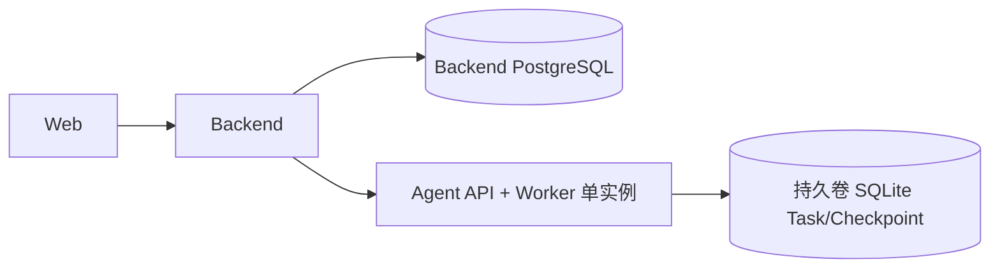
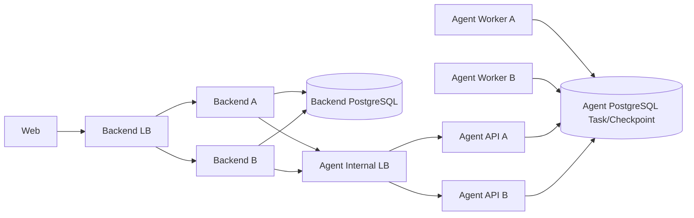
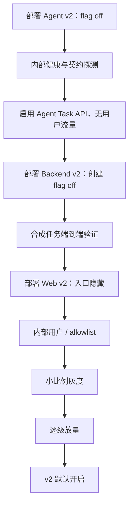
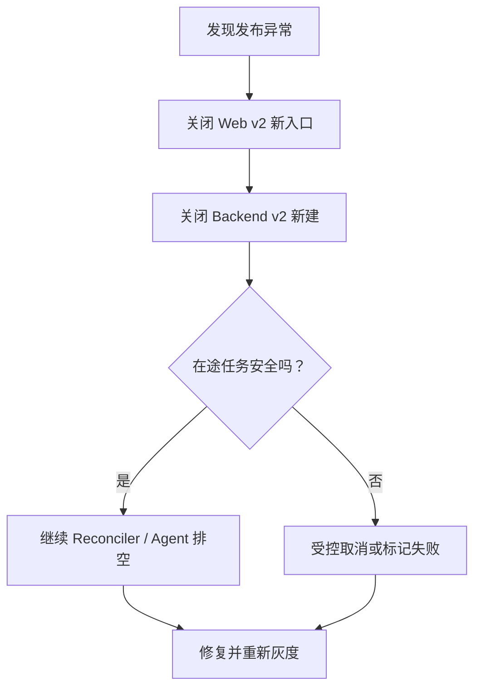

# 06：阶段 5——发布与可观测性

- **状态：** Proposed
- **负责人：** Release / Operations 负责人
- **最后更新：** 2026-08-02
- **相关仓库：** `foodmind-web`、`foodmind-backend`、`foodmind-intelligence`、`foodmind-docs`
- **相关契约/ADR：** 部署拓扑、Task Store ADR、发布 Runbook（待创建）
- **未决问题：** SLO 数值、灰度平台、生产存储容量

## 1. 阶段目标

以可灰度、可暂停、可回滚的方式发布 v2。发布顺序先保证下游 Agent v2 可用，再启用 Backend v2，最后给 Web 用户开放入口；回滚则反向关闭新流量，同时妥善处理已创建任务。

## 2. 环境配置

### 2.1 Agent

需要显式管理：

- Task API enable flag；
- 内部 token / Secret 引用；
- Task Store DSN、Checkpoint Store DSN；
- Worker 并发、claim batch、lease duration、renew interval；
- 最大尝试次数和重试退避；
- 运行中、等待确认和终态保留 TTL；
- solver timeout / optimization level；
- 默认区域和已加载政策包；
- LLM/search feature flags；
- 请求/响应大小和配方数量上限。

约束：

- 本地和受控单实例可用持久卷 SQLite；
- 多实例生产必须使用共享 Task Store 和 Checkpointer；
- `lease_duration` 必须显著大于正常续租间隔；
- token 轮换支持新旧短暂重叠或无损滚动；
- readiness 只有在存储、策略包和 Worker 模式满足服务角色时才成功。

### 2.2 Backend

- Agent base URL、内部 token、契约版本；
- 连接/读取超时、重试和熔断参数；
- Reconciler enable、batch、lease 和 polling backoff；
- v2 创建 feature flag 与用户灰度规则；
- v1 compatibility flag；
- 每用户创建/查询/确认/取消限流；
- 原始 Agent 响应保留与脱敏策略。

### 2.3 Web

- v2 入口 flag；
- 公开 API base URL；
- 轮询上下限和页面隐藏退避；
- READY 结果组件和确认组件的能力开关；
- 不配置任何 Agent URL 或内部 token。

## 3. 部署拓扑

### 3.1 单实例试运行

仅适合开发、内部试用或明确接受单实例风险的灰度环境。必须验证 Pod/进程重启后持久卷仍在。

### 3.2 多实例生产

API 和 Worker 可同进程起步，但需要明确服务角色、优雅关闭和容量边界。多实例上线门禁不能仅凭 SQLite 单机测试通过。

## 4. 发布前检查

- Agent v2 提交已在正式 Git 历史；
- 数据库迁移在生产规模副本上演练；
- OpenAPI 契约版本完全匹配；
- Secret 已创建并验证轮换方案；
- Task/Checkpoint 存储备份和恢复演练完成；
- Feature flag 默认关闭；
- 仪表盘和告警先于流量启用；
- E2E、恢复、负载和安全门禁通过；
- v1 兼容窗口和回滚责任明确；
- 支持人员知道 correlation ID、状态滞留和手动终结流程。

## 5. 发布顺序

### 5.1 阶段性放量

每一级至少观察：

- 创建成功率；
- Agent submit 成功率；
- 队列年龄和 RUNNING 滞留；
- READY / NEEDS_CONFIRMATION / INFEASIBLE / FAILED 比例；
- p95/p99 完成时间，按菜谱数分桶；
- Backend Reconciler lag；
- checkpoint 恢复、租约丢失和重试耗尽；
- v1/v2 流量与用户反馈；
- 数据库连接、CPU、内存和存储增长。

只有指标稳定且样本足够才扩大，不以“没有收到投诉”代替观测证据。

## 6. SLI、SLO 与仪表盘

### 6.1 用户层

- v2 创建 API 可用率与延迟；
- 计划最终到达业务终态的比例；
- 可重试基础设施失败率；
- Agent 已终态到 Web 可见的同步延迟；
- 确认提交成功率和恢复时间；
- 取消最终生效率；
- 各状态滞留数量和年龄。

### 6.2 服务层

| 仪表盘 | 核心图表 |
| --- | --- |
| Web/API | 创建/查询 QPS、错误码、轮询频率、429 |
| Backend | Reconciler lag、claim、重试、Agent 调用结果、物化错误 |
| Agent Queue | queued/running、queue age、attempt、lease lost |
| Agent Workflow | stage duration、solver、policy region、result distribution |
| Storage | 连接池、锁等待、慢查询、DB 大小、checkpoint 增长 |
| Migration | v1/v2 创建量、活跃客户端、回退/阻断原因 |

SLO 数值在阶段 4 基准后确定。所有比率要排除明确的用户取消和业务 INFEASIBLE，避免把产品结果误报为基础设施不可用。

## 7. 告警

建议告警条件：

- 创建或查询 API 错误率持续超阈值；
- 队列最老任务年龄持续增长；
- RUNNING 超过执行阈值；
- NEEDS_CONFIRMATION 超过产品 TTL；
- Reconciler lag 超过 Web 可接受窗口；
- lease_lost 或 retry_exhausted 突增；
- Agent 协议错误出现；
- checkpoint restore 失败；
- Task Store/Backend DB 连接池接近耗尽；
- 清理失败导致存储持续增长；
- 某区域策略加载失败；
- v2 FAILED 比例相对基线显著异常。

告警应附 runbook、仪表盘和 correlation/task/plan 查询方式，不能只发一条无法操作的错误消息。

## 8. 结构化日志与追踪

### 8.1 关联字段

- `correlation_id`：一次外部请求/后台动作；
- `public_plan_id`：Backend 公开资源；
- `agent_task_id`：仅内部日志；
- `request_id`：逻辑任务幂等标识；
- `revision`、`attempt`、`stage`、`status`；
- `service`、`version`、`environment`。

### 8.2 脱敏

- 不记录 token、Cookie、Authorization header；
- 默认不记录完整菜谱文本、用户过敏原详情或决定自由文本；
- 指标 label 不使用用户 ID、plan ID、task ID；
- 原始结果调试日志需受采样、访问控制和保留期约束；
- correlation ID 可展示给用户，但内部 task ID 不作为公共支持接口。

## 9. 容量与成本

- 按 recipe_count、步骤数和 solver complexity 分析执行成本；
- Worker 并发上限应由 CPU/内存/solver 基准决定；
- Backend 轮询频率根据 Agent 状态退避，避免内部放大；
- Web GET 优先读 Backend，使用缓存/ETag 降低重复负载；
- 等待确认任务不占 Worker，但占存储，应独立计算 TTL；
- Task/Checkpoint/原始结果分别设保留期和清理批次；
- 清理使用小批量和索引，避免大事务锁表；
- 区分用户重试和系统重试，防止同一失败任务放大成本。

## 10. 回滚策略

### 10.1 原则

回滚不等于删除 v2 数据或把 v2 多菜谱请求转成 v1。优先停止新流量，并保持已有资源可查询、可终结。

### 10.2 顺序

- 不先关闭 Agent Worker，否则 Backend 中的在途任务无法收敛；
- 若 Agent 新版本协议不兼容，先保持兼容实例或按契约版本路由；
- Backend 应用回滚仍需认识 v2 数据，至少提供只读/终结能力；
- 数据库新增表通常保留，使用前滚修复；禁止未经验证直接删除；
- 只有 v1 请求本来就语义等价时才允许显式切回 v1；多菜谱和确认恢复不可静默降级。

## 11. Runbook

至少编写：

- 任务长时间 QUEUED；
- RUNNING 滞留与 Worker 租约丢失；
- NEEDS_CONFIRMATION 过期；
- Backend 与 Agent 状态不一致；
- checkpoint restore 失败；
- 数据库连接/锁等待异常；
- 区域策略包加载失败；
- 批量失败时暂停灰度；
- 安全地取消/终结单个毒任务；
- v2 回滚与重新放量。

Runbook 操作需保留审计，不允许通过直接随意改数据库跳过状态机。

## 12. 退出标准

- Agent → Backend → Web 的顺序发布和合成验证成功；
- 灰度指标达到阶段 4 定义的放量阈值；
- 关键状态、队列、租约、同步延迟和存储均有仪表盘与告警；
- SQLite 和 PostgreSQL 的允许环境被部署配置强制区分；
- 备份恢复、滚动重启和回滚演练通过；
- 关闭新 v2 流量后，在途任务仍能查询和安全收敛；
- 运维 Runbook 可由非开发者按 correlation ID 执行。
