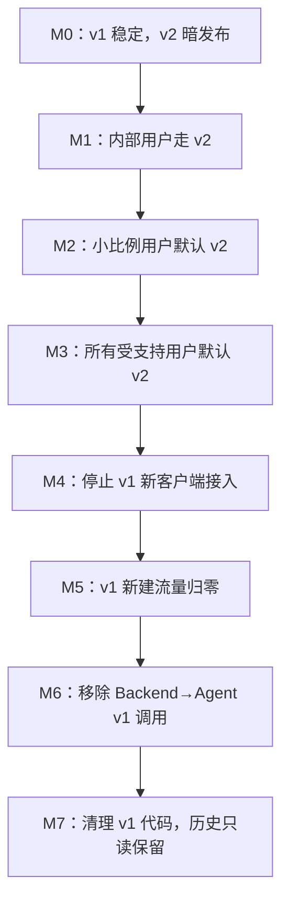
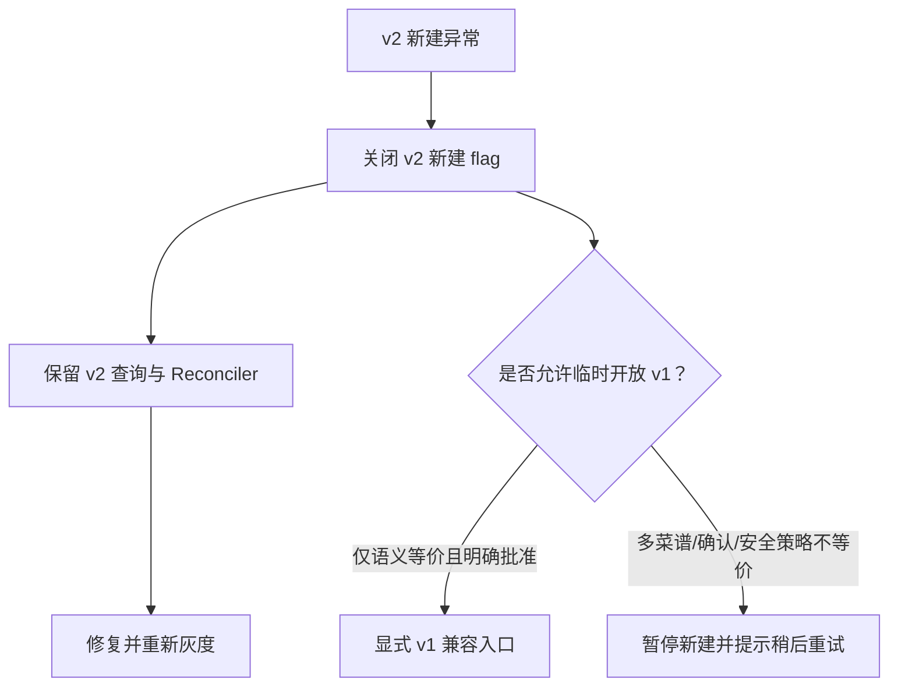

# 07：阶段 6——v1 迁移与退役

- **状态：** Proposed
- **负责人：** Cooking Plan 跨仓库集成负责人
- **最后更新：** 2026-08-02
- **相关仓库：** `foodmind-web`、`foodmind-backend`、`foodmind-intelligence`
- **相关契约/ADR：** v1/v2 OpenAPI、弃用与数据保留 ADR（待创建）
- **未决问题：** 兼容客户端清单、观察窗口、历史数据保留期

## 1. 阶段目标

v1 是迁移期兼容路径，不再承担未来架构。只有当 v2 覆盖用户、稳定性和运维要求后，才逐步停止 v1 新建、移除内部调用，最后清理代码和数据结构。

## 2. 共存原则

- `/api/v1/cooking-plans/generate` 在兼容窗口保持原语义；
- `/api/v2/cooking-plans` 是新异步入口；
- v1 和 v2 使用可区分的数据版本/来源，不互相覆盖；
- Web v2 只调用公开 v2，不先调 v2 失败后自动调 v1；
- v1 历史计划继续可读，不要求强制重算为 v2；
- 多菜谱、确认恢复、区域策略等 v2 特性不存在语义等价 v1 回退。

## 3. 能力对照

| 能力 | v1 | v2 | 迁移处理 |
| --- | --- | --- | --- |
| 生成方式 | 同步 | 异步任务 | 新 UI 默认 v2 |
| 菜谱数量 | 现有语义偏单菜谱 | 1–6 | 不向下转换 |
| 状态 | 简化成功/回退/失败 | 完整任务状态机 | 历史显示适配各自模型 |
| 确认恢复 | 无 | 有 | 只在 v2 开放 |
| 刷新恢复 | 有限 | 持久 planId | v2 状态页替代同步等待 |
| 调度 | v1 工作流 | 多目标调度 | 以 v2 为默认 |
| 区域食安 | 有限/旧模型 | 策略包 | v2 独立验证 |
| 内部端点 | `/internal/v1/.../generate` | `/internal/v2/.../tasks` | Backend 分客户端维护 |

## 4. 迁移阶段

### M0：暗发布

- 部署 Agent v2 和 Backend v2，但 Web 不展示入口；
- 合成任务验证任务生命周期；
- 建立 v1/v2 指标分组；
- 不改用户默认行为。

### M1–M2：受控灰度

- allowlist/小比例用户使用 v2；
- 按菜谱数量、来源类型、区域和复杂度分层；
- 收集失败、确认率、完成时长和用户放弃率；
- 问题通过 flag 停止新 v2，不迁移在途任务到 v1。

### M3：v2 默认

- 新版 Web 创建入口全部走 v2；
- v1 仅服务旧客户端或明确兼容调用者；
- 文档、客服和运行手册以 v2 为主；
- 继续观察 v1 活跃客户端版本和调用方。

### M4–M5：停止 v1 新建

- 公告弃用时间和升级路径；
- 对已知调用方逐一确认；
- v1 返回 Deprecation/Sunset 等现有网关支持的标准头；
- 先阻止新客户端接入，再让旧客户端流量归零；
- 需要时按客户端版本返回可操作升级提示。

### M6–M7：安全移除

- Backend 不再调用 Agent v1 内部端点；
- Agent v1 路由先关闭、观察，再删除；
- 删除 v1 回退分支和配置；
- v1 历史数据继续通过兼容读取模型展示；
- 数据库旧列/约束只有在确认无读取者、完成备份和迁移后才清理。

## 5. 流量判定

v1 退役不能只看公开 endpoint 总 QPS。需要区分：

- Web 版本；
- 移动端/第三方客户端（若存在）；
- 内部测试和合成流量；
- v1 历史查询与 v1 新建；
- Backend 到 Agent v1 的实际调用；
- 自动化脚本、旧文档示例和监控探针。

日志和指标使用低基数 `api_version`、`client_family`、`operation` 标签；未知调用方通过受控日志定位。

## 6. 数据迁移

### 6.1 不强制转换历史结果

v1 计划缺少 v2 的多来源、revision、Agent task 和结构化结果。默认做法：

- 保留 v1 原数据；
- 读取时根据 `plan_version` 使用对应展示 DTO；
- 不伪造 v2 task_id、progress 或 confirmation；
- 用户要重新生成时，创建一个新的 v2 plan，并显式引用旧计划来源（若产品需要）。

### 6.2 结构清理条件

清理旧 `source_recipe_id` 或状态约束前：

1. 证明所有生产读取路径已兼容；
2. 证明无 v1 新写入；
3. 完成数据备份和还原演练；
4. 对历史显示做抽样对账；
5. 使用分阶段 migration，先停止使用，再删除；
6. 明确回滚只能通过备份/前滚恢复还是可直接回滚。

## 7. 客户端迁移

- 新 Web 版本不再调用 v1 generate；
- 状态页面始终以 planId 查询，不依赖同步响应对象；
- 旧书签/历史详情仍可打开 v1 计划；
- SDK 或 API 文档把 v2 标为默认；
- 示例代码展示 202 + polling + confirmation，而非等待同步结果；
- 客户端遇到 v1 Sunset 应给出升级提示，不无限重试；
- 确认没有浏览器代码引用 Agent 内部 v1/v2 地址。

## 8. 退役门禁

进入“停止 v1 新建”前必须满足：

- v2 已覆盖所有计划创建 UI；
- v2 READY/基础设施失败指标在约定观察窗内达标；
- 确认、取消、刷新恢复和重启恢复稳定；
- v2 能处理所有受支持菜谱来源和区域；
- 无必须依赖 v1 的已知客户端；
- 回滚 v2 时可以关闭新建并排空任务，不依赖 v1 数据转换。

进入“删除 v1 代码”前必须满足：

- v1 新建流量连续为零，观察窗覆盖最长客户端升级周期；
- Backend 到 Agent v1 调用为零；
- v1 端点关闭后没有未识别告警；
- v1 历史读取已与 v1 生成逻辑解耦；
- 代码搜索、配置、OpenAPI、部署和告警中不再有运行依赖；
- 已批准删除/迁移清单和恢复方案。

## 9. 回退边界

宁可暂时停止不等价的新建，也不能给用户返回看似成功但少菜、少约束或安全策略不同的计划。

## 10. 清理清单

- Web v1 cooking-plan service 与同步跳转逻辑；
- Backend v1 public Controller（在历史读取解耦后）；
- Backend Agent v1 adapter、800 ms 同步预算和回退分支；
- Agent `/internal/v1/cooking-plans/generate` 路由与只服务它的模型；
- v1 feature flags、Secret、配置和部署探针；
- v1 OpenAPI 文档与示例；
- 只针对 v1 新建的监控/告警；
- 过期兼容测试，同时保留历史读取回归。

删除是最后动作，执行前再次通过 `rg`、运行时指标和依赖图确认无调用者。

## 11. 退出标准

- 所有新计划由 v2 创建；
- v1 新建和内部调用在约定观察窗内为零；
- v1 路由关闭演练无未知调用方；
- v1 历史计划仍可安全读取；
- v1 代码、配置、Secret 和文档按批准范围清理；
- 数据迁移/保留和恢复方案有验证证据；
- 最终架构只保留 Web → Backend v2 → Agent v2 主链路。
