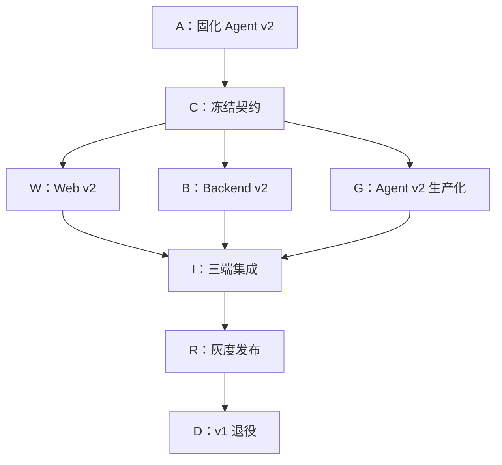

# 08：执行清单

- **状态：** Proposed
- **负责人：** Cooking Plan 跨仓库集成负责人
- **最后更新：** 2026-08-02
- **相关仓库：** `foodmind-web`、`foodmind-backend`、`foodmind-intelligence`、`foodmind-docs`
- **相关契约/ADR：** 本系列阶段 0–6 产物
- **未决问题：** PR 负责人、排期和阶段 4 性能阈值

## 1. 使用方式

本清单按依赖顺序执行。每个条目只有在代码、自动化测试、文档和可观测证据同时齐备后才能勾选。PR 编号与负责人可在执行时补充。

## 2. 依赖总图



## 3. Wave 0：同步并复验现有成果

- [x] 确认组织仓库 PR #21 / `94ae323` 已包含 v2 P3 架构；
- [x] 快进同步 `foodmind-intelligence/main@604518e`；
- [x] 确认 PR #22 / `604518e` 已包含共享备料；
- [ ] 在 `agent-service/app/agents/cooking` 运行 Agent 完整 CI；
- [ ] 记录完整测试数、覆盖率、lint/type/OpenAPI 结果；
- [x] 确认 `foodmind-intelligence` 是 Agent 正式发布源；
- [ ] 对独立本地镜像仅做差异核查，不直接 push；
- [x] 保留独立镜像未跟踪的 `openapi.json`，未覆盖或提交；
- [ ] 在 README/ADR 记录 v2 路由版本、领域 schema 版本和应用版本的区别。

完成证据：稳定 Git ref、CI URL/日志、基线 PR、工作区状态截图或文本记录。

## 4. Wave 1：契约冻结

### 4.1 公开 Backend v2

- [ ] 冻结 `POST /api/v2/cooking-plans`；
- [ ] 冻结 `GET /api/v2/cooking-plans/{planId}`；
- [ ] 冻结 cancel 与 decisions 端点；
- [ ] 冻结历史列表所需最小字段；
- [ ] 定义 1–6 菜谱、时区、区域、份量和资源校验；
- [ ] 定义公开状态、progress、revision、result、confirmation、error；
- [ ] 定义 Idempotency-Key、If-Match/revision 和 409 行为；
- [ ] 确认公开响应不包含 Agent task ID/location/token。

### 4.2 内部 Agent v2

- [ ] 冻结 submit/get/cancel；
- [ ] 设计并冻结 decisions/resume；
- [ ] 将 `result/error` 改为强类型判别联合；
- [ ] 冻结 TaskStatus 合法转换和终态；
- [ ] 定义契约版本头 `cooking-plan-task-v2` 或批准的等价方案；
- [ ] 明确现有 `X-Internal-Token` 的 Secret、比较和轮换规则；
- [ ] 明确 polling 首发，SSE 不在首发承诺中；
- [ ] 生成 READY/确认/不可行/失败/取消/过期 fixtures；
- [ ] CI 加入 OpenAPI breaking-change 检查。

完成证据：两份 OpenAPI、状态机 ADR、fixtures、provider/consumer contract tests。

## 5. Wave 2A：Backend v2 数据与 API

### 5.1 数据库

- [ ] 按实际最新编号新增可回滚 migration；
- [ ] 为计划增加 v2 status/revision/input snapshot/region/serveAt；
- [ ] 新增 generation/task mapping 表；
- [ ] 新增多来源 `cooking_plan_source`；
- [ ] 目录菜谱与用户菜谱来源不再复用错误外键；
- [ ] 新增 decision 幂等和审计表；
- [ ] 新增时间线、备料、清单或批准的物化结构；
- [ ] 建立 owner/history、next_poll、task ID、source order 索引；
- [ ] 用真实 PostgreSQL 执行 migration 和 rollback/前滚演练；
- [ ] 对关键 claim/history 查询运行 `EXPLAIN ANALYZE`。

### 5.2 应用层

- [ ] 实现创建、查询、历史、取消、decisions Controller；
- [ ] 所有查询在 SQL/repository 层绑定 owner；
- [ ] 批量校验 1–6 个菜谱的可见性和生成资格；
- [ ] 冻结结构化不可变菜谱快照；
- [ ] 修复用户菜谱虚假耗时和空数量/单位问题；
- [ ] 实现公开创建幂等；
- [ ] 实现 revision 冲突；
- [ ] 公开错误码脱敏并保留 correlation ID；
- [ ] Controller/Service/Repository 边界沿用仓库现有模式。

### 5.3 Agent Adapter 与 Reconciler

- [ ] 实现强类型 submit/get/cancel/decisions client；
- [ ] 配置 token、契约版本、超时、重试和响应大小；
- [ ] PENDING_SUBMIT 使用稳定 request ID 重试；
- [ ] Reconciler 使用短租约/`SKIP LOCKED` 支持多实例；
- [ ] 轮询退避带抖动并尊重 Retry-After；
- [ ] 防止乱序/旧版本覆盖；
- [ ] 对 READY 等结果做 schema、引用和范围校验；
- [ ] 单事务物化结果和终态；
- [ ] Backend 重启后恢复 PENDING/POLLING/DECISION/CANCEL；
- [ ] feature flag 关闭新建时仍允许在途任务查询和收敛。

完成证据：数据库集成测试、Agent contract test、两个 Reconciler 并发测试、重启恢复测试。

## 6. Wave 2B：Agent v2 生产化

### 6.1 功能与契约

- [ ] 强类型 TaskSummary result/error；
- [ ] decisions endpoint；
- [ ] revision 和 Idempotency-Key；
- [ ] 从同一持久 checkpoint 恢复；
- [ ] 安全硬约束不可由决定覆盖；
- [ ] 节点级单调 progress；
- [ ] 排队、运行、等待确认、终态进度语义明确；
- [ ] 节点边界和长任务的协作取消；
- [ ] READY/CANCELLED 条件写入竞态测试；
- [ ] flag 关闭时返回稳定 503。

### 6.2 持久化与生命周期

- [ ] SQLite 使用范围限制为本地/受控单实例；
- [ ] SQLite task/checkpoint 重启恢复测试；
- [ ] 实现生产 PostgreSQL Task Store；
- [ ] 实现共享 PostgreSQL Checkpointer 或批准的等价方案；
- [ ] claim/renew/complete 使用 owner + version 条件；
- [ ] 数据库时间作为 lease 时间源；
- [ ] Worker 优雅关闭和租约释放；
- [ ] 运行、等待确认、终态分别设置 TTL；
- [ ] 清理批次、保留期和 Backend 同步窗口协调；
- [ ] Worker 崩溃和租约接管故障注入通过。

### 6.3 回归与观测

- [ ] 保留 1–6 菜谱测试；
- [ ] 保留多目标调度测试；
- [ ] 保留区域政策测试；
- [ ] 合入共享备料后验证安全隔离和确定性；
- [ ] 指标不使用高基数 task/user ID 标签；
- [ ] trace 串联 API、Store、Worker、节点和 solver；
- [ ] 队列、stage、lease、checkpoint、solver 和结果指标可用；
- [ ] 全量 pytest、覆盖率、lint、type、OpenAPI 门禁通过。

完成证据：完整 Agent CI、恢复/取消/确认测试、PostgreSQL 并发报告、指标截图或查询结果。

## 7. Wave 2C：Web v2

### 7.1 创建体验

- [ ] 路由 `/cooking-plans/new`；
- [ ] 选择 1–6 道菜并去重；
- [ ] 目录/用户菜谱来源和资格可见；
- [ ] 每道菜份量、出餐时间、区域、限制和厨房资源；
- [ ] 提交带 Idempotency-Key；
- [ ] 202 后立即用 planId 导航；
- [ ] 校验错误定位到具体字段；
- [ ] 自有菜谱编辑器补齐耗时、食材、步骤和设备。

### 7.2 状态与结果

- [ ] 状态页只轮询 Backend；
- [ ] 使用 pollAfterMs、jitter、退避和 AbortController；
- [ ] 页面隐藏降频，恢复可见立即刷新；
- [ ] 刷新/跨设备只依赖 URL 和 Backend 恢复；
- [ ] NEEDS_CONFIRMATION 停止常规轮询；
- [ ] decisions 带 revision 和幂等键；
- [ ] 409 后刷新而非覆盖；
- [ ] 取消区分请求中与已取消；
- [ ] READY 展示总览、时间线、共享备料和清单；
- [ ] INFEASIBLE、FAILED、EXPIRED 有不同、可操作的页面；
- [ ] 终态停止轮询；
- [ ] 未知状态安全降级并上报。

### 7.3 质量

- [ ] OpenAPI 类型生成或等价穷尽类型；
- [ ] API 逻辑在 services，轮询在 hook；
- [ ] Zustand 不作为服务端事实源；
- [ ] 不可信 Agent 文本转义；
- [ ] 键盘、焦点、语义化列表和非颜色安全提示；
- [ ] 桌面和移动端浏览器验证；
- [ ] lint、typecheck、unit、coverage、build、E2E 通过。

完成证据：浏览器 E2E 视频/trace、刷新恢复测试、移动/桌面截图、Web validate 输出。

## 8. Wave 3：三端集成门禁

- [ ] 1 道目录菜谱 READY；
- [ ] 6 道混合来源菜谱 READY；
- [ ] NEEDS_CONFIRMATION → decisions → READY；
- [ ] 重复 decisions 幂等；
- [ ] revision conflict；
- [ ] QUEUED 和 RUNNING 取消；
- [ ] READY/取消竞态；
- [ ] INFEASIBLE 与 FAILED 区分；
- [ ] EXPIRED；
- [ ] Web 刷新、离线恢复、多标签页；
- [ ] Backend 重启恢复；
- [ ] Agent API/Worker 重启恢复；
- [ ] lease 过期接管；
- [ ] Agent 429/503/timeout/schema error；
- [ ] owner 越权和内部 token 安全；
- [ ] SG/US 区域策略和未知区域拒绝；
- [ ] 多菜谱 v2 不静默降级 v1；
- [ ] 公开响应无内部 task ID/location/token；
- [ ] correlation ID 串联三端；
- [ ] 稳态、突发、复杂 6 菜谱负载基准；
- [ ] 队列和 Reconciler lag 发布阈值确定。

## 9. Wave 4：发布

- [ ] Agent v2 先部署，flag 关闭；
- [ ] 内部契约和合成任务验证；
- [ ] Backend v2 部署，创建 flag 关闭；
- [ ] 数据库迁移和 Reconciler 健康；
- [ ] Web v2 部署，入口隐藏；
- [ ] 仪表盘、告警、Runbook 就绪；
- [ ] 内部 allowlist；
- [ ] 小比例灰度；
- [ ] 按既定窗口和指标逐级放量；
- [ ] 滚动重启、备份恢复、回滚演练；
- [ ] v2 成为受支持用户默认入口。

暂停放量条件：创建/协议错误异常、队列持续增长、checkpoint 恢复失败、状态滞留、结果安全验证失败或数据库资源接近上限。

## 10. Wave 5：v1 迁移与退役

- [ ] 识别全部 v1 调用方和客户端版本；
- [ ] 新 Web 不再调用 v1 generate；
- [ ] v1/v2 指标独立；
- [ ] 公告弃用和升级路径；
- [ ] 停止 v1 新客户端接入；
- [ ] v1 新建流量在观察窗内为零；
- [ ] Backend → Agent v1 调用为零；
- [ ] v1 路由关闭演练；
- [ ] v1 历史读取与生成代码解耦；
- [ ] 移除 v1 同步 adapter、回退和短超时配置；
- [ ] 移除 Agent v1 generate 路由；
- [ ] 清理过期 Secret、flag、OpenAPI、示例和告警；
- [ ] 保留 v1 历史读取回归；
- [ ] 旧数据库结构按备份/迁移审批后清理。

## 11. PR 建议顺序

```text
01 agent: preserve v2 baseline
02 contracts: public/internal v2 OpenAPI + fixtures
03 agent: typed task results
04 backend: additive v2 schema
05 agent: decisions + checkpoint resume
06 backend: public v2 API + recipe snapshots
07 backend: Agent v2 adapter + reconciler
08 agent: progress + cooperative cancellation
09 web: v2 create + status polling
10 web: confirmation + result views
11 agent: PostgreSQL task/checkpoint store
12 integration: full-stack E2E + resilience
13 operations: dashboards + alerts + runbooks
14 rollout: flags + canary configuration
15 migration: v1 deprecation and retirement
```

可以并行的 PR 仍需等待共同契约合并；不要让 Web 或 Backend 先把临时猜测固化为事实。

## 12. 单项完成定义

每个 PR 都要回答：

- [ ] 改了什么，为什么；
- [ ] 是否改变公开/内部契约；
- [ ] 是否有 schema migration 与回滚说明；
- [ ] 是否保持 owner、幂等、revision 和状态机边界；
- [ ] 新增了哪些自动化测试；
- [ ] 实际运行了哪些命令，结果是什么；
- [ ] 是否增加日志、指标或告警；
- [ ] 是否更新本系列文档和仓库运行文档；
- [ ] 是否确认没有覆盖用户无关改动；
- [ ] 尚存哪些风险以及由谁/哪个后续 PR 处理。

## 13. 项目完成定义

- [ ] 唯一新建主链路为 Web → Backend v2 → Agent v2；
- [x] Agent v2 存在于 `foodmind-team/foodmind-intelligence` 正式 Git 历史；
- [ ] 1–6 道菜、确认恢复、取消、刷新恢复完整可用；
- [ ] Backend/Agent 重启和多实例租约恢复通过；
- [ ] 多实例生产不使用本地 SQLite；
- [ ] 三端契约可自动检测破坏性变化；
- [ ] 公开接口不泄漏内部 Agent 细节；
- [ ] 主路径、安全路径、故障路径和性能门禁通过；
- [ ] 发布、告警、Runbook、回滚和备份恢复可用；
- [ ] v1 新建与内部调用退役，历史仍可读；
- [ ] 最终验证结果和已知限制写入发布记录。
