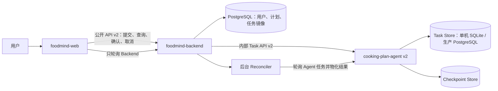
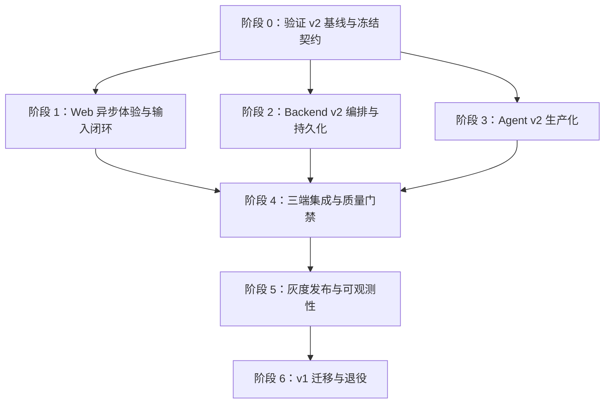

# Cooking Plan Agent v2 全栈开发计划

- **状态：** Proposed
- **负责人：** Cooking Plan 跨仓库集成负责人
- **最后更新：** 2026-08-02
- **相关仓库：** `foodmind-web`、`foodmind-backend`、`foodmind-intelligence`、`foodmind-docs`
- **相关契约/ADR：** Backend 公开 OpenAPI、Intelligence Agent 内部 OpenAPI；阶段 0 完成后补充版本与 ADR 链接
- **未决问题：** decisions/resume 契约、生产 Task/Checkpoint Store、v1 退役窗口

## 1. 文档目标

本系列只覆盖 Cooking Plan 从前端到后端再到 Agent 的一条业务链路：

```text
foodmind-web → foodmind-backend → cooking-plan-agent v2
```

计划以本地已经完成的 Agent v2 为基线，目标不是重新实现 Agent v1，而是：

1. 验证并同步组织仓库中的现有 v2 基线；
2. 冻结前后端可共同实现的异步契约；
3. 让 Web、Backend 接入 Agent v2 Task API；
4. 补齐确认恢复、取消、进度、持久化与生产部署缺口；
5. 灰度 v2，并在满足退出条件后退役 v1 链路。

## 2. 范围边界

### 2.1 本计划包含

- Web 端菜谱选择、生成任务、轮询、确认、取消与结果展示；
- Backend 的公开 API、鉴权、幂等、状态镜像、后台协调与结果物化；
- Agent v2 的内部 Task API、工作流执行、持久化、恢复和生产化；
- 三端契约测试、集成测试、灰度、观测和回滚；
- 当前 v1 同步接口的兼容与退役。

### 2.2 本计划不包含

- 通用聊天 Agent、购物清单 Agent、营养 Agent 等其他业务线；
- 推荐流、社交、支付、广告和与 Cooking Plan 无关的页面；
- 为所有 Agent 建设统一平台；
- 浏览器直接访问 Agent；
- 在 v2 首发阶段承诺 SSE。首版采用 Web 轮询 Backend，SSE 作为后续优化。

## 3. 已确认的本地基线

| 层级 | 当前能力 | 本计划中的定位 |
| --- | --- | --- |
| Web | 支持多选菜谱，但调用 Backend v1 同步生成接口 | 改为 v2 异步提交、轮询、恢复和交互 |
| Backend | 公开 `/api/v1/cooking-plans/generate`，内部调用 Agent v1 | 新增 v2 公开资源 API和任务协调层，保留 v1 兼容 |
| Agent | `foodmind-intelligence/main@604518e` 已包含 v2 P3 架构批次和共享备料 | 以组织仓库为事实源，补齐契约和生产化缺口 |

> Agent 的远端事实源是 `foodmind-team/foodmind-intelligence`。其中 PR #21 的 `94ae323` 合入 v2 P3 架构批次，最新 `604518e` 又合入共享备料。独立的本地 `cooking-plan-agent` 目录没有 remote，不作为发布源。

## 4. 目标架构



架构约束：

- Backend 是唯一公开边界，负责用户鉴权、资源所有权和稳定的公开错误码；
- Agent 只接受内部服务身份，浏览器不能获得 Agent 地址、令牌或 `task_id`；
- Backend 保存公开 `planId` 与内部 Agent `task_id` 的映射；
- Agent 返回的结果必须先通过 Backend 校验和物化，再返回给 Web；
- 多菜谱请求不能在失败时静默降级为 v1 单菜谱计划。

## 5. 阶段路线图



| 阶段 | 主要交付 | 进入条件 | 退出条件 |
| --- | --- | --- | --- |
| 0 | 远端 v2 基线、状态机、API 和版本语义 | 组织仓库已合入 v2 | 完整基线复验与契约评审通过 |
| 1 | Web v2 生成流程 | 公开契约冻结 | 刷新、确认、取消、失败状态均可用 |
| 2 | Backend v2 资源与协调层 | 数据模型和内部契约冻结 | 可稳定驱动 Agent 并物化结果 |
| 3 | Agent v2 生产化 | v2 提交被固化 | 确认恢复、真实进度、持久化和运维门禁通过 |
| 4 | 三端 E2E 和非功能验证 | 三端功能完成 | 主路径、异常路径和恢复路径通过 |
| 5 | 灰度、监控、告警和回滚 | 质量门禁通过 | v2 指标达到放量阈值 |
| 6 | v1 退役 | v2 稳定运行且无阻断客户端 | v1 流量归零并完成安全移除 |

## 6. 文档导航

1. [00：现状基线与范围](./00-baseline-and-scope.md)
2. [01：阶段 0——验证 v2 基线与冻结契约](./01-phase-0-contract-freeze.md)
3. [02：阶段 1——前端与输入闭环](./02-phase-1-frontend-and-input.md)
4. [03：阶段 2——后端编排与持久化](./03-phase-2-backend-orchestration.md)
5. [04：阶段 3——Agent v2 生产化](./04-phase-3-agent-v2-production.md)
6. [05：阶段 4——三端集成与质量门禁](./05-phase-4-integration-and-quality.md)
7. [06：阶段 5——发布与可观测性](./06-phase-5-release-and-observability.md)
8. [07：阶段 6——v1 迁移与退役](./07-phase-6-v1-migration-retirement.md)
9. [08：执行清单](./08-execution-checklist.md)

## 7. 整体完成标准

- 用户可选择 1–6 道有权限的菜谱创建计划；
- 提交接口快速返回 `202 Accepted`，Web 不等待完整工作流；
- 刷新或更换设备后仍能通过 Backend 恢复任务状态；
- `NEEDS_CONFIRMATION` 可提交带修订号的决定并恢复原任务语义；
- READY、INFEASIBLE、FAILED、CANCELLED、EXPIRED 均有稳定公开表现；
- Backend 和 Agent 的重试不会重复创建计划或重复应用用户决定；
- Agent 重启后可恢复或明确终结在途任务；
- 多实例部署前，任务和检查点迁移到支持并发租约的共享存储；
- 全链路有相关 ID、延迟、队列、错误率和状态滞留告警；
- v1 只作为受控兼容路径存在，最终按退出标准退役。
