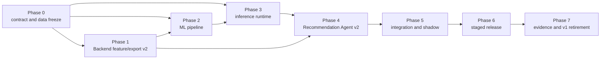

# Recommendation System Delivery Plan

- **Status:** Proposed
- **Owner:** Chen Yaqi / recommendation workstream
- **Last updated:** 3 August 2026
- **Related repositories:** `foodmind-docs`, `foodmind-backend`, `foodmind-intelligence`, `foodmind-ml`, `foodmind-web`, `foodmind-android`
- **Related contract/ADR:** Proposed recommendation-v2 boundary ADR, `recommendation-agent-v2`, `recommendation-inference-v1`, `recommendation-features-v2`, model-package manifest v1
- **Open questions:** Named reviewers/owners; representative-data threshold; release environment; dataset approval; target latency/SLO

## Outcome

Deliver the documented hybrid UserCF + ItemCF + logistic-regression recommender through a dedicated, bounded Recommendation Agent, while keeping the existing Backend deterministic fallback and public API operational throughout the migration.

This plan assumes the current Backend implementation is the starting point. It does not reimplement sessions, filters, fallback, Agent HTTP handling, feedback, or snapshot export from scratch.

## Definition of done

The workstream is complete only when:

- An accepted ADR freezes v2 ownership, model-key handling, and compatibility.
- Backend persists point-in-time v2 features, validates grounded v2 reasons, and exports reproducible labeled/impression snapshots.
- ML reproducibly builds and evaluates UserCF, ItemCF, and a logistic-regression pipeline against required baselines.
- An immutable package passes schema, checksum, known-answer, model-card, and approval gates.
- Intelligence loads that package, serves bounded inference, and runs the dedicated Recommendation Agent workflow.
- Backend falls back deterministically for every unavailable, invalid, late, or incompatible private-service response.
- Normal, cold-start, no-candidate, fallback, feedback, and “try another” paths pass end-to-end tests.
- Web and Android preserve ordered-set parity without direct private-service access.
- Observability, security, rollback, and delivery evidence are complete and tied to revisions/environments.
- Documentation and copied contracts identify canonical owners and exact source revisions.

## Delivery dependencies



Phases may overlap only where the dependency graph permits. Contract fixtures and golden feature vectors allow Backend, ML, and Intelligence to work in parallel after Phase 0.

## Phase 0 — Freeze decisions and contracts

### Tasks

1. Accept or amend the [Recommendation System Implementation Design](../architecture/recommendation-system-implementation-design.md).
2. Approve an ADR covering:
   - Spring Boot as sole public/permission boundary.
   - Logical Agent/inference split and offline ML ownership.
   - Pseudonymous HMAC model keys and rotation/version policy.
   - v1/v2 compatibility and rollback window.
   - Fail-closed allergen/dietary evidence policy.
3. Profile a representative training snapshot without copying personal data into Git.
4. Freeze machine-readable schemas and examples for:
   - `recommendation-agent-v2`.
   - `recommendation-inference-v1`.
   - `recommendation-features-v2`.
   - model-package manifest v1.
5. Freeze the reason-code predicate table, diversity policy, and typed failure taxonomy.
6. Record initial latency budgets, candidate cap, data sufficiency criteria, evaluation gates, and rollback thresholds.
7. Decide whether an external bootstrap dataset is approved; record licence/provenance and proxy-label rules if yes.

### Deliverables

- Accepted ADR and compatibility matrix in `foodmind-docs`.
- Canonical schemas/fixtures in their owning repositories, with coordination copies that identify revision and owner.
- Golden v2 input/features/score/reason examples with no real personal data.
- Data profile and acceptance-threshold record in restricted evidence storage.

### Exit gate

Backend, ML, and Intelligence tests can validate the same golden feature vector and reject the same incompatible examples. No cross-repository implementation begins on an unfrozen field name or semantic.

## Phase 1 — Backend point-in-time feature and export v2

### Tasks

1. Rebase the implementation branch on current Backend `master`; choose the next unused migration number.
2. Introduce an injected decision clock and make all recency/availability evaluation use the persisted decision time.
3. Formalise the candidate-source query:
   - Active `place_meal` is the recommendable unit.
   - Personal/group history nominate or support only resolvable active offerings.
   - Source quotas and final cap are deterministic.
4. Add evidence completeness/freshness, actual requested-time availability, and fail-closed constraint behavior.
5. Add `RecommendationFeatureAssembler` for the exact `recommendation-features-v2` contract.
6. Persist feature schema, model-key version, source, exposure metadata, and v2 snapshots in TX1.
7. Add HMAC domains for model user, meal, offering, and session keys; keep secrets out of code/config examples/logs.
8. Extend snapshot export:
   - Explicitly labeled dataset for LR.
   - Nullable-label impression dataset.
   - Pseudonymous session grouping.
   - Decision/outcome cutoffs, provenance, schema/key versions, checksums, and counts.
9. Add v2 Agent DTOs and dual-version handling behind configuration/feature flags.
10. Add `ReasonEvidenceValidator`; correct the current UserCF/ItemCF proxy semantics in the v2 path.
11. Keep deterministic fallback behavior independent and available.

### Likely code areas

```text
foodmind-backend/src/main/java/com/foodmind/foodmindbackend/recommendation/
  application/GenerateRecommendation.java
  application/RecommendationTransactionService.java
  application/BuildTrainingSnapshot.java
  application/port/RecommendationContextQuery.java
  domain/filter/
  domain/reason/
  infrastructure/persistence/JdbcRecommendationContextQuery.java
  infrastructure/export/

foodmind-backend/src/main/java/com/foodmind/foodmindbackend/integration/agent/
foodmind-backend/src/main/resources/db/migration/
foodmind-backend/src/test/resources/contracts/agent/recommendation/
```

### Exit gate

- Unit and property tests pass.
- PostgreSQL/Testcontainers recommendation flows pass in CI.
- Query-plan test proves the candidate query remains bounded.
- Two exports from the same database snapshot/config are checksum-identical.
- Golden features match the frozen schema.
- Logs contain no raw/pseudonymous model identity or feature payload leakage.
- With Agent v2 disabled, existing public behavior and fallback remain unchanged.

## Phase 2 — Offline ML pipeline and candidate package

### Tasks

1. Create a conventional Python package in `foodmind-ml` with pinned dependencies, CLI entry points, configuration, and tests.
2. Implement manifest/checksum/schema validation before loading a snapshot.
3. Implement time-aware session-grouped splits and leakage checks.
4. Build the versioned collaborative-strength aggregation.
5. Train UserCF and ItemCF sparse artifacts inside each fold.
6. Generate CF score/availability/support features for labeled examples.
7. Train the full preprocessing + regularised logistic-regression pipeline.
8. Run baselines and ablations: constant, Backend fallback, context-only LR, UserCF-only, ItemCF-only, full hybrid.
9. Produce classification, calibration, ranking, coverage/diversity, latency-size, cold-start, and critical-slice reports.
10. Package model, preprocessing, CF artifacts, indexes, schemas, manifest, metrics, model card, and checksums.
11. Rebuild from a clean environment and compare the expected manifest/artifact checksums or documented deterministic components.
12. Keep a candidate package in `evaluation` status until the review gate is signed.

### Suggested repository shape

```text
foodmind-ml/
  pyproject.toml
  configs/recommendation/
  src/foodmind_ml/
    data/
    features/
    collaborative/
    ranking/
    evaluation/
    packaging/
    cli.py
  tests/
    fixtures/
    unit/
    integration/
  docs/experiments/
  docs/model-cards/
```

Generated snapshots, trained artifacts, and caches stay outside Git. Only small synthetic/golden fixtures belong in the repository.

### Exit gate

- CI passes data-contract, fold-isolation, deterministic/golden, packaging, and checksum tests.
- The model card documents dataset provenance, limitations, label semantics, cold start, and external-data caveats.
- The full hybrid is compared with every required baseline and meets the Phase 0 thresholds.
- A reviewer independent of the author approves the metrics and model card.
- The candidate package is immutable and addressable by version/checksum.

## Phase 3 — Private inference runtime

### Tasks

1. Implement package acquisition from an allowlisted authenticated source.
2. Verify manifest, schemas, every checksum, supported model-key version, and controlled joblib provenance before loading.
3. Add an atomic model registry with warm-up and last-known-good rollback.
4. Implement Pydantic inference schemas and strict payload/candidate limits.
5. Implement sparse UserCF/ItemCF lookup, v2 feature assembly checks, and vectorised LR probabilities.
6. Return structured CF/evidence signals; return no prose.
7. Implement liveness, readiness, active-version metadata, metrics, and structured typed errors.
8. Add known-answer, corrupt/tampered package, missing artifact, key/schema mismatch, concurrency, and latency tests.
9. Containerise with non-root execution, read-only model mount/cache where practical, dependency/image scanning, and SBOM.

### Likely code areas

```text
foodmind-intelligence/inference-service/app/
  api/
  contracts/
  model_registry/
  recommenders/
  observability/

foodmind-intelligence/contracts/internal/inference/
foodmind-intelligence/contracts/internal/model-package/
```

### Exit gate

- An approved package reaches readiness and a tampered/incompatible one cannot.
- Golden inputs match offline probabilities within the frozen tolerance.
- Package swap is atomic under concurrent reads.
- Last-known-good rollback succeeds without rebuilding the image.
- No database credentials, public route, or training dependency exists in the runtime.

## Phase 4 — Dedicated Recommendation Agent v2

### Tasks

1. Implement strict `recommendation-agent-v2` schemas and internal authentication.
2. Build a bounded structured workflow:
   - Validate envelope/deadline/bounds.
   - Call inference exactly once.
   - Verify compatibility.
   - Select the lead and diverse alternatives deterministically.
   - Derive reason codes using the frozen predicate table.
   - Render constrained templates.
   - Emit structured result or typed failure.
3. Preserve request/trace correlation and stop before the Backend deadline.
4. Enforce at most 100 candidates in and 3 results out, unique IDs, stable ties, and distinct types where evidence permits.
5. Add explicit tests proving the workflow performs no DB/web search and cannot introduce a candidate.
6. Add optional LLM explanation only behind a separate disabled-by-default flag after template behavior is accepted; ranking never depends on it.

### Likely code areas

```text
foodmind-intelligence/agent-service/app/agents/recommendation/
foodmind-intelligence/agent-service/app/contracts/internal/agent/
foodmind-intelligence/contracts/internal/agent/
```

Reuse service scaffolding, authentication, structured-state, and observability patterns from the implemented Cooking Agent where they are generic. Do not reuse Cooking prompts, state, or endpoint semantics.

### Exit gate

- Contract fixtures pass in Intelligence and Backend.
- Every reason code is supported by a golden predicate fixture.
- Timeout, unavailable inference, invalid response, mismatch, and deadline exhaustion return typed failures that cause Backend fallback.
- Repeated identical input/package/policy yields identical structured output.
- No unbounded loop, retry, tool access, database access, or candidate invention is possible.

## Phase 5 — Integration, shadow traffic, and quality

### Tasks

1. Deploy inference, then Agent, with readiness disabled from live routing until package validation completes.
2. Enable Backend v2 dual-contract support and shadow scoring for authorised non-production/synthetic or approved staged traffic.
3. Compare, without returning shadow output:
   - Model score distribution and calibration proxy.
   - Candidate coverage and result-type diversity.
   - Reason support/validation failures.
   - End-to-end latency and payload size.
   - Agent/inference failure and Backend fallback rates.
4. Run full end-to-end cases across Backend, Agent, inference, database, and both clients.
5. Run security tests for service authentication, permission isolation, payload limits, secret/log redaction, package tampering, and dependency/container findings.
6. Validate Web/Android lead + “try another” parity and explicit feedback submission.
7. Exercise rollback to fallback-only and to last-known-good package.

### Exit gate

- No critical permission, safety, privacy, or unsupported-explanation defect remains.
- Shadow metrics satisfy Phase 0 thresholds and show no unacceptable critical-slice regression.
- P95/P99 latency, timeout, and fallback rate are within the frozen budget.
- Rollback has been demonstrated, timed, and recorded.
- UAT evidence identifies commit, package checksum, environment, date, and tester.

## Phase 6 — Staged release

### Tasks

1. Promote the approved package; never promote an unreviewed experiment output.
2. Enable v2 by cohort/percentage with an explicit owner and observation window at each step.
3. Monitor readiness, latency, contract mismatch, feature missingness, score drift, fallback/no-candidate rate, coverage, explicit outcomes, and critical slices.
4. Stop or roll back on an agreed threshold breach. Do not tune thresholds live without a reviewed change.
5. Keep deterministic fallback enabled and last-known-good package available throughout.

### Exit gate

- Full intended cohort is stable for the agreed window.
- No rollback threshold or unresolved critical alert is active.
- Operational runbook, dashboard, alert ownership, and model release record are complete.

## Phase 7 — Evidence, documentation alignment, and v1 retirement

### Tasks

1. Update Backend overview/status docs that still say the recommendation is framework-only.
2. Update the central status workbook with evidence-backed implementation status; do not overwrite historical dates without noting the new as-of date.
3. Publish coordination copies/version references for accepted internal contracts and the model-package compatibility matrix.
4. Store model card, evaluation report, security scans, CI evidence, UAT, screenshots, rollback proof, and final demo references.
5. After the compatibility window, remove v1 runtime traffic and then v1 code/fixtures in a separate reviewed change.
6. Mark superseded plans/contracts explicitly rather than deleting their rationale.

### Exit gate

- Source-of-truth artifacts and repository READMEs describe the actual deployed state.
- Evidence is complete and traceable to exact revisions/package/environment.
- Telemetry shows no v1 use during the agreed window.
- v1 retirement has a reviewed rollback note and no client dependency.

## Cross-repository responsibility matrix

| Work product | Responsible repository | Required reviewers/consumers |
| --- | --- | --- |
| Product/architecture decision and evidence index | `foodmind-docs` | Backend, Intelligence, ML, client representatives |
| Public API, permissions, candidates, filters, sessions, fallback, feedback, export | `foodmind-backend` | Web, Android, ML snapshot consumer, Intelligence Agent consumer |
| Agent and inference schemas/runtime | `foodmind-intelligence` | Backend and ML contract reviewers |
| Training, evaluation, model card, immutable package | `foodmind-ml` | Intelligence package consumer and recommendation owner |
| Web recommendation UX and feedback | `foodmind-web` | Backend contract owner and Android parity reviewer |
| Android recommendation UX and feedback | `foodmind-android` | Backend contract owner and Web parity reviewer |

## Pull-request and Git strategy

Use small, reviewable branches in the owning repository. A suggested sequence is:

1. `foodmind-docs`: ADR, contracts/compatibility coordination, architecture acceptance.
2. `foodmind-backend`: feature/export v2 and hard-filter fixes.
3. `foodmind-ml`: snapshot validation and baseline pipeline.
4. `foodmind-ml`: CF/LR evaluation and candidate package.
5. `foodmind-intelligence`: model loader/inference service.
6. `foodmind-intelligence`: Recommendation Agent v2.
7. `foodmind-backend`: v2 Agent integration/shadow flags.
8. Clients only if an approved additive public-contract/UX change is needed.
9. `foodmind-docs`: release evidence and status alignment.

For each change:

- Fetch/prune and branch from the current canonical remote branch.
- Keep unrelated working-tree changes out of the branch; use a separate worktree when necessary.
- Rebase or merge the current target branch before assigning migration numbers or freezing contract revisions.
- Update canonical schemas first, then consumer fixtures in the same coordinated window.
- Run repository-specific formatting, lint, unit, integration, contract, security, and artifact checks.
- Use scoped conventional commits, for example `feat(recommendation): persist feature schema v2`.
- Do not commit snapshots, real user data, secrets, generated model binaries, caches, or local environment files.
- Record the exact model package checksum in deployment evidence, not in mutable source configuration.
- Open PRs; do not force-push shared branches or combine cross-repository source into a monorepo.

## Acceptance checklist

### Scope and architecture

- [ ] Dedicated Recommendation workflow; no chatbot routing.
- [ ] Backend remains sole public/security/database boundary.
- [ ] Offline training and runtime inference remain separate.
- [ ] UserCF + ItemCF + logistic regression implemented; fallback independent.
- [ ] Up to three ordered, evidence-supported result types.

### Data and ML

- [ ] Explicit labels only; passive non-selection is not negative.
- [ ] Point-in-time features and outcome cutoff prevent leakage.
- [ ] Pseudonymous session/user/meal/offering keys and key version.
- [ ] Time-aware session-grouped split and cold-start slices.
- [ ] Baselines, ablations, calibration, ranking, coverage/diversity, and model card.
- [ ] External dataset provenance/licence/domain limitations, if used.

### Runtime and Agent

- [ ] Strict Agent/inference/feature/package versions and compatibility matrix.
- [ ] Package checksum, known-answer readiness, atomic activation, and rollback.
- [ ] Bounded one-call Agent workflow and deterministic tie-breaking.
- [ ] Reason predicates validated again by Backend.
- [ ] All private failures produce observable Backend fallback.

### Security and operations

- [ ] Fail-closed required safety evidence and careful non-guarantee wording.
- [ ] Internal auth, payload limits, network controls, redacted logs, no raw IDs.
- [ ] Dependency/container/package scans and SBOM.
- [ ] Dashboards, alerts, staged rollout, and tested rollback.

### Evidence and governance

- [ ] Contract and schema fixtures pass in every producer/consumer.
- [ ] PostgreSQL/Testcontainers recommendation suite passes in CI.
- [ ] Web/Android parity and UAT paths pass.
- [ ] Evidence ties revisions, model checksum, environment, date, and tester.
- [ ] Stale status documents are aligned without rewriting frozen baselines.

## Immediate next actions

1. Review and accept/amend the implementation design.
2. Assign the ADR and contract owners.
3. Produce a privacy-safe snapshot profile to set numeric data/metric/latency gates.
4. Freeze feature v2, Agent v2, inference v1, model package v1, and model-key semantics.
5. Start Backend Phase 1 and ML snapshot validation against the same golden fixtures.

See [Recommendation and Agent Documentation Inventory](../architecture/recommendation-document-inventory.md) for all audited source material and [Recommendation System Implementation Design](../architecture/recommendation-system-implementation-design.md) for the complete technical design.
