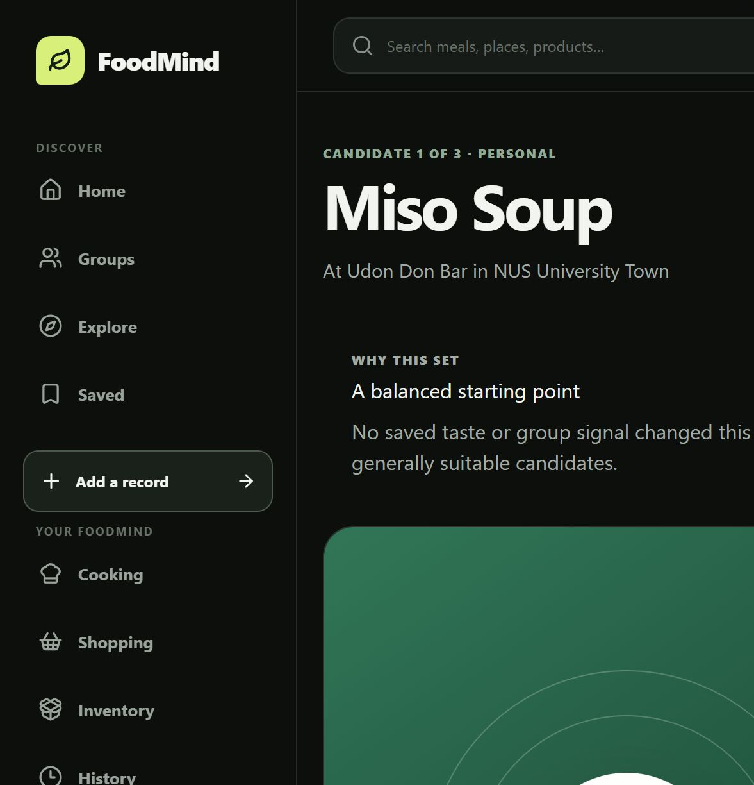
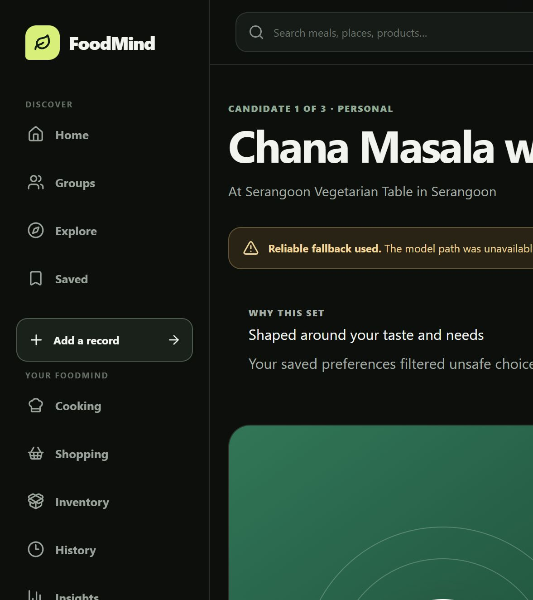
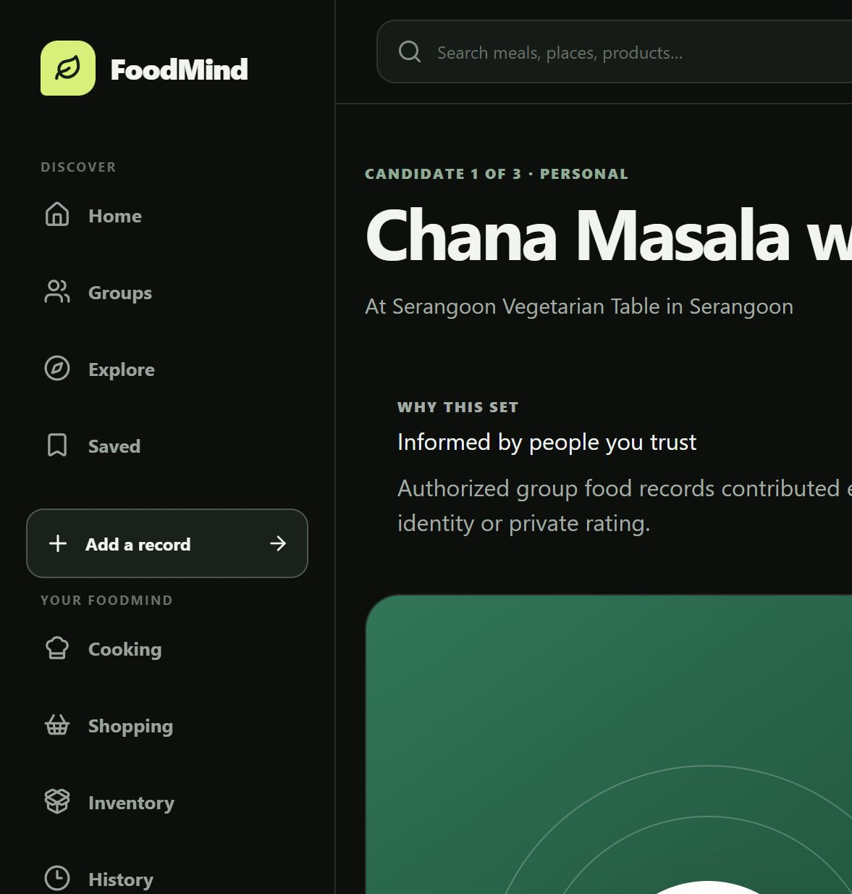
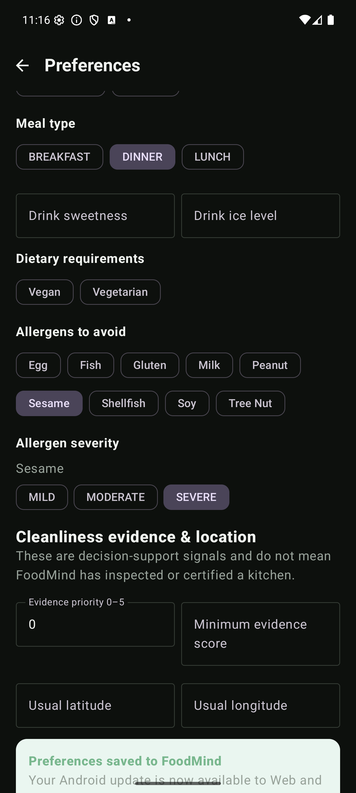
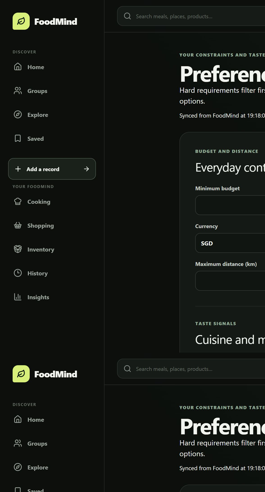

# User-centred recommendation showcase

Validated on 15 August 2026 against the local FoodMind Compose stack. The stack used the real `hybrid-ranking-v1` package, Backend local catalogue seed, Recommendation Agent, inference service, Web application, and an Android emulator running the debug APK.

## What the audience should notice

The recommendation screen now explains why the result differs for the current person. The explanation is derived from the immutable request evidence stored with the recommendation session; it does not infer sensitive details from a meal name or expose another group member's identity.

| Test user | Evidence prepared | Lead result | Decision profile | Runtime result |
| --- | --- | --- | --- | --- |
| New registration | No preferences or interaction history | Miso Soup | `DEFAULT`, new-user baseline | `hybrid-ranking-v1`, succeeded |
| Strong taste and allergy | Spice tolerance 5, Indian cuisine, severe sesame allergy | Chana Masala with Rice | `CONSTRAINT_FOCUSED`, spice + allergen + cuisine | Safety-filtered deterministic fallback |
| Group guided | Two authorised group members recorded Chana Masala | Chana Masala | `GROUP_GUIDED`, two group records | `hybrid-ranking-v1`, succeeded |

The resulting session IDs were:

- default: `c630fc1b-adb3-4cad-a0f6-f268fe0e4e92`
- constraint-focused: `b2eb9e02-366e-458d-acec-a1bde00190c6`
- group-guided: `10427724-781c-4bf1-94f0-f8f299e945e8`

The default and group-guided sessions completed with the real model. The constraint-focused case correctly failed closed after allergy filtering left three controlled candidates and the Agent returned one unsupported reason code. Backend rejected that response and used its deterministic safe fallback. The UI exposes the fallback instead of presenting it as a successful model prediction.

## Cross-device refresh

1. The allergy test user was opened in the Android APK.
2. Spice tolerance was changed from 5/5 to 4/5 and saved.
3. Android confirmed that the update was available to Web and future recommendations.
4. The same user opened Web Preferences and selected **Refresh from FoodMind**.
5. Web displayed `Synced from FoodMind at 19:18:08`; its accessible form state showed `4 / 5` selected, Indian cuisine selected, and Sesame severity still set to Severe.

This is API-backed synchronisation through Backend, not a shared browser cache or a mocked front end.

## Visual evidence

### New user: balanced cold start



### Strong taste and allergy: constraints made visible



### Group-guided: authorised group evidence



### Android save acknowledgement



### Web refresh acknowledgement



## Reproduction

From the Infra repository with the FoodMind Compose stack healthy:

```powershell
./scripts/verify-user-centered-recommendations.ps1
```

The script creates or reuses isolated showcase accounts, prepares only the evidence needed by each case, generates fresh sessions, and fails unless all three decision profiles and group evidence counts match their expected values.

